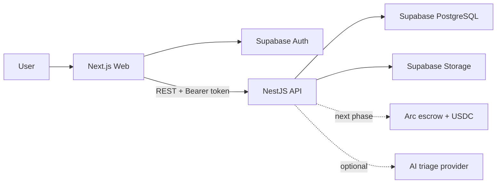

# Bug Bounty Escrow

A Web3 bug bounty platform that combines private vulnerability reporting,
controlled human review, and transparent USDC escrow.

> **Current status:** the repository contains an **off-chain MVP** with a web
> application, REST API, Supabase Auth/PostgreSQL/Storage, role-based access
> control, bounty programs, reports, reviews, attachments, and demo data. Arc
> smart contracts, real on-chain USDC settlement, and production AI triage are
> not integrated yet; their corresponding packages are currently scaffolds.

## Key features

- Registration, sign-in, onboarding, and role-based access for Owners,
  Researchers, and Reviewers.
- Bounty program creation and management, including scopes, reward tiers,
  reviewers, and program lifecycle controls.
- Public program discovery and private vulnerability report submission with PoC
  attachments and status tracking.
- Human review workflows for requesting more information, validating, rejecting,
  or marking reports as duplicates.
- Simulated off-chain reward approval and payment workflows with audit history
  and controlled state transitions.
- Row Level Security, API authorization, rate limiting, log redaction, and
  private Supabase Storage for sensitive data.
- OpenAPI/Swagger documentation, unit and integration tests, and Playwright E2E
  coverage.

Target product workflow:

```text
Owner creates a program → defines scope/rewards → deploys and funds escrow
        ↓
Researcher submits a report → reviewer validates it → owner approves reward
        ↓
Escrow releases USDC → report transitions to PAID
```

AI is limited to triage assistance. It must never approve reports, select
payouts, or release payments.

## Architecture



| Layer             | Technology                                                     |
| ----------------- | -------------------------------------------------------------- |
| Monorepo          | pnpm workspace, Turborepo, TypeScript                          |
| Frontend          | Next.js 15, React 19, Tailwind CSS 4, Radix UI, TanStack Query |
| Backend           | NestJS 11, REST, Zod, OpenAPI/Swagger, Pino                    |
| Data              | Supabase PostgreSQL, Auth, Storage, Realtime, RLS              |
| Testing           | Vitest, Supertest, Playwright, PGlite                          |
| Target blockchain | Arc, Solidity, USDC, viem/wagmi                                |

## Prerequisites

- Node.js `^20.19.0`, `^22.13.0`, or `>=24.0.0`.
- Corepack and pnpm `11.17.0` (pinned in `package.json`).
- Docker Desktop or Docker Engine for the local Supabase stack.

## Run locally

### 1. Install dependencies

```sh
corepack enable
pnpm install --frozen-lockfile
```

### 2. Start Supabase and generate environment files

```sh
pnpm exec supabase start
node scripts/setup-local-env.mjs
```

The setup script generates:

- `apps/web/.env.local`, containing browser-safe configuration only.
- `apps/api/.env`, containing server configuration, including the Supabase
  service-role key.

Both files are excluded by `.gitignore` and must never be committed.

### 3. Apply migrations and seed demo data

Read `DB_URL` from the local Supabase stack, assign it to `DATABASE_URL`, and run
the migrations with the demo seed.

PowerShell:

```powershell
$supabaseStatus = pnpm exec supabase status -o env
$dbUrlLine = $supabaseStatus | Where-Object { $_ -match '^DB_URL=' }
$env:DATABASE_URL = $dbUrlLine -replace '^DB_URL="?|"$', ''
pnpm --filter @bug-bounty-escrow/database db:migrate --seed
```

macOS/Linux:

```sh
export DATABASE_URL="$(
  pnpm exec supabase status -o env |
  sed -n 's/^DB_URL="\(.*\)"$/\1/p'
)"
pnpm --filter @bug-bounty-escrow/database db:migrate --seed
```

### 4. Build the workspace and start the development servers

```sh
pnpm build
pnpm dev
```

Local services:

| Service           | URL                                |
| ----------------- | ---------------------------------- |
| Web application   | <http://localhost:3000>            |
| API health check  | <http://localhost:3001/api/health> |
| Swagger UI        | <http://localhost:3001/api/docs>   |
| Supabase Studio   | <http://127.0.0.1:54323>           |
| Local email inbox | <http://127.0.0.1:54324>           |

Stop the local Supabase stack when it is no longer needed:

```sh
pnpm exec supabase stop
```

## Demo accounts

The demo seed provides three local accounts:

| Role       | Email                   | Password              |
| ---------- | ----------------------- | --------------------- |
| Owner      | `owner@local.demo`      | `local-demo-password` |
| Researcher | `researcher@local.demo` | `local-demo-password` |
| Reviewer   | `reviewer@local.demo`   | `local-demo-password` |

These accounts and credentials are for local and demo environments only.

## Common commands

| Command                                              | Purpose                                    |
| ---------------------------------------------------- | ------------------------------------------ |
| `pnpm dev`                                           | Run the Web and API development servers    |
| `pnpm build`                                         | Build the workspace dependency graph       |
| `pnpm lint`                                          | Run ESLint                                 |
| `pnpm typecheck`                                     | Run TypeScript checks                      |
| `pnpm test`                                          | Run workspace tests                        |
| `pnpm format:check`                                  | Check formatting with Prettier             |
| `pnpm format`                                        | Format the repository with Prettier        |
| `pnpm --filter @bug-bounty-escrow/web test:e2e`      | Run Playwright E2E tests                   |
| `pnpm --filter @bug-bounty-escrow/api openapi:check` | Verify the OpenAPI snapshot                |
| `pnpm --filter @bug-bounty-escrow/database test`     | Verify migrations, RLS, and database flows |

## Repository structure

```text
.
├── apps/
│   ├── web/          # Next.js frontend
│   └── api/          # NestJS REST API
├── packages/
│   ├── database/     # PostgreSQL migrations, seed data, and database tests
│   ├── domain/       # Domain models, statuses, and state transitions
│   ├── shared/       # API contracts, Zod schemas, environment parsing, and utilities
│   ├── ui/           # Design tokens and reusable React UI primitives
│   ├── ai/           # AI triage provider scaffold
│   ├── blockchain/   # Blockchain client scaffold
│   └── contracts/    # Smart contract scaffold
├── docs/             # Product flows, architecture, API, and implementation reports
├── scripts/          # Local environment setup scripts
└── supabase/         # Supabase CLI configuration
```

## Environment variables

The combined reference template is [`.env.example`](.env.example).
Application-specific templates are:

- [`apps/web/.env.example`](apps/web/.env.example), which contains only
  `NEXT_PUBLIC_*` variables. Every value in this file can be visible to browser
  users.
- [`apps/api/.env.example`](apps/api/.env.example), which contains server,
  Supabase, blockchain, and AI provider configuration.

Never expose `SUPABASE_SERVICE_ROLE_KEY`, `GEMINI_API_KEY`, private keys, or
signed URLs in the frontend, source control, logs, or screenshots.

Supported AI configuration modes are `mock`, `gemini`, and `disabled`.
`GEMINI_API_KEY` is required only when `AI_PROVIDER=gemini`.

## Documentation

- [Project context](PROJECT_CONTEXT.md) — product vision, domain, and roadmap.
- [User flows](docs/flow/) — detailed requirements for each product flow.
- [API contracts](docs/api-contracts.md) — REST contracts and error conventions.
- [Database ERD](docs/database-erd.md) — data model.
- [Database package guide](packages/database/README.md) — migrations, RLS, and
  the demo lifecycle.
- [Off-chain MVP report](docs/offchain-mvp-report.md) — scope and results of the
  off-chain milestone.

## Security principles

- Vulnerability reports and attachments are private data and must never use
  public URLs.
- Application roles are resolved from server-side profiles, never trusted from
  client input.
- The Supabase service-role key exists only in the API environment.
- Monetary and reward values use strings/`numeric` for exact representation,
  never floating-point values.
- AI cannot replace reviewer decisions or trigger payouts.
- Any real escrow integration must be audited before it handles real assets.
