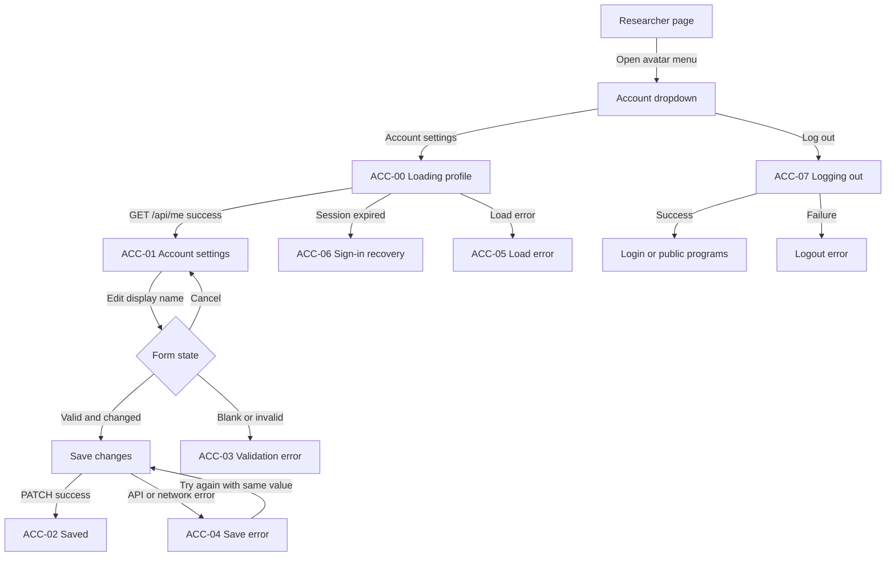

# Account settings — Researcher flow for Figma

## 1. Mục tiêu

Tài liệu này định nghĩa flow **Account settings** cho Security researcher trong Bug Bounty
Escrow.

Flow cho phép user đã đăng nhập:

- Xem thông tin account hiện tại.
- Chỉnh sửa duy nhất `Display name`.
- Xem email ở trạng thái read-only vì email thuộc auth provider.
- Xem account type ở trạng thái read-only.
- Mở các khu vực researcher từ account dropdown trên header.
- Đăng xuất an toàn.
- Liên hệ support khi account type được thiết lập sai.

Account settings không phải nơi đổi role, payout wallet, password hoặc quyền reviewer trong MVP.

## 2. Nguồn sự thật hiện tại

### Figma

- File: `Bug Bounty Escrow — Dark Desktop Preview`.
- File key: `Zdx9FTCAedUZ5R3phehFAp`.
- Design System page: `BBE Design System` (`2:3`).
- Account settings page: `account settings` (`282:1947`).
- Section: `Account settings · Researcher` (`282:1948`).
- Figma section:
  [Account settings · Researcher](https://www.figma.com/design/Zdx9FTCAedUZ5R3phehFAp/Bug-Bounty-Escrow-%E2%80%94-Dark-Desktop-Preview?node-id=282-1948).

Các frame hiện có:

| ID | Frame | Node |
| --- | --- | --- |
| ACC-01 | Account settings · Desktop | `282:1949` |
| ACC-02 | Saved · Desktop | `285:4400` |
| ACC-03 | Validation error · Desktop | `285:4475` |
| ACC-M-01 | Account settings · Mobile | `282:1952` |

### Routes

| Mục đích | Route |
| --- | --- |
| Account settings | `/account/settings` |
| Browse programs | `/programs` |
| My reports | `/reports` |
| Rewards | `/rewards` |
| Login sau logout/session expiry | `/login` |

`/account/settings` là target route cho implementation. Nếu code hiện tại dùng route khác, cần
ghi nhận thành migration task; không tự tạo hai route settings song song.

### API và auth

```text
GET   /api/me
PATCH /api/me
```

`GET /api/me` trả về profile an toàn của user đã xác thực.

`PATCH /api/me` chỉ nhận:

```json
{
  "displayName": "John Delph"
}
```

Không gửi hoặc cho phép sửa các field sau qua request này:

- `role`.
- `email`.
- `walletAddress`.
- `onboardingComplete`.
- Reviewer assignment hoặc bất kỳ permission nào.

Đăng xuất dùng Supabase Auth session flow hiện có. Sau khi logout thành công, xóa authenticated
client cache và điều hướng bằng `replace` tới `/login` hoặc public route an toàn.

## 3. Quyết định sản phẩm

### 3.1. Field được chỉnh sửa

Chỉ `Display name` được chỉnh sửa trong Account settings MVP.

| Field | UI state | Rule |
| --- | --- | --- |
| Display name | Editable | Trimmed, 1–120 ký tự |
| Email | Read-only | Thuộc auth provider; không gửi trong PATCH |
| Account type | Read-only | Không thể tự đổi sau onboarding |

Ví dụ dữ liệu dùng trong Figma và seed UI:

```text
Display name: John Delph
Initials: JD
Email: john.delph@example.com
Account type: Security researcher
```

Không dùng tên thật của thành viên dự án làm dữ liệu mẫu trong header, input, toast hoặc account
card.

### 3.2. Account type không thể đổi trong MVP

Copy bắt buộc:

```text
Account type cannot be changed from settings in the MVP. Contact support if your account was set up incorrectly.
```

Không thiết kế:

- Dropdown `Security researcher / Program owner / Reviewer`.
- Switch đổi workspace có thể click trong MVP.
- Nút tự nâng quyền reviewer.
- Flow xóa role hiện tại để chọn role khác.

Role là security boundary do backend/database quyết định. UI không được suy ra hoặc cập nhật role
từ lựa chọn local.

### 3.3. Email

Email hiển thị read-only với helper:

```text
Managed by your authentication provider.
```

Không dùng disabled input có contrast quá thấp. Có thể dùng read-only input hoặc value row nhưng
phải giữ khả năng đọc và copy bằng keyboard.

### 3.4. Wallet và password

Không hiển thị wallet trong Account settings MVP. Payout wallet thuộc reward/payout flow riêng.

Password, email change, MFA và connected identities thuộc auth-provider security flow, ngoài phạm
vi tài liệu này. Không dựng control giả nếu chưa có endpoint và recovery contract tương ứng.

## 4. Nguyên tắc UX

1. Dùng website header thống nhất với Researcher pages; không dùng sidebar.
2. Account dropdown mở từ avatar/initials ở góc phải header.
3. Settings page phải render profile từ `GET /api/me`, không dùng dữ liệu hard-code làm state thật.
4. Chỉ enable `Save changes` khi form hợp lệ và có thay đổi.
5. Không optimistic success trước khi `PATCH /api/me` hoàn tất.
6. Khi save thành công, cập nhật profile cache để tên mới xuất hiện ngay trong header và account
   card.
7. Validation error hiển thị cạnh field và không chỉ dựa vào màu.
8. API/network error giữ nguyên giá trị đang nhập để retry.
9. `Cancel` khôi phục giá trị profile gần nhất từ server; không gửi request.
10. Không flash nội dung settings trước khi xác nhận session/profile.
11. Logout là action riêng, không nằm trong profile form và không phụ thuộc trạng thái dirty.
12. Các action destructive hoặc session-changing phải có accessible name rõ ràng.

## 5. Information architecture

### 5.1. Researcher website shell

Header desktop:

- BountyEscrow logo.
- `Browse programs`.
- `My reports`.
- `Rewards`.
- Notification icon nếu feature đang bật.
- Avatar/initials và display name.

Không có researcher sidebar. Các destination trước đây nằm trong sidebar được đưa vào account
dropdown hoặc primary header navigation.

### 5.2. Account dropdown

Dropdown mở từ avatar/initials và gồm:

1. Identity summary:
   - Initials.
   - Display name.
   - Account type.
2. Navigation:
   - `Account settings`.
   - Các destination researcher chưa có vị trí trong primary nav, nếu cần.
3. Separator.
4. `Log out`.

Rules:

- `Account settings` có active/selected treatment khi đang ở `/account/settings`.
- `Log out` dùng destructive semantic vừa đủ; không dùng màu đỏ cho toàn bộ menu.
- Menu hỗ trợ Arrow keys, Enter/Space và Escape theo Radix Dropdown Menu behavior.
- Mobile dùng cùng data/action nhưng presentation có thể là dropdown hoặc compact sheet.
- Không thêm role switcher vào menu MVP.

### 5.3. Main content

Desktop:

- Content max width khoảng `1104px`, căn giữa dưới header.
- Title block có khoảng cách rõ giữa heading và supporting copy.
- Grid hai cột:
  - Profile form khoảng `720px`.
  - Account/security rail khoảng `360px`.
- Footer nằm trong document flow, có đủ padding phía trên và phía dưới.

Mobile web:

- Frame chuẩn `390px`.
- Header compact, không có sidebar.
- Profile form và account/security cards xếp dọc.
- Field và action row không vượt viewport.
- Buttons có thể xếp ngang nếu đủ chỗ; nếu không, primary action chiếm full width.

## 6. User flow tổng quát



## 7. Screen inventory

| ID | Screen/state | Route | Mục đích |
| --- | --- | --- | --- |
| ACC-00 | Loading profile | `/account/settings` | Chờ session và `GET /api/me` |
| ACC-01 | Account settings | `/account/settings` | Xem profile và chỉnh display name |
| ACC-02 | Saved | `/account/settings` | Xác nhận cập nhật thành công |
| ACC-03 | Validation error | Client state | Hiển thị lỗi display name |
| ACC-04 | Save error | Mutation error | Retry mà không mất dữ liệu |
| ACC-05 | Load error | Query error | Retry tải profile |
| ACC-06 | Session expired | Auth recovery | Sign in lại an toàn |
| ACC-07 | Logging out | Session mutation | Ngăn double logout |
| ACC-08 | Logout error | Session mutation error | Giữ user ở trang và cho retry |
| ACC-M-01 | Account settings mobile | `/account/settings` | Responsive mobile-web layout |

ACC-01, ACC-02, ACC-03 và ACC-M-01 đã có high-fidelity frame trong Figma. Các state còn lại có
thể dùng component state/prototype overlay thay vì tạo full-page duplicate nếu vẫn thể hiện đầy
đủ hành vi.

## 8. Chi tiết màn hình và trạng thái

### ACC-00 — Loading profile

- Header chỉ render shell an toàn; không dùng tên cũ của user khác.
- Main content dùng skeleton cho title, profile card và side rail.
- Không render editable form trước khi session/profile được xác nhận.
- Không dùng spinner toàn màn hình nếu skeleton giữ layout ổn định.

### ACC-01 — Account settings

Title:

```text
Account settings
```

Supporting copy:

```text
Manage how your profile appears across BountyEscrow.
```

#### Profile information card

Heading:

```text
Profile information
```

Field 1 — Display name:

- Label: `Display name`.
- Default value: `John Delph`.
- Helper: `Shown in your workspace and researcher activity.`
- Editable.

Field 2 — Email:

- Label: `Email`.
- Example: `john.delph@example.com`.
- Read-only.
- Helper: `Managed by your authentication provider.`

Field 3 — Account type:

- Label: `Account type`.
- Value: `Security researcher`.
- Read-only badge/value row.
- Hiển thị immutable account-type callout từ mục 3.2.

Actions:

- Secondary/ghost: `Cancel`.
- Primary: `Save changes`.

`Save changes` disabled khi:

- Chưa có thay đổi sau khi trim.
- Form invalid.
- Mutation đang pending.

#### Account & security card

Hiển thị:

- Avatar initials `JD`.
- `John Delph`.
- `Security researcher`.
- Button `Log out`.

Không hiển thị password/MFA controls giả.

#### Need help card

Copy:

```text
Need help with your account?
```

Action:

```text
Contact support
```

Support destination phải là route/email đã được cấu hình. Không hard-code địa chỉ chưa được xác
nhận vào component.

### ACC-02 — Saved

Sau khi `PATCH /api/me` thành công:

- Input trở về default/filled state.
- Baseline form cập nhật thành profile mới.
- Header, account dropdown và account card dùng display name mới.
- Hiển thị toast:

```text
Profile changes saved
```

- Toast dùng success semantic, có `aria-live="polite"` và tự đóng sau thời gian hợp lý.
- Không redirect khỏi settings page.
- Không hiển thị toast nếu request thất bại.

### ACC-03 — Validation error

Nếu display name rỗng sau trim:

```text
Display name is required.
```

Validation rules:

- 1–120 ký tự sau khi trim.
- Không gửi string chỉ gồm whitespace.
- Focus chuyển tới Display name khi submit invalid.
- Input có error border/icon/helper theo BBE Input error variant.
- Error vẫn đọc được bởi screen reader qua `aria-describedby`.

### ACC-04 — Save error

Page-level hoặc inline alert:

```text
We couldn't save your profile. Your changes are still here.
```

Actions:

- Primary: `Try again`.
- Secondary: `Cancel`.

Retry gửi lại cùng `displayName` đã trim. Không reload page và không làm mất input.

Nếu server trả validation error mới hơn client schema, map error về Display name khi có thể; nếu
không, dùng page-level alert.

### ACC-05 — Load error

Copy:

```text
We couldn't load your account settings.
```

Actions:

- `Try again`.
- `Back to programs`.

Không hiển thị stale profile của user khác.

### ACC-06 — Session expired

Copy:

```text
Your session expired. Sign in again to manage your account.
```

Primary action:

```text
Sign in
```

`returnTo` chỉ dùng internal path `/account/settings`. Không đưa form value vào URL.

### ACC-07 — Logging out

- Disable `Log out` để ngăn double action.
- Label pending: `Logging out…`.
- Không xóa UI/cache trước khi auth client xác nhận logout hoặc local session đã được invalidated
  theo auth contract.
- Sau thành công, clear protected query cache và dùng route replacement.

### ACC-08 — Logout error

Copy:

```text
We couldn't log you out. Try again.
```

Giữ user trên trang; không giả vờ đã logout. Nếu auth provider xác nhận local session đã hết dù
network response lỗi, route theo trạng thái session thực tế.

## 9. Form behavior và state management

Suggested client flow:

```text
load session
  → GET /api/me
  → initialize form from server profile
  → user edits displayName
  → client validation
  → PATCH /api/me
  → replace cached profile with server response
  → reset form baseline
  → show success toast
```

Rules:

- Form dùng React Hook Form + shared Zod schema.
- TanStack Query quản lý current-profile query/mutation.
- React component không query Supabase database trực tiếp.
- API response là nguồn sự thật sau save; không merge role/email từ request.
- Disable double submit.
- Không dùng optimistic name update vì request có thể bị server reject.
- Nếu user rời trang khi form dirty, browser/app có thể cảnh báo; MVP không bắt buộc modal riêng
  nếu navigation guard chưa có pattern dùng chung.
- Cancel reset về profile response gần nhất, không về hard-coded initial value.

## 10. API, validation và security contract

### GET `/api/me`

Response tối thiểu cho UI:

```ts
type CurrentUserProfile = {
  id: string;
  email: string;
  displayName: string;
  role: "owner" | "researcher" | "reviewer";
  onboardingComplete: boolean;
};
```

Frontend map role sang display label:

| Role | Label |
| --- | --- |
| `researcher` | `Security researcher` |
| `owner` | `Program owner` |
| `reviewer` | `Reviewer` |

Tài liệu này minh họa researcher shell. Profile component vẫn không được cho phép đổi role đối với
bất kỳ role nào.

### PATCH `/api/me`

Request:

```http
PATCH /api/me
Authorization: Bearer <access-token>
Content-Type: application/json
```

```json
{
  "displayName": "John Delph"
}
```

Server requirements:

- Xác thực Supabase JWT.
- Chỉ update profile của subject hiện tại.
- Trim và validate display name.
- Reject unknown/mass-assignment fields.
- Không thay đổi role/email/onboarding status.
- Ghi audit event cho profile update nhưng không log access token.
- Trả current safe profile sau update.

Expected errors:

| Case | HTTP | UI |
| --- | --- | --- |
| Missing/expired session | `401` | ACC-06 |
| Forbidden profile access | `403` | Safe access-denied state |
| Invalid display name | `400` hoặc `422` | ACC-03 |
| Profile missing | `404` | ACC-05/support |
| Conflict | `409` | ACC-04 với copy phù hợp |
| Server/network failure | `5xx`/network | ACC-04 |

## 11. Responsive và accessibility

- Desktop frame chuẩn `1440 × 1040`.
- Mobile-web frame chuẩn `390 × 1220`.
- Content usable tại `1280px`, tablet `768px` và mobile `390px`.
- Không có horizontal page scroll.
- Card/action row không overlap khi helper/error text wrap.
- Header, main và footer là landmark rõ ràng.
- Display name có visible label; không dùng placeholder thay label.
- Read-only values có contrast WCAG AA và vẫn selectable khi phù hợp.
- Interactive target tối thiểu khoảng `44 × 44px`.
- Visible focus state cho input, menu item và buttons.
- Menu avatar có `aria-haspopup="menu"` và trạng thái expanded.
- Toast/error được announce; error không chỉ biểu diễn bằng màu.
- Loading và pending buttons giữ width ổn định.
- Keyboard có thể mở/đóng account dropdown và logout mà không dùng pointer.

## 12. Design-system và shadcn/Tailwind mapping

Ưu tiên instance và semantic variables trong `BBE Design System`.

| Figma pattern | shadcn/Tailwind mapping |
| --- | --- |
| Researcher website header | Shared `Header` / navigation shell |
| Avatar account menu | `Avatar` + `DropdownMenu` |
| Profile/security surfaces | `Card`, `CardHeader`, `CardContent`, `CardFooter` |
| Display name | `FormField` + `Input` |
| Email read-only | `Input readOnly` hoặc semantic value row |
| Account type | `Badge` hoặc read-only value row |
| Immutable role note | `Alert` / informational callout |
| Save/Cancel/Logout | `Button` variants |
| Success | `Toast` / `Sonner` |
| Validation/API errors | `FormMessage` + `Alert` |
| Loading | `Skeleton` |
| Mobile account navigation | `DropdownMenu` hoặc `Sheet` |

Visual rules:

- Chỉ dùng dark BBE visual system.
- Brand violet dành cho primary/current action.
- Mint chỉ dùng cho success/escrow-complete semantic.
- Red chỉ dùng cho validation/destructive/error.
- Bind `color/bg/*`, `color/text/*`, `color/border/*`, `color/status/*`.
- Không hard-code hex hoặc arbitrary color trong component.
- Spacing bám scale `4/8/12/16/24/32/48`.
- Title và supporting copy phải có gap đủ rõ; không để text sát nhau.
- Desktop footer có padding phía dưới đủ lớn và không chạm content card.
- Layer names dùng semantic English; không để placeholder/layer vô danh.

## 13. Prototype scenarios

Figma prototype hoặc implementation QA cần kiểm tra:

1. Researcher mở avatar menu → Account settings → profile load thành công.
2. Sửa `John Delph` thành display name hợp lệ → Save → success toast.
3. Xóa display name → Save → validation error.
4. Save gặp network error → giữ input → Try again → success.
5. Cancel khi có thay đổi → reset về server profile gần nhất.
6. Session hết hạn khi load/save → Sign in → safe return to settings.
7. Mở avatar menu → Log out → login/public route.
8. Logout error → giữ session/page và retry.
9. Mobile `390px`: mở account navigation, sửa profile và logout bằng keyboard/touch.

## 14. Ngoài phạm vi MVP

- Đổi email.
- Đổi password hoặc reset password.
- MFA/passkey management.
- Connect/change payout wallet.
- Xóa account.
- Notification preferences.
- Language/timezone preferences.
- API keys.
- Self-service role change.
- Add another workspace/workspace switcher.
- Self-assign reviewer.

Các mục này chỉ được thêm khi có API, security review và flow doc riêng.

## 15. Acceptance checklist

- [ ] Page dùng researcher header thống nhất và không có sidebar.
- [ ] Account dropdown chứa Account settings và Log out.
- [ ] Chỉ Display name editable.
- [ ] Email hiển thị read-only.
- [ ] Account type hiển thị read-only và có immutable-role copy.
- [ ] Không có role dropdown, workspace switcher hoặc reviewer self-assignment.
- [ ] `PATCH /api/me` chỉ gửi `displayName`.
- [ ] Save không optimistic và update profile cache sau server success.
- [ ] Có loading, saved, validation, save error và session-expired behavior.
- [ ] Logout ngăn double action, clear protected cache và route an toàn.
- [ ] Cancel khôi phục server profile gần nhất.
- [ ] Desktop/mobile không overlap, không overflow và không có sidebar.
- [ ] Component bám BBE semantic variables và shadcn-compatible patterns.
- [ ] Dữ liệu mẫu dùng `John Delph`, không dùng tên thật của thành viên dự án.
- [ ] Accessibility annotations bao phủ form, dropdown, error, toast và keyboard flow.

## 16. Figma handoff

High-fidelity frames hiện tại:

- `ACC-01 · Account settings · Desktop`.
- `ACC-02 · Saved · Desktop`.
- `ACC-03 · Validation error · Desktop`.
- `ACC-M-01 · Account settings · Mobile`.

Implementation cần bổ sung bằng component/prototype states cho:

- Loading profile.
- Save error.
- Session expired.
- Logging out.
- Logout error.

Không cần tạo thêm page Figma nếu các state này có thể được đặt trong section
`Account settings · Researcher` mà không overlap. Mọi frame mới phải đặt tên theo screen ID trong
mục 7 và giữ khoảng cách đủ để audit layer/bounds.
