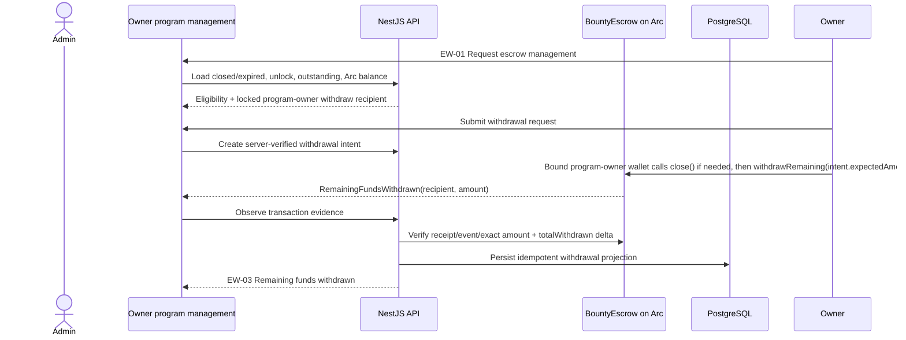

# Create Program — Owner flow for Figma

## 1. Mục tiêu

Tài liệu này định nghĩa user flow để **Program owner tạo một bug bounty program mới** trong BountyEscrow.

Flow bắt đầu từ Owner workspace tại `/owner/programs`, tạo program ở trạng thái `draft`, rồi tiếp
tục trong edit workspace tới khi backend đã deploy custom escrow bằng Circle deployment wallet và
funding đã được verify ở CP-13.

Flow mô tả hành trình liên tục từ cấu hình program tới funding escrow gồm:

- Overview.
- Scope.
- Impact catalog theo asset type.
- Reward tiers và reward calculation theo asset type.
- Program rules, PoC requirement và disclosure policy.
- Review và lưu draft.
- Kết nối owner wallet để trả platform/deployment fee và fund escrow; owner wallet không deploy
  contract bằng Circle nhưng vẫn là program authority sau khi wallet binding được xác minh.
- `BountyEscrowAdmin` được deploy một lần bởi platform admin. Contract này thu fee từng program,
  đăng ký/deactivate các program escrow và chỉ cho phép rút fee pool về admin treasury; nó **không
  bao giờ** rút program funds.
- Server báo giá deployment fee. Owner chuyển fee tới immutable `BountyEscrowAdmin` recipient; backend chỉ
  mở deploy sau khi verify exact on-chain payment hoặc admin waiver.
- Backend deploy custom `BountyEscrow` bytecode lên Arc Testnet bằng Circle Contracts Developer-
  Controlled deployment wallet (operational gas signer), rồi register escrow qua
  `BountyEscrowAdmin`. Constructor/controller binding nhận địa chỉ `BountyEscrowAdmin` và verified
  `programOwner`/withdraw recipient. Deployment là async và idempotent.
- Chọn nguồn USDC testnet trong Ethereum Sepolia, Arbitrum Sepolia, Base Sepolia và Arc Testnet.
- Tự động dùng đúng Circle App Kit capability theo selection: một Arc source dùng same-chain
  `send`, một source ngoài Arc dùng `bridge`, từ hai source/network trở lên mới dùng Unified Balance
  deposit + `spend`.
- Với Unified Balance, `Submit` đầu tiên tạo/khóa funding intent nhưng vẫn ở CP-11 để owner deposit
  tuần tự; chỉ `Submit` tiếp theo sau khi confirmed balance đủ mới chuyển CP-12.
- CP-12 giữ tên `Funding pending`, thực thi Send/Bridge hoặc destination spend đã khóa trực tiếp tới escrow
  trên Arc và xác nhận số USDC thực nhận on-chain trước CP-13.

Program owner là authority chính của từng `BountyEscrow`: pause, close, edit/extend timeline và
approve reward cho paid researcher. Chỉ `BountyEscrowAdmin` mới được deactivate; đây là emergency
control có audit/policy và không phải đường rút tiền của program. Remaining program funds
chỉ được rút bởi owner wallet đã được server bind từ owner account/funding intent; không dùng
`Transfer.from` của Bridge hoặc Unified Balance làm quyền mới.

### Role matrix (canonical)

| Capability | Platform admin / `BountyEscrowAdmin` | Program owner / bound owner wallet |
| --- | --- | --- |
| Deploy/register a program escrow | **Yes** (backend + Circle wallet) | No |
| Collect program platform fee | **Yes** (`BountyEscrowAdmin`) | Pays fee |
| Withdraw platform fees | **Yes**, only from `BountyEscrowAdmin` to the Circle deployment wallet resolved from `CIRCLE_DEPLOYMENT_WALLET_ID` | No |
| Fund program escrow | Can support operationally, but not the owner funding path | **Yes**, direct Send/Bridge/Unified Balance |
| Pause / close | Emergency support only, audited | **Yes**, normal authority |
| Deactivate | **Yes**, admin-only emergency control | **No** |
| Edit/extend timeline | Emergency support only, audited | **Yes**, normal authority |
| Approve paid researcher reward | Emergency support only, audited | **Yes**, normal authority |
| Withdraw remaining program funds | **Never** | **Yes**, only after close/unlock/outstanding checks |

No delete operation exists for a program escrow. Deactivation is a durable soft state; on-chain
close is one-way and does not grant the admin contract a withdrawal path.

Publish program là hành động kế tiếp sau flow này, không được gộp vào thao tác tạo draft hoặc fund reward.

## 2. Nguồn sự thật hiện tại

### Routes

| Mục đích | Route |
| --- | --- |
| Danh sách program của owner | `/owner/programs` |
| Tạo program | `/owner/programs/new` |
| Edit draft sau khi tạo | `/owner/programs/:id/edit` |
| Theo dõi funding | `/owner/programs/:id/edit`, CP-12 state được hydrate từ active funding intent |

### API

```text
POST /api/programs
```

Request hiện tại được validate bằng `createProgramRequestSchema`. Schema hiện tại mới hỗ trợ overview, scopes và reward range cơ bản; phần **Target data contract** trong tài liệu này là requirement cho migration/API revision kế tiếp và có độ ưu tiên cao hơn schema hiện hành khi hai bên khác nhau.

Sau khi tạo thành công:

```text
invalidate programs query
cache program response
router.replace(/owner/programs/:id/edit)
```

Real Arc flow hiện là API gap. Các endpoint legacy nhận `chainId + contractAddress + transactionHash`
hoặc `amount + tokenAddress + transactionHash` từ client chỉ đủ cho off-chain/mock milestone và
không được dùng cho deployment/funding thật. Không được dùng client-supplied address/hash, balance
hoặc App Kit result làm bằng chứng on-chain.

Target API cho Circle Contracts deployment và App Kit funding:

```text
POST /api/programs/:id/escrow-deployment-fees/quote
  server: quote fee using configured Circle deployment policy; persist quote + immutable
          bountyEscrowAdminRecipient + token/chain + expiry
  result: { quoteId, amountBaseUnits, token, chainId, recipientAddress, expiresAt }

POST /api/programs/:id/escrow-deployment-fees/payment
  body: { quoteId, payerAddress, transactionHash }
  server: verify exact token transfer/receipt before marking the quote paid
  result: { quoteId, recipientAddress, amountBaseUnits, status }

GET /api/programs/:id/escrow-deployment-fees/current
  result: current quote/payment state

POST /api/programs/:id/escrow-deployments
  body: {}
  server: require fee status paid/waived and program.deadline; derive refundUnlockAt = deadline;
          Circle Contracts deployContract(ABI, bytecode, ARC-TESTNET, constructorParameters)
          using configured Circle Developer-Controlled deployment wallet and BountyEscrowAdmin + programOwner constructor args
  result: { deploymentId, circleContractId, circleTransactionId, refundUnlockAt, status }

GET /api/programs/:id/escrow-deployments/current
  result: blocked_fee | pending | confirmed | failed deployment projection

POST /api/programs/:id/funding-intents
  body: {
    grossAmount: decimalString,
    estimatedFeeReserve: decimalString,
    sources: [{ chain, amount: decimalString }]
  }
  result: {
    fundingIntentId,
    routeMode: "send" | "bridge" | "unified_balance",
    destinationChain: "Arc_Testnet",
    recipientAddress: escrowAddress,
    token: "USDC",
    expiresAt
  }

POST /api/programs/:id/funding-intents/:fundingIntentId/observe
  body: { operationType, txHash?, providerOperationId?, boundedStepStates? }
  result: accepted_for_reconciliation

POST /api/programs/:id/funding-intents/:fundingIntentId/fee-quote
  result: { quoteId, feeReserveBaseUnits, quotedAt, expiresAt }

GET /api/programs/:id/funding-intents/:fundingIntentId
  result: preparing | collecting_deposits | awaiting_confirmed_balance
          | awaiting_wallet_signature | approving | building_burn_intents
          | signing_burn_intents | burning | fetching_attestation
          | sending | minting
          | verifying_escrow
          | reconciling | confirmed | failed | replaced | recovery_required
  sourceDeposits[].state: awaiting_signature | submission_uncertain | submitted
                          | onchain_verified | gateway_finalized | confirmed | failed

POST /api/programs/:id/withdrawal-intents
  server: verify expired/closed policy, unlock, outstanding, owner and locked recipient
  result: { withdrawalIntentId, chain: "Arc_Testnet", escrowAddress,
            recipientAddress, amountBaseUnits, requiresClose, status }

POST /api/programs/:id/withdrawal-intents/:withdrawalIntentId/observe
  body: { closeTxHash?, withdrawTxHash? }
  result: accepted_for_reconciliation

GET /api/programs/:id/withdrawal-intents/:withdrawalIntentId
  result: awaiting_close_signature | closing | awaiting_withdraw_signature
          | withdrawing | verifying | confirmed | failed | recovery_required
```

`deploy` phải dùng ABI/bytecode artifact `BountyEscrow` version `1.1.0` đã pin ở server; API key,
Entity Secret, Circle Developer-Controlled Wallet ID, BountyEscrowAdmin address và owner binding không bao giờ đi
xuống browser. Backend lưu một Circle idempotency key và request fingerprint cho mỗi deployment
attempt. Retry do timeout, rate limit hoặc lỗi 5xx phải giữ nguyên key để Circle trả lại cùng một
operation; không được tạo contract thứ hai. Nếu Circle trả lỗi validation HTTP 400 trước khi có
`circleContractId`/`circleTransactionId`, backend được rotate key đúng **một lần**, ghi audit event
và retry với cùng fingerprint. Sau khi Circle đã trả bất kỳ identifier nào, key bị khóa vĩnh viễn;
không được rotate dù polling hoặc registration còn pending. Nếu lần validation thứ hai vẫn thất bại,
deployment chuyển sang lỗi cần xử lý thủ công thay vì loop vô hạn. Version `1.1.0` là ABI có
`withdrawRemaining(uint256 expectedAmount)`;
client/server/OpenAPI
không được tiếp tục advertise hoặc encode ABI `1.0.0`.

Deployment fee is a separate durable state machine. `POST /deploy` is fail-closed until the server
has verified the exact token transfer to the configured `BountyEscrowAdmin` recipient, or an explicitly audited
admin waiver exists. A client-provided transaction hash is only a lookup hint. The fee intent and
payment evidence remain linked to the program draft for audit/reconciliation.

Server derive `routeMode` từ normalized unique `sources`; client không được tự chọn hoặc override
mode. Một source `Arc_Testnet` là `send`; một source khác Arc là `bridge`; từ hai source/network trở
lên là `unified_balance`. `sources[].amount` phải cộng đúng bằng `grossAmount`.

`observe` chỉ nhận bounded telemetry/evidence để tìm operation nhanh hơn; không lưu raw provider
result hoặc secrets. Worker vẫn phải poll Circle deployment,
đọc Arc receipt/runtime bytecode/immutable state và đối soát transaction đích của Send, Bridge hoặc
Gateway trước khi xác nhận. `grossAmount` là số owner muốn chuyển; số credit vào pool là
`netReceivedAmount` từ exact canonical Arc USDC destination `Transfer`/route event trong receipt đã
verify, sau phí. Không suy ra amount này bằng pre/post live balance vì payout có thể chạy đồng thời.
Mọi write idempotent theo Circle IDs, internal
funding intent ID, send/bridge/deposit/spend transaction hash, optional Gateway `transferId` hoặc
`chainId + transactionHash + logIndex`.
Amount trong API/database là decimal string hoặc integer base units 6 decimals; không serialize
qua JavaScript `number`.

Với từng Unified Balance source deposit, backend quản lý state machine độc lập:

- `awaiting_signature`: chưa nhận transaction hash hợp lệ; UI chỉ hiển thị đang chờ user ký.
- `submission_uncertain`: wallet/SDK đã được gọi nhưng client không chắc request đã broadcast hoặc
  không nhận được hash; worker reconcile wallet/provider/source RPC trước khi cho ký lại.
- `submitted`: transaction hash đã được attach/persist nhưng exact source receipt/log proof chưa
  hoàn tất; reload chỉ poll/reconcile hash này, không mở signature lại.
- `onchain_verified`: source RPC xác nhận receipt success và backend verify chính xác canonical
  source-chain USDC `Transfer` (token, sender, GatewayWallet recipient, amount) cùng GatewayWallet
  `Deposited` (depositor, token, amount, transaction/log identity).
- `gateway_finalized`: backend verify Circle-signed `gateway.deposit.finalized`, kiểm tra chữ ký/key
  hợp lệ và bind đúng source chain, transaction hash, log/deposit identifier. State này vẫn cần exact
  source on-chain evidence trước khi terminal.
- `confirmed`: terminal state chỉ sau khi **cả** exact source receipt/log proof và signed
  `gateway.deposit.finalized` đã bind cùng deposit attempt. Chỉ state này mới được cộng vào
  server-verified readiness/deposit accounting.
- `failed`: chỉ dùng khi có deterministic failure đã verify; timeout hoặc client mất response không
  tự động chuyển sang failed.

Gateway webhook subscription là precondition bắt buộc của Unified Balance source deposit:

- Môi trường test dùng một stable permissionless subscription có `environment = TEST`; endpoint
  public HTTPS phải xử lý được `HEAD` cho Circle endpoint validation và `POST` cho signed
  notifications. Subscription chỉ đăng ký đúng event `gateway.deposit.finalized`, không dùng event
  rộng hơn làm settlement authority.
- Trước khi tạo source-deposit operation hoặc mở wallet signature, backend phải bảo đảm owner wallet
  đang kết nối và toàn bộ selected source domains của intent đã nằm trong subscription. Trạng thái
  này phải được đọc lại từ Circle và remote-verified; local cache/config hoặc response thành công của
  một write trước đó không đủ. Không đăng ký được hoặc remote state không khớp thì flow fail closed
  trước khi owner chuyển USDC.
- Cập nhật address/domain membership là durable serialized reconcile trên desired state để hai
  funding intent đồng thời không gây lost update. Mỗi lần reconcile phải merge với remote state,
  persist revision/attempt và verify lại remote state sau write; không dùng read-modify-write
  không khóa hoặc replace list từ snapshot cũ.
- Circle giới hạn tối đa **50 registered addresses trên mỗi developer account**. Hệ thống phải theo
  dõi capacity có giới hạn rõ ràng, reserve slot idempotently trước source deposit và fail closed khi
  không thể chứng minh còn capacity; không evict một address khác để tạo chỗ một cách tự động.
- Không tự động remove owner wallet/domain membership khi funding intent kết thúc, timeout hoặc bị
  thay thế nếu source deposit, delivery, manual attach hoặc `removeFund` recovery vẫn có thể tồn tại.
  Removal chỉ được phép bởi lifecycle/retention policy riêng sau khi chứng minh không còn active,
  pending, uncertain hoặc recoverable operation tham chiếu address/domain đó.
- Circle-signed `gateway.deposit.finalized` nhận tại subscription đã remote-verified vẫn là authority
  duy nhất cho Gateway finalization. Source RPC proof, client/App Kit result, Gateway balance polling,
  local subscription state hoặc thao tác đăng ký thành công không được thay thế signed webhook.

`getBalances(includePending: true)`, số dư hiển thị từ client hoặc việc USDC biến mất khỏi wallet
chỉ là telemetry để render/reconcile nhanh hơn; không phải bằng chứng deposit on-chain hoặc Gateway
finalization.

CP-12 luôn hydrate active `fundingIntentId` của program từ API thay vì dựa vào local component
state. Reload, deep link tới edit route hoặc Browser Back không được tự tạo funding intent, burn
intent hay destination transfer mới. Mỗi program/escrow chỉ có một funding intent active; operation
đã submitted chỉ được resume/poll/reconcile theo evidence đã lưu.

CP-11 cũng hydrate cùng active intent khi Unified Balance đang ở
`collecting_deposits | awaiting_confirmed_balance`. `Submit` đầu tiên của route này tạo và khóa
intent nhưng không navigate; source deposits sau đó luôn bind vào intent đã khóa. Chỉ `Submit` thứ
hai, khi mỗi selected domain có gateway-finalized balance cover allocation + provider/gas fee
allocation từ fresh App Kit snapshot đã được server validate/bound/persist và quote còn hạn, mới
chuyển CP-12 và cho phép bắt đầu `unifiedBalance.spend()`.

Transaction hash/operation ID phải được persist như durable evidence ngay khi wallet/SDK trả về.
Nếu hash đã tồn tại, reload/recovery chỉ poll receipt và reconcile; UI không được yêu cầu ký lại
cùng transaction. Khi destination Send/Bridge/Spend deterministic-revert, operation attempt đó là
terminal `failed` nhưng funding intent và source-deposit evidence vẫn bị khóa/giữ nguyên; retry tạo
**linked destination operation attempt** cùng intent với idempotency key mới. Funding bổ sung sau một
intent đã confirmed/cancelled mới tạo intent + key mới; không reopen transaction history cũ. Send
reverted có thể ký linked attempt mới; Bridge chỉ dùng documented `retryBridge` khi còn original SDK
result trong cùng session. Reload Bridge/Unified Balance sau source operation phải recovery-required/
manual original-message recovery, tuyệt đối không chạy lại full bridge/spend.

### Quyền truy cập

- Chỉ account type `owner` được truy cập flow.
- Researcher hoặc account type khác mở deep link phải tới safe forbidden screen, không render form owner trước khi role/profile được xác nhận.
- Khi session hoặc profile đang loading, hiển thị full-page loading; không flash protected content.

## 3. Target data contract

### Program overview

| Field | Bắt buộc | Validation |
| --- | --- | --- |
| Name | Có | Trimmed, 1–200 ký tự |
| Slug | Có khi create | 1–120 ký tự, lowercase kebab-case: `^[a-z0-9]+(?:-[a-z0-9]+)*$` |
| Short summary | Có | Trimmed, 1–280 ký tự; dùng trong program card/header |
| Description | Có | Trimmed, 1–20,000 ký tự; rich long-form overview |
| Official website | Có | HTTPS URL hợp lệ |
| Logo asset | Không | Private draft upload; PNG/JPEG/WebP/SVG, tối đa 2 MB |
| Tags | Có | 1–10 giá trị normalized, mỗi tag tối đa 40 ký tự |
| Deadline | Không | ISO date-time khi có giá trị |

Slug có thể được gợi ý từ Name nhưng phải cho phép owner chỉnh sửa trước khi lưu.
Slug là canonical public URL key: PostgreSQL enforce unique toàn hệ thống và không cho đổi sau khi
program đã được tạo. Owner edit route vẫn dùng UUID nội bộ.

`liveSince`, `lastUpdated`, `maximumBounty`, `totalPaid`, `paidReportCount`, `medianResolutionTime` và `totalAssetsInScope` là derived values. Owner không nhập trực tiếp các field này.

### Định nghĩa canonical của `resolved`

Trong product này, một report được xem là **resolved for review purposes** tại thời điểm có
quyết định review đầu tiên đưa report tới một trong ba trạng thái:

- `rejected`: report bị từ chối;
- `duplicate`: report được xác định là trùng;
- `validated`: lỗ hổng được xác nhận hợp lệ.

`resolvedAt` là `created_at` của bản ghi `report_reviews` đầu tiên có `to_status` thuộc
`rejected | duplicate | validated`. Các trạng thái `reward_approved`, `payment_pending` và
`paid` là settlement sau quyết định; chúng không thay đổi `resolvedAt`.

`medianResolutionSeconds` là median của:

```text
resolvedAt - submitted_at
```

trên các report của program đã có `resolvedAt`. Metric trả `null` nếu chưa có report nào được
resolved. Thời gian ở `triaged`, `needs_information` và các vòng researcher bổ sung/resubmit vẫn
được tính vì `submitted_at` ban đầu không reset. Thời gian chờ approve reward hoặc payout không
được tính.

Label UI: `Median resolution time`. Tooltip bắt buộc:

```text
Median time from initial submission to the first validated, rejected, or duplicate decision.
Reward approval and payment time are not included.
```

Trong flow và Figma, từ `resolved` nếu không có qualifier luôn mang nghĩa review-resolution ở
trên, không có nghĩa là `paid`.

### Program resource

Program có thể có 0–20 resource links.

| Field | Bắt buộc | Validation |
| --- | --- | --- |
| Resource type | Có | `documentation`, `repository`, `audit`, `website`, `other` |
| Title | Có | Trimmed, 1–120 ký tự |
| URL | Có | HTTPS URL hợp lệ |
| Sort order | Có | Integer không âm |

### Scope item

Mỗi program phải có từ 1 đến 50 scope items.

| Field | Bắt buộc | Validation |
| --- | --- | --- |
| Asset type | Có | MVP UI nhận `smart_contract` hoặc `website` |
| Asset name | Có | Trimmed, tối đa 200 ký tự |
| Asset URL | Không | URL hợp lệ |
| Contract address | Không | EVM address hợp lệ |
| Scope status | Có | In scope hoặc Out of scope; mặc định In scope |
| Description | Không | Trimmed, tối đa 2,000 ký tự |

UI phải dùng structured fields. Không hiển thị JSON textarea cho người dùng cuối.

Domain enum hiện còn `api` và `mobile` để mở rộng sau MVP, nhưng Create Program/Submit Bug hiện không được render hai type này. API target phải reject type chưa được product enable thay vì âm thầm tạo asset mà UI không quản lý được.

### Impact definition

Impact catalog là dữ liệu owner cấu hình để researcher chọn trong Submit Bug. Mỗi asset type có in-scope asset phải có ít nhất một enabled impact.

| Field | Bắt buộc | Validation |
| --- | --- | --- |
| Asset type | Có | Thuộc `ASSET_TYPES` và phải tồn tại trong scope của program |
| Severity | Có | `critical`, `high`, `medium`, `low`, `informational` |
| Title | Có | Trimmed, 1–300 ký tự |
| Description | Không | Trimmed, tối đa 2,000 ký tự |
| Enabled | Có | Boolean; mặc định `true` |
| Sort order | Có | Integer không âm |

- Owner có thể dùng impact template hoặc thêm custom impact.
- Không cho phép duplicate normalized title trong cùng `program + asset type`.
- Researcher có thể chọn một hoặc nhiều impact phù hợp với asset type của affected scope.
- Proposed severity của researcher vẫn là đánh giá riêng; UI cảnh báo nếu thấp hơn severity cao nhất của impact đã chọn. Final severity do reviewer quyết định.

### Reward tier

Mỗi asset type có in-scope asset phải có ít nhất 1 reward tier. Tier là duy nhất theo `program + asset type + severity`, không phải chỉ theo severity toàn program.

| Field | Bắt buộc | Validation |
| --- | --- | --- |
| Asset type | Có | Thuộc asset type đang được dùng trong scope |
| Severity | Có | Một severity chỉ xuất hiện một lần trong cùng asset type |
| Calculation type | Có | `range`, `flat` hoặc `percentage` |
| Minimum reward | Với `range` | Monetary amount không âm |
| Maximum reward | Với `range` | Không nhỏ hơn minimum reward |
| Flat amount | Với `flat` | Monetary amount lớn hơn 0 |
| Percentage BPS | Với `percentage` | 1–10,000 basis points |
| Maximum reward cap | Với `percentage` | Monetary amount lớn hơn 0 |
| Calculation note | Không | Trimmed, tối đa 2,000 ký tự |

Đơn vị hiển thị là `USDC`. Network `Arc` và payout token `USDC` là platform-fixed trong MVP, owner không chọn trong form.

Với tier `percentage`, reviewer có thể cung cấp verified `calculationBasisAmount` trong review để
backend tính amount. Backend áp dụng cap và lưu snapshot của basis, percentage, cap và computed
amount trong review/payment metadata; percentage không chỉ là guidance text. Reviewer không reserve
hoặc ký reward: owner decision được ghi nhận trong database, sau đó program owner thực thi
authorized `approveReward`; `BountyEscrowAdmin` chỉ thực thi trong emergency-support path theo policy
và audit trail.

### Program rules and policies

| Field | Bắt buộc | Validation / behavior |
| --- | --- | --- |
| PoC policy | Có | `required` hoặc `optional`; mặc định `required`; global toàn program trong MVP |
| PoC policy note | Không | Trimmed, tối đa 2,000 ký tự |
| Reward/eligibility policy | Có | Markdown, 1–20,000 ký tự |
| Prohibited activities | Có | Platform defaults luôn tồn tại; owner có thể thêm 0–20 rules |
| Testing restrictions | Không | Markdown, tối đa 10,000 ký tự |
| Custom submission acknowledgment | Không | Trimmed, tối đa 1,000 ký tự |
| Allow custom impact | Có | Boolean; mặc định `true` |

Platform defaults gồm tối thiểu: không social engineering, không DoS, không automated high-volume traffic, không test mainnet/public deployment gây thiệt hại và không public unpatched vulnerability.

### Known issues and public disclosure

- Không có field `Known issues` trong Create Program.
- Report content luôn private mặc định, kể cả khi program active hoặc report đã resolved.
- Khi program `expired` hoặc `closed`, owner có thể review từng resolved report và chọn `Keep private`, `Publish summary` hoặc `Publish full disclosure`.
- Chỉ disclosure đã được owner xác nhận mới xuất hiện trong Known Issues/Public disclosures của Program Detail.
- KYC không tồn tại trong product và không tạo field/table/config liên quan KYC.

### Platform-owned data, không thuộc Create Program

- Researcher submission quota/level.
- Spam/quality warning.
- Researcher payout wallet.
- Platform-wide acknowledgments.
- Metrics như total paid và median resolution time.

Các dữ liệu này không được đặt trong `programs` hoặc nested create payload.

### Server-created values

- `status = draft`.
- `totalPool = 0`.
- `remainingPool = 0`.
- Chưa có contract address.
- `deploymentFeeStatus = not_required` only when platform policy explicitly waives the fee; otherwise
  the server creates a quote/intent and sets `awaiting_payment` before deployment.
- `deploymentStatus = blocked_fee` until the fee is `paid` or `waived`; it then becomes `pending`
  while Circle runs and `confirmed` only after Arc receipt/immutable verification.
- Program chưa public cho researcher cho đến khi hoàn thành các flow deploy, fund và publish.

### Database mapping requirement

Target normalized storage tối thiểu:

| Table/entity | Mục đích / constraint chính |
| --- | --- |
| `programs` | Identity, summary, overview, website, logo reference, deadline và policies cấp program |
| `program_tags` | Unique `(program_id, normalized_tag)` |
| `program_resources` | Resource type/title/url/sort order |
| `program_scopes` | Structured eligible/excluded assets |
| `program_impacts` | Impact catalog theo asset type và severity |
| `program_reward_tiers` | Unique `(program_id, asset_type, severity)`; calculation-type checks |
| `program_prohibited_activities` | Default/custom rule snapshots và sort order |
| `deployment_fee_intents` | Server quote/payment evidence and deployment gate; owner client cannot write status |
| `report_impacts` | Many-to-many giữa report và selected program impacts |
| `report_disclosures` | Owner decision, visibility level, public summary/content và published timestamp |

Migration không được biến report content thành public mặc định. `report_disclosures` phải tách khỏi private `reports` để public query không vô tình select nội dung nhạy cảm.

Child records đã được report/review tham chiếu phải giữ stable ID. Update program dùng upsert + soft-disable/versioning; không delete-and-recreate scope, impact hoặc reward rows đã có lịch sử. Program `expired` và `closed` vẫn có public read model cho Program Detail/disclosures, trong khi private report tables tiếp tục participant-only.

### Arc integration decision

MVP dùng:

```text
Versioned BountyEscrowAdmin ABI + bytecode (deployed once)
        ↓
BountyEscrowAdmin collects platform/deployment fees and registers escrows
        ↓ Circle Contracts deployContract
One custom BountyEscrow contract per program on Arc Testnet
        ↓
App Kit routes Send / Bridge / Unified Balance to the escrow address
        ↓
Many reward approvals and payouts per escrow
```

`BountyEscrowAdmin` và custom escrow **không phải ERC-20 templates**. Foundry vẫn compile/test/audit contract, nhưng
production deployment đi qua Circle Contracts Smart Contract Platform:

```typescript
const result = await circleContracts.deployContract({
  idempotencyKey,
  name: circleSafeContractName,
  description: "BountyEscrow program contract",
  blockchain: "ARC-TESTNET",
  walletId: circleDeploymentWalletId,
  abiJson: JSON.stringify(versionedArtifact.abi),
  bytecode: versionedArtifact.bytecode,
  constructorParameters: [
    programKey,
    bountyEscrowAdminAddress,
    programOwnerAddress,
    ARC_USDC_ADDRESS,
    refundUnlockAt,
  ],
  fee: { type: "level", config: { feeLevel: "MEDIUM" } },
});
```

Circle Contracts trả `contractId` và `transactionId`; đây là operation identifiers, chưa phải bằng
chứng deployment đã final. Backend phải poll trạng thái, lấy transaction hash/contract address rồi
verify trực tiếp trên Arc RPC:

- Receipt `status = success` và contract creation address khớp Circle record.
- Runtime bytecode hash khớp artifact version đã pin.
- `programKey`, `bountyEscrowAdmin`, `programOwner`, `token`, `refundUnlockAt` đọc từ contract khớp dữ
  liệu server.
- Constructor event `EscrowInitialized` và `ProgramRegistered` khớp các immutable/bound parameters.

Circle Developer-Controlled Wallet là deployment origin và trả gas. Constructor phải nhận
`bountyEscrowAdminAddress` tường minh làm controller và `programOwnerAddress` làm owner/remaining-
funds recipient; không dùng `Ownable(msg.sender)` để vô tình trao quyền cho Circle deployer.
Deployment wallet, `BountyEscrowAdmin` controller và program owner là các role/field khác nhau.
Owner binding phải đến từ verified server owner/funding intent; không suy ra từ destination
`Transfer.from` của Bridge/Unified Balance. Owner browser wallet không có platform-admin role chỉ vì
đã trả fee, nhưng có owner authority của program escrow sau khi binding thành công.

Circle App Kit là lớp funding. Product không dùng Unified Balance cho mọi selection mà derive route
deterministically từ số source/network owner chọn:

| Selection đã normalize | `routeMode` | App Kit call | Funds path |
| --- | --- | --- | --- |
| Chỉ `Arc_Testnet` | `send` | `kit.send()` | Same-chain transfer trực tiếp từ owner wallet tới Arc escrow |
| Chỉ một source ngoài Arc | `bridge` | `kit.bridge()` | CCTP bridge từ source tới Arc escrow |
| Từ hai source/network trở lên | `unified_balance` | `kit.unifiedBalance.deposit()` cho từng source, rồi `kit.unifiedBalance.spend()` | Deposit vào Circle Gateway, chờ confirmed combined balance, rồi spend tới Arc escrow |

Routing này bám theo Arc App Kit chính thức: [Send cùng
chain](https://docs.arc.io/app-kit/quickstarts/send-tokens-same-chain), [Bridge giữa các
chain](https://docs.arc.io/app-kit/quickstarts/bridge-tokens-across-blockchains) và [Unified Balance
deposit + spend](https://docs.arc.io/app-kit/quickstarts/unified-balance-deposit-and-spend).
Unified Balance không phải tên khác của một bridge đơn. Nó là balance đã deposit vào Circle Gateway;
owner phải chờ confirmed balance rồi ký burn intents/spend để mint/credit ở destination. Explicit
per-chain allocations phải cộng đúng total spend theo [Arc source-selection
rules](https://docs.arc.io/app-kit/tutorials/unified-balance/select-source-blockchains).

Product allowlist testnet được chốt đúng bốn lựa chọn trong source dropdown:

| Vai trò | App Kit chain identifier | Network |
| --- | --- | --- |
| Source/destination | `Arc_Testnet` | Arc Testnet |
| Source | `Base_Sepolia` | Base Sepolia |
| Source | `Arbitrum_Sepolia` | Arbitrum Sepolia |
| Source | `Ethereum_Sepolia` | Ethereum Sepolia |

Từ “Erc” trong yêu cầu sản phẩm được chuẩn hóa thành **Ethereum Sepolia**. UI và API không dùng
label mơ hồ `Erc` hoặc map nó sang Arc. Arc Testnet là lựa chọn source thứ tư đồng thời luôn là
destination cố định của per-program escrow.

Arc cũng có ERC-8183 job reference flow, nhưng không dùng trực tiếp cho MVP này: ERC-8183 mô hình
một client/provider/evaluator job với một deliverable, trong khi BountyEscrow cần một pool theo
program, nhiều private report cạnh tranh/duplicate và nhiều payout. Mapping mỗi report thành một
ERC-8183 job sẽ đổi domain model, tăng transaction count và làm lộ submission metadata. Có thể
đánh giá lại như interoperability option sau MVP, không thay custom per-program escrow hiện tại.

Signer/custody được tách rõ:

- Backend giữ Circle API key/Entity Secret và dùng Circle Developer-Controlled deployment Wallet để deploy,
  trong khi `BountyEscrowAdmin` giữ platform fee, registration và emergency-support controls.
- Owner browser EOA chỉ trả fee, fund trực tiếp tới escrow và thực hiện owner-level actions (pause,
  deactivate, close, timeline, reward approval và program remainder withdrawal) sau khi server-bound
  owner authority được xác minh. Owner không được truyền làm `BountyEscrowAdmin` admin.
- Owner browser EOA dùng `@circle-fin/app-kit` với viem adapter để `send`, `bridge` hoặc
  deposit/spend Unified Balance theo routing table. UI luôn hiển thị route được derive, không cho
  owner chọn mode thủ công.
- Route Unified Balance dùng explicit allocation theo từng source row; SDK automatic allocation
  không được phép âm thầm thay selection owner đã review.
- Sau `RewardApproved`, `payReward(reportKey)` nên permissionless vì recipient/amount đã bị khóa;
  owner, researcher hoặc gas relayer đều chỉ có thể thực thi đúng payment đã approve. Nếu MVP vẫn
  role-gate payout, phải ghi nhận liveness risk là owner có thể trì hoãn settlement.
- NestJS không giữ owner private key. Circle credentials chỉ cấp quyền cho deployment wallet;
  fee payment và funding vẫn do owner browser ký, không chuyển pool funds qua admin.
- Reviewer trong database không có on-chain approval/signing role. Program owner là normal approver;
  `BountyEscrowAdmin` emergency operator có thể execute theo policy/audit. `PAYOUT_ROLE`/delegated
  approver không thuộc MVP và không được dùng để cấp cho reviewer quyền reserve hoặc ký reward;
  mọi thay đổi quyền on-chain trong tương lai phải có flow riêng và audit event.
- Nếu funding dùng Circle Wallets SCA thay vì browser EOA, phải dùng Unified Balance delegate
  workflow; SCA deposit dùng `allowanceStrategy: "approve"`. Đây không phải default owner UX.

Package/adapter boundary:

| Runtime | Packages | Trách nhiệm |
| --- | --- | --- |
| NestJS backend | `@circle-fin/smart-contract-platform`, `@circle-fin/developer-controlled-wallets` | Deploy custom bytecode, poll Circle IDs, execute permissionless funding sync và reconcile |
| Next.js owner UI | `@circle-fin/app-kit`, `@circle-fin/adapter-viem-v2`, `viem` | Connect owner browser wallet, estimate và thực thi Send/Bridge hoặc deposit/get balance/spend Unified Balance |
| Optional backend-custodied funding | `@circle-fin/app-kit`, `@circle-fin/adapter-circle-wallets` | Chỉ dùng nếu source funds thuộc Circle Developer entity; không thể ký thay external owner wallet |

Không đưa Circle Entity Secret vào Next.js public/runtime bundle. Nếu owner dùng external browser
wallet thì App Kit signing phải chạy qua browser provider; backend Node library chỉ chuẩn bị intent
và verify, không có quyền ký thay.

### Network, USDC và amount policy

| Network | App Kit ID / Circle ID | Gas token | Funding role |
| --- | --- | --- | --- |
| Arc Testnet | `Arc_Testnet` / `ARC-TESTNET` | Native USDC | Send source, Unified Balance source, fixed destination |
| Base Sepolia | `Base_Sepolia` / `BASE-SEPOLIA` | Testnet ETH | Bridge or Unified Balance source |
| Arbitrum Sepolia | `Arbitrum_Sepolia` / `ARB-SEPOLIA` | Testnet ETH | Bridge or Unified Balance source |
| Ethereum Sepolia | `Ethereum_Sepolia` / `ETH-SEPOLIA` | Testnet ETH | Bridge or Unified Balance source |

Arc deployment constants:

| Thuộc tính | Target MVP |
| --- | --- |
| Chain ID | `5042002` |
| RPC baseline | `https://rpc.testnet.arc.io` |
| Explorer | `https://testnet.arcscan.app` |
| Circle deployment blockchain | `ARC-TESTNET` |
| Canonical Arc USDC contract | `0x3600000000000000000000000000000000000000` |
| USDC token decimals | `6`; vẫn đọc/verify bằng `decimals()` |

Native USDC và ERC-20 USDC trên Arc dùng chung một underlying balance nhưng có hai precision khác
nhau. Đây không có nghĩa BountyEscrow là ERC-20: contract chỉ tham chiếu canonical USDC bằng
`IERC20` để đọc pool và payout. Không trộn `address.balance`/`msg.value` 18 decimals với
`IERC20.balanceOf`/amount 6 decimals.

Frontend/backend phải:

- Chỉ USDC được hỗ trợ trong funding flow; parse/format amount bằng 6 decimals và không dùng
  JavaScript floating point.
- Backend allowlist chính xác bốn chain identifiers ở trên và reject mainnet/lookalike values; UI
  có thể đối chiếu runtime bằng `kit.getSupportedChains(operationType)` nhưng SDK result không thay
  thế product allowlist. Arc Docs hiện xác nhận cả bốn testnet đều hỗ trợ Send, Bridge và Unified
  Balance trong [capability matrix](https://docs.arc.io/app-kit/references/supported-blockchains).
- Backend derive route sau khi normalize/dedupe source: Arc-only → `send`, một non-Arc →
  `bridge`, từ hai source/network trở lên → `unified_balance`. Route bị khóa trong funding intent;
  thay đổi selection trước submission phải refresh intent/estimate, còn sau submission không được
  reroute cùng intent.
- Hiển thị USDC balance và gas readiness riêng cho từng source chain. Ethereum/Base/Arbitrum cần
  testnet ETH cho bridge/deposit transaction; Arc dùng cùng underlying USDC cho amount và native
  gas. Native gas preflight/combined Arc amount+gas check phải hoàn tất trước durable
  `submission_uncertain`; lỗi preflight giữ attempt ở `awaiting_signature`.
- Hiển thị `gross amount`, route-specific estimated fees và `estimated net received`; funding
  projection cuối cùng luôn lấy `netReceivedAmount` đã verify trên Arc. Với Unified Balance,
  Gateway protocol fee chỉ áp dụng cho phần cross-chain và gas phát sinh theo burn intent; chi tiết
  bám [Arc Unified Balance fee model](https://docs.arc.io/app-kit/concepts/unified-balance-fees).
- Route Send/Bridge dùng một `Submit`: chỉ enable khi source wallet cover amount + route-specific
  gas/fee; action tạo/khóa intent rồi chuyển CP-12.
- Route Unified Balance dùng hai `Submit` trên CP-11. `Submit` đầu tiên validate source allocations,
  tạo/khóa intent và mở sequential deposit state nhưng không navigate. `Submit` thứ hai chỉ enable
  khi từng selected domain có confirmed balance lớn hơn hoặc bằng spend allocation + provider/gas
  fee allocation của chính domain đó; aggregate và unselected domains chỉ là summary, không bù vào
  readiness. Pending/on-chain-only balance không bù vào điều kiện này. Ngay trước second Submit,
  client gọi App Kit bằng connected wallet để
  refresh quote rồi server validate/bound/persist snapshot gồm `quotedAt`, `expiresAt`; hết hạn thì
  disable Submit và re-quote. Snapshot này chỉ là advisory readiness evidence, không phải
  server-issued/provider-authoritative settlement proof. Nếu
  fee reserve mới khác snapshot đã khóa thì fail closed và cập nhật fresh quote trên cùng locked
  intent trước destination submission; không spend theo quote cũ.
  Action mới chuyển CP-12 để bắt đầu destination spend; UI nói rõ actual Arc net có thể khác estimate.
- Circle Forwarding Service và custom App Kit fee đều disabled trong scope này. Estimate trả
  non-zero `forwarder` hoặc `kit` fee phải fail closed trước signature; không âm thầm route hoặc
  trộn fee làm giảm destination mint vào provider/gas source headroom.
- Chỉ route Unified Balance mới deposit; chờ deposit chuyển từ pending sang confirmed Unified
  Balance trước khi cho spend. Send và Bridge không tạo Gateway deposit.
- Mỗi source row dùng một network duy nhất, không cho duplicate network. Tổng source amounts phải
  bằng gross amount. Ở route Unified Balance, server refresh confirmed Gateway balance theo từng
  selected source domain/wallet; existing confirmed balance có thể thỏa allocation tương ứng mà
  không cần current-intent deposit row hoặc bị buộc deposit lại. Pending balance không được tính.
  Spend allocations luôn giữ tổng bằng gross. Provider/gas fees bắt buộc có App Kit per-chain
  allocation; non-zero provider/gas fee thiếu allocation phải fail closed, không tự gán sang chain
  đầu tiên.
  Server tính exact deposit còn thiếu từ allocation + bounded fee allocation trừ confirmed Gateway
  balance. Vì vậy durable `sourceDeposit.amount` có thể lớn hơn allocation row
  và web phải ký đúng amount server trả về, hiển thị phần deposit/top-up riêng, không sửa spend
  allocation. Nếu quote tăng sau một deposit confirmed, tạo top-up attempt mới cùng network/intent;
  không rewrite hoặc replay attempt cũ.
- Không đếm cả ERC-20 `Transfer` log 6 decimals và native system `Transfer` log 18 decimals cho
  cùng một movement. Pool accounting ưu tiên event riêng của BountyEscrow và kiểm tra chéo ERC-20
  balance.
- Destination/recipient trong `send`, `bridge` hoặc `unifiedBalance.spend` luôn là verified escrow
  address; UI không cho owner sửa hoặc paste địa chỉ đích.
- Cả ba route chuyển USDC tới địa chỉ escrow nhưng không gọi một ABI funding function của escrow.
  Contract phải hỗ trợ direct token credit bằng balance reconciliation; không yêu cầu
  `approve(escrow)` hoặc `fund(amount)` ở Arc trong primary flow.
- Gateway mint/credit không hỗ trợ arbitrary `fundProgram` callback. MVP vì vậy giữ chiến lược
  **một escrow address cho mỗi program**, khóa một active funding intent trên escrow, verify exact
  route destination receipt/event rồi reconcile lifetime accounting để attribution không mơ hồ.
- Chỉ cho một destination transfer/reconciliation active trên mỗi escrow để funding intent và
  destination evidence không bị attribution chéo. Source deposits của Unified Balance có thể tiếp
  tục độc lập. Pre/post live balance chỉ là telemetry/cross-check và không phải attribution proof,
  vì permissionless payout có thể thay đổi balance giữa destination transfer và reconciliation.
- Sau khi một funding intent đã `confirmed`, `expired`, `cancelled` hoặc unrecoverable terminal,
  mọi lần Add funds/late funding phải tạo intent mới và idempotency key mới. Destination revert có
  thể retry bằng linked operation attempt trong cùng locked intent. Existing confirmed Gateway
  balance có thể được reuse làm nguồn, nhưng không được rewrite accounting hoặc transaction history.
- Không có payable `receive` funding path và không dùng native `msg.value`.

Trước khi bật production flow, integration test bắt buộc phải deploy artifact qua Circle Contracts
và chạy đủ route-path test: Arc-only Send; từng Ethereum/Arbitrum/Base Bridge; ít nhất một
multi-source Unified Balance case gồm hai network. Test chỉ pass khi Arc receipt cho thấy exact
canonical USDC destination event đã credit deployed BountyEscrow, `syncExternalFunding()` đưa
lifetime `totalFunded` lên ít nhất threshold trước sync + attributed destination amount và retry
không double-count. Phải có regression trong đó permissionless payout chạy giữa destination
transfer và sync; funding vẫn reconcile đúng dù optional live-balance telemetry trước/sau không
khớp destination amount.

### Dữ liệu nên lưu trong BountyEscrow

Contract chỉ giữ dữ liệu cần để enforce escrow invariant. Không mirror toàn bộ Program database.

| On-chain state | Kiểu gợi ý | Lý do |
| --- | --- | --- |
| `programKey` | immutable `bytes32` | Domain-separated hash của canonical program UUID; bind contract với program |
| `token` | immutable `IERC20` | Khóa escrow vào canonical Arc USDC ERC-20 |
| Escrow controller | immutable `bountyEscrowAdmin` | `BountyEscrowAdmin` registers/deactivates/pauses/closes and provides audited emergency support; it cannot withdraw program funds |
| Program owner authority | immutable/bound `programOwner` | Server binds the verified owner/funding intent; normal authority for pause, close, timeline and reward approval; never deactivate |
| Reward approval authority | Program owner, emergency admin support | Owner decision is audited in database; `BountyEscrowAdmin` can execute only as an explicit emergency exception |
| `refundUnlockAt` | `uint64` hoặc `uint256` | Server-derived bằng chính xác `program.deadline`; client không được nhập/override; thiếu deadline thì deploy fail closed |
| `programOwner` / remaining recipient | immutable or explicit audited owner binding | Đích nhận phần dư program sau close/unlock/outstanding checks; không phải admin treasury |
| `closed` | `bool` | Lifecycle on-chain tối thiểu; không mirror mọi status của app |
| `totalFunded` | `uint256` | Lifetime USDC inflow đã reconcile, gồm Send/Bridge/Unified Balance direct credits |
| `totalPaid` | `uint256` | Audit accounting và invariant |
| `totalWithdrawn` | `uint256` | Audit phần dư program đã withdraw bởi bound owner sau khi program kết thúc |
| `totalApprovedOutstanding` | `uint256` | Không approve vượt available balance và không withdraw reward đã reserve |
| `rewards[reportKey]` | mapping | Snapshot recipient, amount, approved content hash và `Approved/Paid` |

Canonical keys phải được tạo duy nhất ở backend/shared package:

```text
programKey = keccak256(
  abi.encode("BBE_PROGRAM_V1", chainId, platformNamespace, canonicalProgramUuidBytes)
)
reportKey = keccak256(
  abi.encode("BBE_REPORT_V1", programKey, canonicalReportUuidBytes)
)
```

Không hash bằng string concatenation mơ hồ. Raw UUID vẫn ở database; public chain chỉ cần
domain-separated key. `chainId` và `programKey` ngăn cùng UUID tạo key trùng khi mở rộng sang
network/program khác. Uniqueness của deployment được enforce bởi unique database constraint +
Circle idempotency key; không dựa vào browser hoặc contract address do client gửi.

`approvedContentHash` là hash của canonical report snapshot mà program owner đã approve sau khi
xem human review, không phải raw report content. Hash được commit ở reward-approval time thay vì lúc submit để giảm việc
lộ timing/metadata của mọi private submission. Nếu report trải qua `needs_information`, hash phải
đại diện cho version cuối được review.

Để giảm khả năng đoán nội dung từ hash của một report ngắn/dễ đoán, dùng commitment có salt:

```text
approvedContentHash = keccak256(
  abi.encode(
    "BBE_REPORT_CONTENT_V1",
    reportKey,
    canonicalizationVersion,
    canonicalApprovedSnapshotBytes,
    random32ByteSalt
  )
)
```

Salt và canonicalization version nằm trong private review metadata, không phát lên chain cùng
approval. Chỉ reveal salt nếu sau này cần chứng minh một public disclosure khớp snapshot đã approve.

Reward mapping tối thiểu:

```solidity
enum RewardStatus {
    None,
    Approved,
    Paid
}

struct Reward {
    bytes32 approvedContentHash;
    address researcher;
    uint128 amount;
    RewardStatus status;
}
```

Không cho silent overwrite một approval. Cancel/reapprove nếu được thêm sau MVP phải là transition
riêng, có event và không được áp dụng sau payout.

### Escrow invariants bắt buộc

1. Constructor reject zero address, sai canonical Arc USDC, invalid program key và invalid lock.
2. Constructor binds `bountyEscrowAdmin` and the verified `programOwner`; it never grants authority
   from `msg.sender` or an unverified browser wallet. The normal reward approver is program owner;
   emergency-admin support is explicit, policy-gated and audited.
3. `availableBalance()` dựa trên `token.balanceOf(address(this)) -
   totalApprovedOutstanding`, không dựa trên App Kit payload hoặc database snapshot.
4. Send, Bridge và Unified Balance đều có thể chuyển USDC trực tiếp tới escrow mà không gọi
   contract. Hàm
   `syncExternalFunding()` permissionless tính:

   ```text
   observedLifetimeInflow =
     token.balanceOf(escrow) + totalPaid + totalWithdrawn

   newlyObserved = observedLifetimeInflow - totalFunded
   ```

   Chỉ emit/increment khi `newlyObserved > 0`; gọi lại không được double-count. Backend gọi sync
   sau khi destination transfer final và serialize một reconciliation per escrow.
5. Reward chỉ được approve khi:
   - caller là bound program owner (normal path), hoặc `BountyEscrowAdmin` emergency execution wallet
     được backend policy cho phép (không phải reviewer hoặc delegated approver);
   - report chưa từng được approve/paid;
   - researcher khác zero address;
   - amount lớn hơn 0;
   - `amount <= tokenBalance - totalApprovedOutstanding`.
6. `payReward` chỉ chuyển đúng recipient/amount đã snapshot ở approval; target khuyến nghị
   permissionless execution sau approval để không phụ thuộc owner ký lần hai.
7. Report không thể payout hai lần.
8. `totalApprovedOutstanding <= token.balanceOf(address(this))`; payout/withdraw không được dựa vào
   database snapshot hoặc `totalFunded` cũ hơn current balance.
9. `withdrawRemaining(uint256 expectedAmount)` chỉ được thực hiện bởi bound program owner khi
   escrow đã `closed`, `block.timestamp >= refundUnlockAt` và `totalApprovedOutstanding == 0`.
   `BountyEscrowAdmin` và admin treasury bị từ chối tuyệt đối trên đường này. `close()` normally
   dành cho program owner; controller chỉ gọi qua emergency-support path, chỉ sau
   `block.timestamp >= refundUnlockAt`, là transition một chiều và gọi lại không được mở escrow
   hoặc reset accounting.
10. Backend derive `refundUnlockAt = program.deadline` chính xác. Client không có field hoặc API
    override; program thiếu deadline thì deploy fail closed. Trong flow này lock không được chỉnh
    độc lập khỏi deadline sau deploy. Sau khi escrow đã confirmed, backend block mọi thay đổi
    `program.deadline` nếu chưa có verified on-chain extend flow. Nếu extension được hỗ trợ sau MVP,
    phải tăng lock on-chain trước, verify final receipt/state, rồi mới cập nhật deadline projection;
    không được rút ngắn deadline hoặc chỉ sửa database.
11. Dùng `SafeERC20`, `ReentrancyGuard` và checks-effects-interactions.
12. Transfer tới zero/blocklisted address có thể revert trên Arc; state không được đánh dấu paid
    hoặc withdrawn trước receipt success.
13. Không dùng `SELFDESTRUCT`, native sweep hoặc wrapped-USDC logic.
14. Recipient của `withdrawRemaining(expectedAmount)` là immutable/bound `programOwner`, không lấy
   địa chỉ hoặc amount tùy ý từ browser input. `expectedAmount` lấy từ server-verified withdrawal
   intent snapshot theo 6-decimal canonical USDC; contract require live balance ít nhất bằng
   snapshot rồi chỉ chuyển đúng snapshot. Late USDC vượt snapshot ở lại escrow cho scan + intent
   mới. Effect cập nhật trước interaction và cùng intent/transaction không thể double-withdraw.
15. `BountyEscrowAdmin.withdrawPlatformFees(amount, adminTreasury)` chỉ chuyển fee token đang nằm
   trong admin contract tới allowlisted admin treasury. Không có admin-controller method nào có thể
   chuyển token từ một program escrow; không `sweep`, delegatecall hoặc arbitrary recipient path.

`syncExternalFunding()` chỉ ghi nhận tổng inflow; không chứng minh source chain hoặc depositor. Các
App Kit route, send/bridge/deposit/spend identifiers, source allocation và phí nằm ở database. Một
người thứ ba gửi USDC trực tiếp tới escrow vẫn làm tăng pool thật, nhưng không được gắn attribution
“owner funded” nếu không khớp funding intent đã verify.

Accounting dùng integer base units và đối soát chính xác theo từng intent:

```text
netReceivedBaseUnits = exact canonical Arc USDC destination Transfer/route-event amount
minimumTotalFundedBaseUnits = totalFundedBefore + netReceivedBaseUnits
totalFundedAfter >= minimumTotalFundedBaseUnits
availableUnreservedBaseUnits = canonicalArcUsdcBalance - totalApprovedOutstanding
```

Không suy ra `netReceived` bằng `gross - estimatedFee`, không dùng
`postArcUsdcBalance - preArcUsdcBalance` làm amount/acceptance invariant, không cộng lại cumulative
balance như một delta mới và không round qua decimal UI. Pre/post balance có thể persist để
telemetry/cross-check nhưng payout hoặc withdrawal hợp lệ chạy đồng thời có thể làm delta khác
destination amount. `totalFunded`, `totalPaid`, `totalWithdrawn`, outstanding và canonical Arc USDC
balance phải thỏa lifetime invariant trước khi CP-13 hoặc withdrawal được xác nhận.

CP-10 hiển thị read-only `Escrow fund lock until` do server derive bằng chính xác public submission
deadline. Browser không gửi hoặc chỉnh giá trị này. Nếu program không có deadline, deployment bị
fail closed và owner phải quay lại Overview để đặt deadline trước khi deploy.

### Dữ liệu tuyệt đối không lưu on-chain

- Program name, slug, summary, description, website, logo, tags và resources.
- Scope URLs, smart-contract targets, impact catalog, reward-policy text và prohibited activities.
- Raw report UUID, title, vulnerability description, PoC, comments, attachments hoặc signed URLs.
- Researcher account/profile identity; chỉ payout wallet xuất hiện khi reward được approve.
- Reviewer profile/assignment, AI triage output hoặc private review notes.
- Disclosure body hoặc Known Issues content.
- Full application status machine (`draft`, `awaiting_funding`, `active`, `paused`, `expired`,
  `closed`); chain chỉ cần state bảo vệ tiền.

On-chain payout amount, payout wallet, report key/hash, transaction timing và events là dữ liệu
public. UI reward approval phải nói rõ metadata thanh toán sẽ công khai dù vulnerability body vẫn
private.

### Contract interface target

Interface hiện trong `PROJECT_CONTEXT.md` cần được mở rộng để phản ánh approval/reservation và
close invariant:

```solidity
interface IBountyEscrow {
    event EscrowInitialized(
        bytes32 programKey,
        address escrowAdmin,
        address programOwner,
        address token,
        uint256 refundUnlockAt
    );

    function syncExternalFunding() external returns (uint256 newlyObserved);

    function approveReward(
        bytes32 reportKey,
        bytes32 approvedContentHash,
        address researcher,
        uint256 amount
    ) external;

    function payReward(bytes32 reportKey) external;

    function close() external;
    function withdrawRemaining(uint256 expectedAmount) external returns (uint256 amount);

    function totalFunded() external view returns (uint256);
    function availableBalance() external view returns (uint256);
    function approvedOutstanding() external view returns (uint256);
    function isReportPaid(bytes32 reportKey) external view returns (bool);
}
```

Contract constructor thực tế nhận `programKey`, `bountyEscrowAdmin`, `programOwner`, canonical Arc USDC
và `refundUnlockAt`. `programOwner` là locked remaining-funds recipient. Tên legacy
`refundRemaining()` trong prototype cũ phải migrate rõ sang
ABI canonical `withdrawRemaining(uint256 expectedAmount)`; frontend phải encode exact intent
snapshot, còn indexer/event verification không được hỗ trợ hai tên hoặc no-arg ABI mơ hồ song song.
Implementation/ABI/bytecode phải lấy từ compiled artifact đã version/pin checksum,
không viết tay trong frontend hoặc lấy từ request của owner.

### Events và source of truth

```solidity
event EscrowInitialized(
    bytes32 indexed programKey,
    address indexed escrowAdmin,
    address indexed programOwner,
    address indexed token,
    uint256 refundUnlockAt
);

event ProgramRegistered(
    bytes32 indexed programKey,
    address indexed escrow,
    address indexed programOwner
);

event PlatformFeesWithdrawn(address indexed adminTreasury, uint256 amount);

event ExternalFundingSynced(
    address indexed actor,
    uint256 newlyObserved,
    uint256 totalFunded
);

event RewardApproved(
    bytes32 indexed reportKey,
    bytes32 indexed approvedContentHash,
    address indexed researcher,
    uint256 amount
);

event RewardPaid(
    bytes32 indexed reportKey,
    address indexed researcher,
    uint256 amount
);

event EscrowClosed(address indexed actor);

event RemainingFundsWithdrawn(
    address indexed recipient,
    uint256 amount
);
```

NestJS/event worker chỉ ghi confirmed chain effects khi receipt:

- Có đúng `chainId`.
- `status = success`.
- Deployment xuất phát từ Circle deployment wallet đã config; interaction gửi tới đúng escrow.
- Có event signature/contract address đúng ABI/config.
- Event bind đúng `programKey`, `reportKey`, token, owner/recipient và amount đã verify.
- Chưa từng được consume theo unique key `chainId + transactionHash + logIndex`.

Đối với mọi route, App Kit result chỉ là hint. Worker phải verify exact destination transaction/
receipt event credit đúng escrow, canonical USDC và lấy `netReceivedAmount` từ event amount. Sau
`syncExternalFunding()`, worker verify lifetime `totalFunded` đạt threshold của intent; live balance
chỉ là cross-check. Không suy ra success chỉ từ SDK trả `SendResult`, `BridgeResult`, `SpendResult`
hoặc source deposit đã confirmed.

### Database projection cần giữ

Program/product data vẫn là source of truth trong PostgreSQL. Chain records là evidence và
financial enforcement:

| Storage | Fields target |
| --- | --- |
| `programs` | Product status, policies và derived pool snapshot |
| `bounty_escrow_admin` | Single `BountyEscrowAdmin` address, fee token/configuration, allowlisted admin treasury and deployment/registration evidence |
| `escrow_contracts` | `program_id`, `program_key`, `chain_id`, `contract_address`, `contract_version`, ABI/bytecode checksum, `token_address`, `token_decimals`, `bounty_escrow_admin_address`, verified `program_owner_address`, `refund_unlock_at`, Circle `contract_id`, Circle `transaction_id`, deployment wallet ID reference, deploy idempotency key, deployment tx/block/status, `last_synced_block` |
| `deployment_fee_intents` | `program_id`, quote/version, amount base units, token/chain, immutable `BountyEscrowAdmin` recipient, status (`quoted`/`awaiting_payment`/`payment_submitted`/`paid`/`waived`/`expired`/`failed`), payment tx/log evidence, expiry/paid timestamps, creator, idempotency key and failure code |
| `funding_intents` | `program_id`, derived `route_mode`, CP-11 phase (`review`/`collecting_deposits`/`ready_for_destination`), gross amount/base units, server-validated App Kit fee snapshot/reserve/quoted-at/expires-at, exact four-chain allowlist, requested sources/allocations, destination chain/address, durable operation status, expiry, creator, idempotency key, optional `replaces_intent_id`/`replaced_by_intent_id` |
| `funding_operations` | Funding intent + route, send/bridge/deposit/spend tx hashes, optional `traceId`/`transferId`, returned steps/allocations, source chain/address, requested/deposited/allocated amounts, source deposit state (`awaiting_signature`/`submission_uncertain`/`submitted`/`onchain_verified`/`gateway_finalized`/`confirmed`/`failed`), exact source receipt + canonical USDC `Transfer` + GatewayWallet `Deposited` identities, signed `gateway.deposit.finalized` reference, exact fee base units, exact destination receipt/log-derived `net_received_base_units`, optional pre/post canonical Arc USDC telemetry và timestamps; client/provider payload chỉ lưu bounded reference, không làm authority |
| `funding_confirmation_artifacts` | Canonical CP-13 snapshot: funding intent/version, escrow artifact version/checksum, canonical Arc USDC address/decimals, exact destination tx/log evidence, gross/fee/net base units, pre-sync and post-sync lifetime `totalFunded` threshold/evidence, total paid/withdrawn/outstanding/available values, optional live-balance telemetry và reconciliation timestamp |
| `withdrawal_intents` | Program/escrow, Arc chain, locked program-owner recipient, amount base units, close/withdraw tx hashes, status, idempotency key, optional replacement linkage, failure code và reconciliation timestamps |
| `escrow_transactions` | `program_id`, optional `report_id`/funding intent, escrow ID, Arc chain ID, tx hash, log index, type (`deployment`, `funding_sync`, `payout`, `withdraw_remaining`), status, token, net amount, from/to, block number/hash, failure code, timestamps |
| `reports` / `report_reviews` | Private report, final review, reward calculation snapshot, content-commitment salt/version và settlement state |
| `audit_logs` | Actor, API decision, intent creation, receipt reconciliation; không chứa report body/private key |

Schema hiện tại chưa có Circle IDs, artifact checksum, funding intent hoặc App Kit operation
projection; real Arc milestone phải migration trước khi thay mock deploy/fund. Không lưu raw Entity
Secret/API key trong database. Cột `confirmations` trong `escrow_transactions` không được dùng để
dựng multi-confirmation UX trên Arc.

Arc có deterministic finality: transaction chỉ `unconfirmed` hoặc `final`, không có confirmation
window/reorg sau commit. Mapping application:

```text
Circle deploy accepted          → pending
Circle transaction + no receipt → pending/unconfirmed
Arc receipt status success      → confirmed/final
Arc receipt status reverted     → operation attempt failed terminal; funding destination retry dùng linked attempt/key trong same locked intent
no receipt before timeout       → timeout, nhưng reconciliation tiếp tục theo Circle/hash IDs
```

Không hiển thị `1/12 confirmations`. Sau receipt final có thể cập nhật database, notification và
readiness checklist ngay.

Khi transaction hash đã được lưu, `pending`, `timeout`, reload hoặc reconnect đều đi qua
hash-first recovery: poll canonical Arc/source receipt rồi reconcile, không mở lại wallet signature.
Chỉ trạng thái chưa từng trả hash và chưa vượt submission boundary mới có thể prompt đúng signature
step hiện tại. Replacement intent phải liên kết intent cũ và không xóa revert/timeout evidence.

### End-to-end Arc contract flow

```mermaid
sequenceDiagram
  actor Owner
  participant Web as Next.js + owner wallet
  participant API as NestJS API
  participant DB as PostgreSQL
  participant Circle as Circle Contracts
  participant GW as App Kit / Circle Gateway
  participant Admin as BountyEscrowAdmin
  participant Escrow as BountyEscrow
  participant Arc as Arc RPC

  Owner->>Web: Create program draft
  Web->>API: POST /api/programs
  API->>DB: Save private draft and child records
  DB-->>API: Program UUID
  API-->>Web: Draft

  Owner->>Web: Request fee quote and pay deployment fee
  Web->>API: Create fee intent + observe payment
  API->>Arc: Verify exact fee transfer to BountyEscrowAdmin
  Owner->>Web: Request escrow deployment after fee is paid
  Web->>API: Deploy escrow()
  API->>API: Require deadline; set refundUnlockAt = program.deadline
  API->>Circle: deployContract(ABI, bytecode, ARC-TESTNET, admin + owner constructor args)
  Circle-->>API: contractId + transactionId
  API-->>Web: Deployment pending
  API->>Circle: Poll deployment
  API->>Arc: Verify receipt, runtime bytecode, admin controller and owner binding
  API->>Admin: registerProgram(programKey, escrow, programOwner)
  API->>DB: Persist verified escrow/admin evidence and owner binding

  Owner->>Web: CP-11 connect/change wallet for direct funding
  Owner->>Web: Add rows: network + amount
  Note over Web: Ethereum / Arbitrum / Base / Arc testnets only
  alt Only Arc_Testnet selected
    Note over Web,GW: routeMode=send; no Gateway deposit
    Owner->>Web: Submit when Arc USDC + gas are ready
    Web->>API: Create and lock Send funding intent
    API-->>Web: Intent + Arc_Testnet + verified escrow recipient
  else One non-Arc source selected
    Note over Web,GW: routeMode=bridge; no Gateway deposit
    Owner->>Web: Submit when source USDC + gas are ready
    Web->>API: Create and lock Bridge funding intent
    API-->>Web: Intent + Arc_Testnet + verified escrow recipient
  else Two or more sources selected
    Note over Web,GW: routeMode=unified_balance
    Owner->>Web: First Submit after allocations review
    Web->>API: Create and lock Unified Balance funding intent
    API-->>Web: collecting_deposits; remain on CP-11
    loop One source at a time; wallet prompt count is SDK-dependent
      Web->>GW: switch chain + unifiedBalance.deposit selected USDC
      GW-->>Web: Deposit submitted/pending
      Web->>API: Persist deposit hash/operation evidence
      API->>API: Source RPC receipt + canonical USDC Transfer + GatewayWallet Deposited
      API->>GW: Verify signed gateway.deposit.finalized
      GW-->>API: gateway_finalized or continue reconciliation
      Web->>GW: getBalances(testnet, includePending=true) for display telemetry
    end
    Web->>GW: Refresh App Kit fee quote with connected wallet
    Web->>API: Persist quote snapshot before second Submit
    API-->>Web: Validated, bounded, unexpired advisory fee reserve
    Owner->>Web: Second Submit when every selected domain covers allocation + source fee allocation
  end
  Web-->>Owner: Navigate to CP-12 Funding pending
  alt routeMode=send
    Web->>GW: estimateSend + send to Arc_Testnet escrow
  else routeMode=bridge
    Web->>GW: bridge source to Arc_Testnet escrow
    Note over Web,GW: approve/burn/fetchAttestation/mint as returned
  else routeMode=unified_balance
    Web->>GW: unifiedBalance.spend(explicit allocations)
    Note over Web,GW: build/sign burn intents, attestation and mint as returned
  end
  GW-->>Web: Destination operation + transaction
  Web->>API: Observe App Kit result
  API->>Arc: Verify exact canonical USDC destination receipt/event at escrow
  API->>Circle: Execute permissionless syncExternalFunding()
  Circle->>Escrow: Contract execution transaction
  API->>Arc: Verify lifetime totalFunded threshold and accounting invariants
  API->>DB: Persist source evidence, actual Arc net and available pool
  Web-->>Owner: CP-13 Rewards funded

  Owner->>Web: Publish when readiness checks pass
  Web->>API: POST /api/programs/:id/publish
  API->>DB: Verify draft + escrow + funding + coverage
  DB-->>Web: Active program
```

Reward lifecycle sau create/fund:

```text
Researcher submits private report
  → no on-chain write
Human validates and chooses final reward
  → database atomically reserves amount and creates settlement intent
Program owner signs or submits the authorized approveReward(reportKey, approvedContentHash, researcher, amount)
  after owner decision is recorded and policy checks pass → final RewardApproved event
`BountyEscrowAdmin` may submit the same operation only as audited emergency support.
Permissionless executor (or backend relayer) calls payReward(reportKey)
  → payment_pending while unconfirmed
  → final RewardPaid event
  → database moves reserved → paid and report becomes paid
```

Nếu approval transaction bị reject/revert/timeout, report chưa được chuyển sang
`reward_approved`; reservation/intent phải được retry hoặc released bằng atomic server workflow.
Nếu payout bị revert, report giữ `reward_approved`, không chuyển `paid`.

Program-owner withdrawal sau program end là một management flow riêng, không nối thẳng từ CP-13:



UI chỉ enable request khi program đã expired/closed theo product state, on-chain escrow đã/được
đóng, `block.timestamp >= refundUnlockAt`, `totalApprovedOutstanding == 0` và recipient khớp
bound `programOwner`. Owner wallet ký tuần tự trên Arc Testnet; admin contract không được ký thay,
không được nhận program remainder và không được nhập recipient/amount tùy ý. Receipt/event phải được
verify trước success. Đây là **escrow withdrawal**, không phải Gateway `removeFund`; `removeFund`
chỉ là trustless recovery của tiền còn trong Unified Balance và có lifecycle riêng.

### Publish funding rule

Để claim `Guaranteed Escrow` có nghĩa kiểm chứng được, readiness không chỉ kiểm tra pool lớn hơn
0 hoặc raw token balance. Publish phải dùng canonical Arc state đã reconcile:

```text
available_pool = canonicalArcUsdcBalance - totalApprovedOutstanding
available_pool >= max_bounty
```

Actual Arc net và `available_pool` là authority cho accounting/collateralization; client fee quote,
estimated net hoặc client balance chỉ là telemetry. Nếu product chấp nhận pool thấp hơn `max_bounty`,
UI/public detail phải nói rõ reward nào chưa được
fully collateralized và không dùng claim guaranteed cho tier đó. MVP nên chọn rule đầu tiên để
giữ product promise đơn giản.

### Arc Docs references

- [Connect to Arc](https://docs.arc.io/arc/references/connect-to-arc)
- [Deploy contracts on Arc with Circle Contracts](https://docs.arc.io/arc/tutorials/deploy-contracts)
- [Interact with contracts on Arc](https://docs.arc.io/arc/tutorials/interact-with-contracts)
- [Circle Contracts custom bytecode deployment](https://developers.circle.com/contracts/scp-deploy-smart-contract)
- [Circle Contracts deploy API](https://developers.circle.com/api-reference/contracts/smart-contract-platform/deploy-contract)
- [Arc contract addresses](https://docs.arc.io/arc/references/contract-addresses)
- [Stablecoin-native model](https://docs.arc.io/arc/concepts/stablecoin-native-model)
- [USDC system events](https://docs.arc.io/arc/references/usdc-system-events)
- [Gas and fees](https://docs.arc.io/arc/references/gas-and-fees)
- [Deterministic finality](https://docs.arc.io/arc/concepts/deterministic-finality)
- [ERC-8183 job lifecycle reference](https://docs.arc.io/arc/tutorials/create-your-first-erc-8183-job)
- [App Kit same-chain Send quickstart](https://docs.arc.io/app-kit/quickstarts/send-tokens-same-chain)
- [App Kit cross-chain Bridge quickstart](https://docs.arc.io/app-kit/quickstarts/bridge-tokens-across-blockchains)
- [Unified Balance overview](https://docs.arc.io/app-kit/unified-balance)
- [Unified Balance deposit and spend quickstart](https://docs.arc.io/app-kit/quickstarts/unified-balance-deposit-and-spend)
- [Select Unified Balance source blockchains](https://docs.arc.io/app-kit/tutorials/unified-balance/select-source-blockchains)
- [Unified Balance fee and funds-flow model](https://docs.arc.io/app-kit/concepts/unified-balance-fees)
- [Supported App Kit blockchains](https://docs.arc.io/app-kit/references/supported-blockchains)
- [App Kit adapter setups](https://docs.arc.io/app-kit/tutorials/adapter-setups)

## 4. Nguyên tắc UX

1. Dùng stepper 7 bước để thể hiện trọn hành trình: Overview, Scope, Impacts, Rewards, Rules, Review và Fund rewards.
2. Giữ dữ liệu của các bước trước khi Back/Next.
3. Validate tại field khi blur và validate toàn bước khi nhấn Continue.
4. Không submit API trước bước Review.
5. Trong lúc save, khóa Back và primary action; không optimistic redirect.
6. Nếu network/API lỗi, giữ nguyên toàn bộ form data để retry cùng payload.
7. Chỉ redirect sau khi server trả về program hợp lệ.
8. Leaving flow với thay đổi chưa lưu phải có confirmation dialog.
9. Program mới luôn được trình bày là `Draft`, không dùng copy khiến owner nghĩ program đã live hoặc đã funded.

## 5. Information architecture

### Desktop shell

- Viewport: `1440 × 1200` cho các màn desktop dài trong flow create program.
- Header cao `80px`; sidebar và workspace content cao `1120px` để toàn bộ form/action phía dưới luôn nằm trong frame.
- Header dùng Owner workspace navigation hiện có.
- Sidebar active item: `Programs`.
- Main content max width: `1120px`.
- Wizard gồm:
  - Breadcrumb: `Programs / Create program`.
  - Page title và `Draft` badge.
  - Horizontal stepper có node tròn, connector và trạng thái completed/current/upcoming.
  - Form card.
  - Sticky action footer bên trong form card.

### Step labels

1. Overview
2. Scope
3. Impacts
4. Rewards
5. Rules
6. Review
7. Fund rewards

Quy tắc hiển thị stepper:

- Completed: node mint với semantic Lucide icon và connector mint.
- Current: node brand violet với focus halo nhẹ.
- Upcoming: node surface-raised, border và text disabled.
- Label nằm dưới node, không dùng Tabs component cho wizard này.
- Giữ tối thiểu `24px` từ subtitle tới stepper và `32px` từ đáy stepper tới content card.
- Không dùng số thứ tự trong node. Dùng Lucide icon theo semantic step: `file-text`, `crosshair`, `shield-alert`, `coins`, `scroll-text`, `clipboard-check`, `wallet`.

## 6. User flow tổng quát

```mermaid
flowchart LR
  A[OWNER-01 Programs] -->|Create program| B[CP-01 Overview]
  B -->|Valid| C[CP-02 Scope]
  B -->|Invalid| BV[CP-01V Overview validation]
  C -->|At least 1 valid scope| CI[CP-02I Impacts]
  C -->|Invalid| CV[CP-02V Scope validation]
  CI -->|Impact coverage valid| D[CP-03 Rewards]
  CI -->|Invalid| CIV[CP-02IV Impact validation]
  D -->|Reward coverage valid| DR[CP-03R Rules]
  D -->|Invalid| DV[CP-03V Reward validation]
  DR -->|Policies valid| E[CP-04 Review]
  DR -->|Invalid| DRV[CP-03RV Rules validation]
  E -->|Save draft| F[CP-05 Saving]
  F -->|201 success| G[CP-06 Draft created / edit]
  G -->|Deploy escrow| W[CP-10 Deployment fee]
  W -->|Fee paid/waived| J[CP-10A Review Circle deployment]
  J -->|Request deploy| JP[CP-10B Circle deployment pending]
  JP -->|Final receipt + EscrowInitialized valid| K[CP-11 Fund rewards]
  K -->|Arc only: derive Send| KS[Route summary: Send]
  K -->|One non-Arc: derive Bridge| KB[Route summary: Bridge]
  K -->|Two or more: first Submit locks intent| KU[CP-11 Unified Balance deposits]
  KU -->|Deposit one source; pending/confirmed| KU
  KS -->|Arc wallet ready; Submit| L[CP-12 Funding pending]
  KB -->|Source wallet ready; Submit| L
  KU -->|Each selected domain covers allocation + provider/gas fees; second Submit| L
  L -->|Arc net USDC verified + DB reconciled| M[CP-13 Rewards funded]
  W -->|Fee unpaid/expired| WE[CP-10E Deployment recovery]
  JP -->|Circle/API/revert/timeout| DE[CP-10C Deployment recovery]
  L -->|Before destination operation submission; Back| K
  L -->|Recoverable failure| L
  F -->|API or network error| H[CP-07 Save error]
  H -->|Try again, same payload| F
  B -->|Cancel with dirty form| I[CP-08 Discard dialog]
  C -->|Cancel with dirty form| I
  CI -->|Cancel with dirty form| I
  D -->|Cancel with dirty form| I
  DR -->|Cancel with dirty form| I
  E -->|Cancel with dirty form| I
  I -->|Discard| A
  I -->|Keep editing| previous[Return to current step]
  M -.->|Program later expired/closed| EW1[EW-01 Escrow management]
  EW1 -->|Eligible; review| EW2[EW-02 Withdraw remaining dialog]
  EW2 -->|Final Arc receipt/event| EW3[EW-03 Remaining funds withdrawn]
```



## 7. Screen inventory

| ID | Screen | Route/state | Mục đích |
| --- | --- | --- | --- |
| CP-00 | Owner programs entry | `/owner/programs` | CTA mở flow |
| CP-01 | Overview | `/owner/programs/new`, step 1 | Nhập thông tin tổng quan |
| CP-01V | Overview validation | Client state | Hiển thị field errors |
| CP-02 | Scope | Step 2 | Quản lý scope items |
| CP-02A | Scope editor | Dialog/drawer state | Add hoặc edit một scope item |
| CP-02V | Scope validation | Client state | Scope thiếu hoặc field không hợp lệ |
| CP-02I | Impacts | Step 3 | Cấu hình impact catalog theo asset type |
| CP-02IV | Impact validation | Client state | Thiếu coverage hoặc duplicate impact |
| CP-03 | Rewards | Step 4 | Quản lý reward tiers theo asset type |
| CP-03V | Reward validation | Client state | Duplicate severity hoặc reward range sai |
| CP-03R | Rules | Step 5 | Cấu hình PoC, eligibility và prohibited activities |
| CP-03RV | Rules validation | Client state | Policy bắt buộc thiếu hoặc không hợp lệ |
| CP-04 | Review | Step 6 | Kiểm tra payload trước khi submit |
| CP-05 | Saving | Mutation pending | Chờ server xác nhận |
| CP-06 | Draft created | `/owner/programs/:id/edit` | Xác nhận draft và next actions |
| CP-07 | Save error | Mutation error | Retry giữ nguyên payload |
| CP-08 | Discard changes | Confirmation dialog | Ngăn mất dữ liệu ngoài ý muốn |
| CP-09 | Wrong role | Safe forbidden | Bảo vệ owner-only route |
| CP-10 | Deployment fee | Quote/payment state | Owner xem quote và thanh toán phí tới BountyEscrowAdmin |
| CP-10A | Review Circle deployment | Pre-deploy review | Review admin contract, owner binding, artifact, token, program key và refund lock |
| CP-10B | Circle deployment pending | Backend operation pending | Chờ Circle Contracts và verify `EscrowInitialized` trên Arc |
| CP-10C | Deployment recovery | API/reverted/timeout | Pre-submit retry dùng same key; deterministic revert dùng linked replacement deployment intent/key |
| CP-10E | Deployment recovery | API/reverted/timeout | Hash-first reconciliation; retry không tạo duplicate |
| CP-11 | Fund rewards workspace | Single page + inline states | Derive route; Send/Bridge single Submit, Unified first Submit khóa intent rồi deposit tuần tự và second Submit khi confirmed đủ |
| CP-12 | Funding pending | Funding operation state dưới `/owner/programs/:id/edit` | Durable route-specific progress và recovery, verify escrow và DB reconciliation |
| CP-13 | Rewards funded | Funding success | Canonical escrow artifact/Arc USDC, exact accounting, pool readiness và publish handoff |
| EW-01 | Escrow management | Owner program management, post-program | Kiểm tra điều kiện withdraw phần dư |
| EW-02 | Withdraw remaining | Confirmation/progress dialog | Program owner ký Arc transaction; admin chỉ emergency support (không withdraw) và verify receipt/event |
| EW-03 | Remaining funds withdrawn | Management success state | Xác nhận amount/recipient/Arc evidence |

## 8. Chi tiết màn hình

### CP-00 — Owner programs entry

- Giữ Owner programs landing đã có.
- Primary CTA: `Create program`.
- CTA điều hướng tới `/owner/programs/new`.
- Nếu owner chưa có program, empty state dùng heading `Create your first program` và cùng CTA.

### CP-01 — Overview

Eyebrow:

```text
NEW BOUNTY PROGRAM
```

Heading:

```text
Create a program
```

Supporting copy:

```text
Start with the public identity and timeline for your bounty. Your program remains a private draft until it is funded and published.
```

Fields:

1. `Program logo` — optional upload.
   - PNG, JPEG, WebP hoặc SVG; tối đa 2 MB.
   - Preview vuông; alt/accessible name lấy từ program name.
2. `Program name`
   - Placeholder: `e.g. Aegis Protocol`
   - Helper: `Shown to researchers when the program is published.`
3. `Slug`
   - Prefix presentation: `/programs/`
   - Placeholder: `aegis-protocol`
   - Helper: `Lowercase letters, numbers and hyphens only.`
4. `Short summary`
   - Placeholder: `Describe the program in one concise sentence.`
   - Character counter: `0 / 280`.
5. `Official website`
   - Placeholder: `https://aegis.xyz`.
6. `Tags`
   - Combobox/chips; 1–10 tags.
   - Example: `DeFi`, `Solidity`, `DEX`, `Arbitrum`.
7. `Program overview`
   - Textarea.
   - Placeholder: `Describe the product, security goals and what researchers should know.`
   - Character counter: `0 / 20,000`.
8. `Submission deadline` — optional.
   - Helper: `Leave empty for an open-ended program.`
9. `Resources` — optional repeatable rows.
   - Type, title và HTTPS URL.
   - Dùng `Add resource`; delete dùng Lucide `trash-2` icon button.

Actions:

- Secondary: `Cancel`.
- Primary: `Continue to scope`.

### CP-01V — Overview validation

Summary alert:

```text
Review the highlighted fields before continuing.
```

Field errors:

- Name empty: `Enter a program name.`
- Slug invalid: `Use lowercase letters, numbers and single hyphens.`
- Short summary empty/too long: `Add a summary within 280 characters.`
- Website invalid: `Enter a valid HTTPS website.`
- Tags empty: `Add at least one program tag.`
- Description empty: `Describe the program.`
- Resource invalid: `Enter a title and valid HTTPS URL.`
- Deadline invalid/past: `Choose a valid future date or leave it empty.`

Focus chuyển tới field invalid đầu tiên sau khi submit bước.

### CP-02 — Scope

Heading:

```text
Define program scope
```

Supporting copy:

```text
Tell researchers exactly which assets are eligible and which assets are excluded.
```

Content:

- Summary row: số In scope và Out of scope items.
- Filter tabs: `Smart contracts` và `Websites`.
- Tabs chỉ lọc danh sách đang hiển thị; không giới hạn asset type có thể thêm.
- Reusable Scope cards, mỗi card hiển thị:
  - Asset name.
  - URL hoặc shortened contract address.
  - In scope / Out of scope badge.
  - Description preview.
  - `Edit` và overflow action `Remove`.
- Secondary button: `Add scope`.

Empty state:

```text
Add at least one asset researchers can assess.
```

Actions:

- Ghost: `Back`.
- Primary: `Continue to impacts`.

### CP-02A — Scope editor

Desktop dùng modal/dialog rộng khoảng `640px`.

Heading khi create:

```text
Add scope item
```

Fields:

1. `Asset type` — Select.
   - Luôn có cả `Smart contract` và `Website`, không phụ thuộc filter tab đang active phía sau dialog.
2. `Asset name` — Input.
3. `Asset URL` — optional input.
4. `Contract address` — optional input, chỉ nổi bật với contract asset.
5. `Scope status` — Radio group: `In scope`, `Out of scope`.
6. `Description` — optional textarea.

Actions:

- Secondary: `Cancel`.
- Primary: `Add scope` hoặc `Save changes`.

Modal chỉ cập nhật client draft. Không gọi create program API.

Prototype phải có view Smart contracts active, Websites active và trạng thái chọn Website từ dropdown khi Smart contracts vẫn đang active.

### CP-02V — Scope validation

Các error chính:

- Không có scope: `Add at least one scope item.`
- Asset name trống: `Enter an asset name.`
- URL sai: `Enter a valid URL.`
- Contract address sai: `Enter a valid EVM contract address.`
- Vượt 50 items: `A program can contain up to 50 scope items.`

Giữ modal mở nếu lỗi thuộc item đang edit.

### CP-02I — Impacts

Heading:

```text
Define impacts in scope
```

Supporting copy:

```text
Choose the security outcomes researchers can report for each asset type. These options appear directly in Submit Bug.
```

Content:

- Asset type tabs: `Smart contracts`, `Websites` và các type khác khi scope có type đó.
- Tabs lọc impact list; không thay đổi data của tab khác.
- Coverage summary: số enabled impacts và severity coverage cho asset type active.
- Impact rows/cards gồm:
  - Checkbox/toggle enabled.
  - Impact title.
  - Severity badge/dot.
  - Optional guidance preview.
  - Edit và Lucide `trash-2` action với custom impact.
- `Add custom impact` mở dialog gồm Title, Severity và Description.
- `Allow researchers to propose a custom impact` switch; mặc định on.
- Template impacts có thể được chọn nhanh nhưng được lưu thành program-owned snapshot để thay đổi template sau này không âm thầm đổi active program.

Actions:

- Ghost: `Back`.
- Primary: `Continue to rewards`.

### CP-02IV — Impact validation

- Asset type có in-scope asset nhưng không có enabled impact: `Add at least one impact for this asset type.`
- Duplicate normalized title: `This impact is already listed for this asset type.`
- Missing severity: `Choose the severity associated with this impact.`
- Missing title: `Enter an impact title.`
- Tab có lỗi hiển thị error indicator ngoài label để lỗi không bị ẩn.

### CP-03 — Rewards

Heading:

```text
Set reward tiers
```

Supporting copy:

```text
Define USDC rewards for each asset type and severity. Funding happens after the draft is created.
```

Content:

- Asset type tabs chỉ xuất hiện cho type có in-scope asset.
- Coverage summary cho asset type active.

Reward tier row:

- Severity Select.
- Calculation type Select: `Range`, `Flat`, `Percentage with cap`.
- `Range`: Minimum và Maximum reward, suffix `USDC`.
- `Flat`: Flat amount, suffix `USDC`.
- `Percentage with cap`: Percentage và Maximum reward cap.
- Optional calculation note/callout, ví dụ `10% of directly affected funds, capped at 250,000 USDC`.
- Delete action dùng icon button `trash-2` của Lucide; không dùng text `Remove`.
- Severity dot và label được căn giữa bằng Auto Layout với gap `8px`.

Secondary button:

```text
Add reward tier
```

Context callout:

```text
These ranges describe intended rewards. Researchers will only see the program after escrow is funded and the program is published.
```

Actions:

- Ghost: `Back`.
- Primary: `Continue to rules`.

### CP-03V — Reward validation

- Không có tier: `Add at least one reward tier.`
- Asset type thiếu tier: `Add at least one reward tier for this asset type.`
- Duplicate severity: `Each severity can only be used once per asset type.`
- Missing amount: `Enter a valid USDC amount.`
- Maximum thấp hơn minimum: `Maximum reward must not be below minimum reward.`
- Percentage không hợp lệ: `Enter a percentage greater than 0% and no more than 100%.`
- Missing cap: `Enter the maximum USDC reward for this calculation.`

Không tự sửa hoặc tự đổi thứ tự severity của owner.

### CP-03R — Rules

Heading:

```text
Set program rules
```

Supporting copy:

```text
Explain what a valid submission must include and which testing activities are prohibited.
```

Sections:

1. `Proof of Concept`
   - Radio: `Required` hoặc `Optional`; default `Required`.
   - Optional policy note.
2. `Reward and eligibility policy`
   - Markdown-friendly textarea.
   - Nêu calculation, exclusions và primacy rules nếu cần.
3. `Prohibited activities`
   - Platform default rules hiển thị checked + locked.
   - Owner có thể thêm, edit và delete custom rules.
4. `Testing restrictions` — optional markdown textarea.
5. `Custom acknowledgment` — optional concise checkbox copy cho Submit Bug.

Disclosure callout:

```text
Reports stay private by default. After the program ends, you decide whether each resolved report remains private or becomes a public summary/full disclosure.
```

Không có KYC section. Không có Known Issues editor.

Actions:

- Ghost: `Back`.
- Primary: `Review program`.

### CP-03RV — Rules validation

- Missing reward policy: `Describe reward eligibility and exclusions.`
- Empty custom prohibited rule: `Enter a rule or remove this row.`
- Custom acknowledgment too long: `Keep the acknowledgment within 1,000 characters.`

### CP-04 — Review

Heading:

```text
Review your program
```

Status callout:

```text
This creates a private draft. It will not be visible to researchers until escrow is deployed, funded and the program is published.
```

Summary sections:

1. `Program details`
   - Logo, name, slug, summary, website, tags, deadline, overview và resources.
   - Edit link → Step 1.
2. `Scope`
   - Count and compact scope list.
   - Edit link → Step 2.
3. `Impacts`
   - Coverage/count grouped by asset type and severity.
   - Edit link → Step 3.
4. `Reward tiers`
   - Asset type, severity, calculation type và amount/cap.
   - Edit link → Step 4.
5. `Rules`
   - PoC requirement, reward policy preview, prohibited activity count và disclosure policy.
   - Edit link → Step 5.
6. `Next after creating the draft`
   - Deploy escrow.
   - Fund USDC.
   - Publish when ready.

Actions:

- Ghost: `Back`.
- Primary: `Create draft`.

Không dùng label `Publish program` hoặc `Launch program` tại bước này.

### CP-05 — Saving

Heading:

```text
Creating your draft…
```

Body:

```text
We’re validating and saving the program identity, resources, scope, impacts, rewards and rules.
```

Rules:

- Disable Back, Cancel và primary action.
- Primary label: `Creating draft…`.
- Không optimistic redirect.
- Không reset form data.

### CP-06 — Draft created / edit landing

Route:

```text
/owner/programs/:id/edit
```

Success banner:

```text
Draft created
Your program is saved and remains private.
```

Header:

- Program name.
- `Draft` status badge.
- Last saved timestamp.

Readiness checklist:

- Program details — Complete.
- Scope — Complete.
- Impact catalog — Complete.
- Reward tiers — Complete.
- Program rules — Complete.
- Escrow contract — Not deployed.
- Funding — 0 USDC.
- Publishing — Not ready.

Primary next action:

```text
Deploy escrow
```

CTA mở CP-10 để xem deployment fee/payment gate; không deploy trực tiếp từ click đầu tiên.

Secondary actions:

- `Edit program`.
- `Back to programs`.

`Deploy escrow` chuyển sang CP-10. Program phải được tạo thành draft trước vì API cần program UUID
để tạo canonical `programKey`; deploy/fund không nhận slug hoặc client-generated key.

### CP-07 — Save error

Error alert:

```text
The program could not be saved. Check every field or refresh if another editor changed it.
```

Supporting note:

```text
Your draft data is still here. Retrying sends the same program details, resources, scope, impacts, reward tiers and rules.
```

Actions:

- Primary: `Try again`.
- Secondary: `Review program`.

Retry dùng cùng payload và quay lại CP-05.

### CP-08 — Discard changes dialog

Heading:

```text
Discard this program draft?
```

Body:

```text
The program has not been created. Your unsaved details, scope, impacts, rewards and rules will be lost.
```

Actions:

- Destructive: `Discard draft` → `/owner/programs`.
- Secondary: `Keep editing` → đóng dialog và giữ nguyên current step/data.

### CP-09 — Wrong role

Dùng lại `ACCESS-01` pattern:

```text
This workspace isn’t available
Your account does not have Program owner access.
```

Không render form create program phía sau forbidden state.

### CP-10 — Deployment fee

- Stepper: Overview, Scope, Impacts, Rewards, Rules và Review completed; Fund rewards current.
- Heading: `Prepare escrow deployment`.
- Copy:

```text
The backend deployment wallet deploys this escrow on Arc Testnet and registers it with
`BountyEscrowAdmin`. Pay the quoted fee to the admin contract first; your wallet is used for the
fee, later escrow funding and program-owner controls, never as the Circle deployment origin.
```

- Dùng connector hiện có (`wagmi` + `viem`) để owner xem quote và thực hiện direct fee payment tới
  server-verified `BountyEscrowAdmin` recipient. Payment transaction hash chỉ là lookup hint; backend verify exact
  token/amount/recipient/receipt trước khi mở deploy.
- Trước khi xin chữ ký fee, client đọc chain hiện tại của wallet. Nếu wallet chưa có Arc Testnet,
  UI phải thông báo rõ và gửi `wallet_addEthereumChain` với chain ID `5042002`, RPC và explorer
  chính thức; chỉ sau khi wallet chấp thuận và đã chuyển sang Arc Testnet mới được gửi các request
  approve USDC và charge fee. Nếu Arc đã được thêm nhưng đang ở chain khác, client gửi
  `wallet_switchEthereumChain` trước khi charge.
- Wallet là nơi quyết định số dư USDC/native gas và hiển thị lỗi giao dịch. Khi wallet từ chối hoặc
  báo thiếu tiền/gas, UI phải hiển thị thêm trạng thái `Deployment fee charge failed` sau khi người
  dùng quay lại trang; client không tự ghi nhận fee là paid. Chỉ transaction hash đã được wallet
  trả về mới được gửi lên backend để verify.
- Hiển thị:
  - Connected address hoặc `Not connected`.
  - Deployment wallet: `Circle deployment wallet` (masked, read-only); `BountyEscrowAdmin` address is shown separately.
  - Deployment network: `Arc Testnet`, chain ID `5042002`.
  - Fee status: `Awaiting payment`, `Payment verifying`, `Paid`, hoặc `Waived`.
  - Security note: BountyEscrow không yêu cầu seed phrase/private key; admin contract không có quyền
    rút program funds.
- Primary: `Pay deployment fee` hoặc `Deploy escrow` khi status đã `Paid/Waived`.
- Secondary: `Do this later` về draft edit.

Backend tạo deployment request chỉ sau khi fee status `paid|waived`, deadline hợp lệ và immutable
deployment wallet ID, `BountyEscrowAdmin` address và owner-binding policy đã được server cấu hình.
Owner không nhập hoặc thay đổi các địa chỉ đó.

### CP-10A — Review Circle deployment

Heading:

```text
Review escrow deployment
```

Read-only parameters:

- Program name và private program UUID presentation.
- `Program key` shortened + copy action.
- Circle deployment wallet (masked, read-only) and `BountyEscrowAdmin` address (masked, read-only).
- Locked remaining-funds recipient: verified program owner wallet bound by server/funding intent, not
  admin treasury.
- Network `Arc Testnet` + chain ID.
- Deployment method `Circle Contracts — custom bytecode`.
- Contract artifact version và shortened ABI/bytecode checksum.
- Canonical Arc USDC token address.
- `Escrow fund lock until` read-only, bằng chính xác program deadline.
- Fee handling của Circle deployment wallet/Gas Station config.

Callout:

```text
Circle Contracts deploys a custom BountyEscrow contract, not an ERC-20 token template. Program content and private reports are not stored on-chain.
```

Security rules:

- UI không được upload/sửa ABI, bytecode, token, chain hoặc `programKey`.
- Backend recompute `programKey`, chọn artifact allowlist và truyền `BountyEscrowAdmin` plus the
  verified program owner into the constructor.
- Backend require deadline và derive `refundUnlockAt = program.deadline` chính xác. Không có editable
  client field/override; thiếu deadline thì deploy fail closed.
- Sau khi escrow confirmed, khóa deadline editor/API. Chỉ verified on-chain extend flow tăng lock,
  verify final receipt/state rồi mới cập nhật deadline projection mới được mở khóa; không cho shorten
  hoặc database-only change.
- Circle deployment wallet is the operational gas signer; `BountyEscrowAdmin` is the controller and
  fee treasury. The verified program owner is the on-chain owner/withdraw authority. These roles are
  distinct; admin contract cannot withdraw program funds.

Actions:

- Ghost: `Back`.
- Primary: `Deploy with Circle Contracts`.

Primary gọi server; không mở owner wallet transaction. Double-click/retry dùng cùng deployment
idempotency key.

### CP-10B — Circle deployment pending

Heading:

```text
Deploying program escrow on Arc…
```

- Hiển thị status row với spinner mint, label `DEPLOYING` và disable `Deploy escrow`/duplicate actions.
- Ban đầu hiển thị Circle `contractId` và `transactionId`; thêm Arc transaction hash/ArcScan link
  khi Circle trả về.
- Progress:
  - `Deployment accepted by Circle Contracts` — complete.
  - `Waiting for Arc finality` — active.
  - `Verifying bytecode and escrow parameters` — upcoming.
- Backend poll Circle status và đọc Arc receipt; browser không tự gửi contract address/hash như
  nguồn sự thật.
- Khi receipt success, verify runtime bytecode checksum, `EscrowInitialized`, `ProgramRegistered`,
  `programKey`, `BountyEscrowAdmin`, bound `programOwner`, token và refund lock rồi mới persist address.
- Arc có deterministic finality; không hiển thị confirmation counter.
- Thành công đổi status thành `DEPLOYED`, enable CP-11 và chuyển sang funding khi owner tiếp tục.

### CP-10C — Deployment recovery

Phân biệt:

- `Circle API rejected before submission`: hiển thị safe error code; retry cùng idempotency key.
- `Circle transaction pending/receipt timeout`: giữ `contractId`/`transactionId`, tiếp tục poll và
  không phát request deployment mới.
- `Transaction reverted`: deterministic terminal `failed`; giữ Circle/tx/revert evidence. Retry chỉ
  sau terminal bằng replacement deployment intent + idempotency key mới có linkage tới intent cũ,
  không reset hoặc replay request đã reverted.
- `Bytecode/immutable/event mismatch`: hard error, không persist contract; `Contact support`.
- `Deployment already accepted`: recover bằng Circle IDs/database unique row, không tạo contract
  thứ hai.

### CP-10E — Deployment recovery

- Fee unpaid/expired: giữ draft, cho phép quote lại hoặc tiếp tục payment intent còn hạn.
- Fee payment submitted/unknown: poll receipt trước khi cho ký lại; không tự tạo transfer thứ hai.
- Circle accepted/pending: giữ operation IDs và tiếp tục poll; không gửi deploy request mới.
- Deterministic revert: terminal `FAILED`, giữ evidence; retry dùng linked replacement intent/key.
- Bytecode/immutable/event mismatch: hard error, không persist contract; `Contact support`.
- Không log report/private draft data cùng deployment credentials.

### CP-11 — Fund rewards

- Heading: `Fund rewards`.
- Đây là workspace chung để chọn source/network, nhập amount và review funding route. Không tạo
  page mới hoặc standalone CP-11A.
- Wallet area luôn có `Connect wallet`; sau khi kết nối hiển thị shortened address và
  `Change wallet`. CP-10 wallet có thể được reuse nhưng CP-11 vẫn phải xử lý disconnected/reload.
- Nếu account đổi sau khi funding intent đã tạo, pause flow, không tự remap send/bridge/deposit/
  spend sang address mới.
- Hiển thị current confirmed escrow pool, `Max single bounty`, destination `Arc Testnet` và verified
  per-program escrow address read-only + copy/ArcScan.
- Repeatable source rows:
  - `Network` dropdown chỉ có `Ethereum Sepolia`, `Arbitrum Sepolia`, `Base Sepolia`,
    `Arc Testnet`.
  - `Amount` input USDC dạng decimal string, tối đa 6 decimals; parse thành base units, không dùng
    JavaScript float.
  - Không cho duplicate network; add/remove row giữ tổng và validation rõ ràng.
  - Network trigger và selected-value row dùng logo chính thức đứng trước label; logo không thay
    thế accessible text. Label network dùng small body text, nhỏ hơn amount/value text. Giữ khoảng
    cách dọc rõ từ dòng logo + network name tới balance/gas/amount content phía dưới.
  - Mỗi row hiển thị source wallet USDC, gas readiness và amount.
  - Ethereum/Base/Arbitrum gas hint là testnet ETH; Arc gas hint là USDC.
- Chỉ hiển thị testnet; không trộn mainnet balance.
- Card `Funding route` được derive live, read-only và có một trong ba mode:
  - Chỉ một row `Arc Testnet` → `Send on Arc`.
  - Chỉ một row Ethereum/Arbitrum/Base → `Bridge to Arc`.
  - Từ hai row/network trở lên → `Unified Balance`.
- Với Send/Bridge, CP-11 không tạo Gateway deposit. Row chỉ hiển thị
  `ready/insufficient balance/insufficient gas`; một lần `Submit` tạo/khóa intent rồi chuyển CP-12,
  và wallet transaction chỉ bắt đầu sau user gesture ở CP-12.
- Chỉ với Unified Balance, CP-11 có hai submit boundary rõ ràng:
  - Trước `Submit` đầu tiên, owner còn sửa được sources/amounts và review estimate. Action validate
    exact allocations, tạo/khóa intent idempotent rồi **giữ nguyên ở CP-11**; chưa deposit và chưa
    tạo destination spend trước user gesture này.
  - Sau khi khóa intent nhưng trước khi tạo source-deposit operation hoặc mở wallet prompt, backend
    phải remote-verify owner wallet + toàn bộ selected domains trong stable TEST Gateway
    subscription. Thiếu registration, vượt bounded capacity hoặc subscription reconcile chưa hoàn
    tất thì fail closed trong CP-11; không thay đổi route hoặc cho deposit trước rồi chờ đăng ký sau.
  - Sau khi intent đã khóa, source rows chuyển sang sequential deposit state. Route, destination,
    escrow và reviewed allocations không còn edit; muốn thay đổi phải cancel/replace intent theo
    policy, không mutate intent đang thu deposit.
  - Existing confirmed Unified Balance của connected wallet được tính vào readiness; không ép
    owner deposit lại amount đã confirmed.
  - Owner deposit theo **một row tại một thời điểm**: switch source chain → App Kit/Gateway
    approval/authorization nếu SDK yêu cầu → `unifiedBalance.deposit`. Poll
    `getBalances({ networkType: "testnet", includePending: true })` chỉ để hiển thị telemetry.
  - Trước wallet prompt, API tạo một source-deposit operation bất biến theo intent + network và
    chụp baseline Gateway balance làm telemetry. Client persist `submission_uncertain` ngay trước
    khi gọi composite App Kit; vì vậy chỉ `awaiting_signature` mới được resume wallet boundary.
    Nếu SDK response/hash không chắc chắn, row vẫn là `submission_uncertain` và tuyệt đối không tự
    gọi deposit lại. Khi SDK trả hash, client ghi hash
    vào recovery storage trước rồi persist observation; server chỉ chuyển `onchain_verified` sau
    exact source RPC receipt success + canonical source USDC `Transfer` + GatewayWallet `Deposited`,
    và chỉ chuyển `gateway_finalized` sau verified Circle-signed `gateway.deposit.finalized` bind
    đúng source chain/transaction/log/deposit identity.
  - Wallet prompt được serialize, luôn ghi rõ network + amount. Không hứa một số signature cố định
    vì approval/permit/deposit steps phụ thuộc wallet, chain và SDK result.
  - Mỗi row map server state `awaiting_signature`, `submission_uncertain`, `submitted`,
    `onchain_verified`, `gateway_finalized`, `confirmed`, `failed`; action là
    `Add to Unified Balance` chỉ trước durable claim. UI có
    thể dùng copy thân thiện nhưng không collapse `onchain_verified` thành finalized. Operation đã
    qua `submission_uncertain` không có auto-retry; khi mất hash dùng reconcile/manual
    attach/support, còn hash đã biết chỉ poll/reconcile.
  - Các state switch/approve/deposit/pending/confirmed hiển thị inline ngay trong CP-11.
  - Ngay trước `Submit` thứ hai, UI lấy fresh App Kit quote bằng connected wallet, gửi server
    validate/bound/persist per-domain provider/gas fee allocations và hiển thị expiry. Chỉ enable
    khi quote còn hạn và mỗi selected domain cover allocation + fee allocation của domain đó;
    expired quote phải
    re-quote. Action này mới chuyển CP-12 để bắt đầu destination `unifiedBalance.spend()`; nó không
    deposit lại source nào.
- Summary:
  - Derived funding route.
  - Gross funding amount.
  - Route-specific App Kit/Gateway/gas fee estimate.
  - Với Unified Balance: mỗi selected-domain gateway-finalized balance phải cover spend allocation
    + fresh validated App Kit provider/gas fee allocation; aggregate chỉ là summary.
  - Estimated net received.
  - Destination `Arc Testnet`.
  - Locked recipient = verified escrow address.
- Primary `Submit` chỉ enable khi sources hợp lệ, tổng source amounts bằng gross amount,
  wallet/account khớp intent, escrow đã verified và route-specific readiness pass:
  - Send: Arc wallet cover amount + estimated gas.
  - Bridge: selected non-Arc wallet cover amount + estimated bridge gas/fee.
  - Unified Balance first Submit: source allocations/estimate hợp lệ; chưa yêu cầu confirmed
    balance và không ép source-wallet USDC khi existing confirmed Unified Balance đã đủ. Canonical
    source USDC + native gas được check riêng ngay trước từng explicit deposit.
  - Unified Balance second Submit: App Kit quote snapshot đã được server validate/bound/persist còn
    hạn và từng selected domain cover allocation + provider/gas fee allocation; pending,
    on-chain-only và unselected-domain balance không được tính. Quote chỉ là advisory readiness
    telemetry; actual Arc net mới authoritative.
- Send/Bridge `Submit` tạo/reuse funding intent idempotent rồi điều hướng CP-12. Unified Balance
  first Submit tạo/reuse intent nhưng ở CP-11; second Submit mới điều hướng CP-12. Không action nào
  mở dialog overlay hoặc tạo destination operation mới nếu intent đã có durable submission evidence.
- Secondary: `Do this later`.

Copy:

```text
Your source selection determines the funding route. Arc-only uses Send, one source outside Arc uses Bridge, and two or more networks use Unified Balance. The reward pool is credited only after USDC is verified at this program’s escrow on Arc.
```

Không hiển thị `Approve escrow` hoặc gọi `fund(amount)`. Bridge/Unified Balance có thể yêu cầu
wallet approve/permit Circle contracts trên source chain như internal App Kit steps; UI phải đặt
tên theo route/source operation, không mô tả đó là escrow funded.

Với Unified Balance, deposit success chưa phải escrow funding success. Nếu owner dừng tại đây, USDC
vẫn nằm trong Unified Balance và có thể dùng cho spend sau. Gateway `removeFund` là trustless
Unified Balance recovery riêng, không phải action withdraw của BountyEscrow.

Source balance/gas error được xử lý inline. Với Unified Balance, approval/signature rejected,
deposit pending/timeout hoặc chỉ một phần source đã gateway-finalized phải giữ selections và existing
finalized balance rồi poll operation đã submit; không deposit lại mù quáng. Wallet balance giảm hoặc
client balance/result không chứng minh deposit. Operation `submission_uncertain` phải reconcile
wallet/provider/source RPC và không tự mở lại signature; chỉ manual attach verified hash, support
hoặc linked source-deposit replacement attempt trong cùng intent mới được tiếp tục.
Nếu source deposit đã có durable tx hash thì recovery chỉ poll/reconcile hash đó và không yêu cầu
re-sign. Deterministic source-deposit revert đóng attempt cũ ở `failed`; owner tiếp tục bằng linked
replacement deposit attempt và idempotency key mới trong cùng locked intent. Confirmed Gateway
balance còn lại có thể được reuse, nhưng evidence/accounting cũ không bị rewrite.

### CP-12 — Funding pending

Giữ màn hình CP-12 hiện có trong Program owner flow và giữ canonical frame name
`CP-12 · Funding pending · Desktop`. Send/Bridge chuyển tới đây sau single Submit; Unified Balance
chỉ chuyển tới đây sau **second Submit** khi gateway-finalized balance và fresh fee quote đã đủ. Đây
không phải dialog overlay
và không tạo một flow/page song song. First Submit của Unified Balance vẫn ở CP-11.

Phần summary đầu screen luôn giữ context của operation:

- Connected wallet.
- Exact source rows và source testnets.
- Locked `routeMode`: `Send`, `Bridge` hoặc `Unified Balance`.
- Gross amount, refreshed estimated fees/fee reserve và estimated net received.
- Destination cố định `Arc Testnet`.
- Verified escrow address read-only.
- Warning: wallet prompt count phụ thuộc route/SDK; actual net credit được xác nhận on-chain.

Nếu intent chưa có destination operation submitted, primary `Continue and sign` bắt đầu route đã
khóa và ghost `Back` quay CP-11. Wallet prompt chỉ mở sau user gesture, không tự bật khi
hydrate/reload.

Progress luôn kết thúc bằng hai bước chung:

1. `Verifying escrow funding received` — exact canonical Arc USDC destination receipt/event;
   live balance chỉ là cross-check.
2. `Reconciling reward pool` — permissionless `syncExternalFunding()` + database projection.

Các bước đứng trước đó phụ thuộc route:

- Send: `Waiting for Arc signature` → `Sending USDC to the Arc escrow`.
- Bridge: map `approve` khi có → `burn` → `fetchAttestation` → `mint` từ `kit.bridge()` result/
  events. Không giả định approve luôn tồn tại hoặc số prompt cố định.
- Unified Balance: map `buildBurnIntents` → `signBurnIntents` tuần tự → `fetchAttestation` →
  destination `mint` từ `kit.unifiedBalance.spend()` result/events. Không coi các source deposits
  ở CP-11 là destination progress.

Các App Kit calls target:

```typescript
// routeMode=send
await kit.send({
  from: { adapter: viemAdapter, chain: "Arc_Testnet" },
  to: verifiedEscrowAddress,
  amount: grossAmount,
  token: "USDC",
});

// routeMode=bridge
await kit.bridge({
  from: { adapter: viemAdapter, chain: selectedNonArcSource },
  to: {
    adapter: viemAdapter,
    chain: "Arc_Testnet",
    recipientAddress: verifiedEscrowAddress,
  },
  amount: grossAmount,
  token: "USDC",
});

// routeMode=unified_balance
await kit.unifiedBalance.spend({
  amount: grossAmount,
  token: "USDC",
  from: { adapter: viemAdapter, allocations: explicitConfirmedAllocations },
  to: {
    adapter: viemAdapter,
    chain: "Arc_Testnet",
    recipientAddress: verifiedEscrowAddress,
  },
});
```

- Recipient lấy từ backend funding intent và bị khóa. Bridge explicit recipient behavior bám
  [Arc App Kit recipient guide](https://docs.arc.io/app-kit/tutorials/bridge/specify-recipient-address).
- Send transfer hoặc Bridge/Gateway mint/credit USDC trực tiếp; không route nào gọi
  `fundProgram`/arbitrary callback trên escrow. Per-program escrow + serialized active intent +
  exact route destination receipt/event + lifetime `totalFunded` threshold là attribution strategy.
- Không optimistic success. `SendResult`, `BridgeResult` hoặc `SpendResult` vẫn phải qua server
  reconciliation.
- Backend verify destination receipt/token/address/exact event amount, gọi permissionless
  `syncExternalFunding()` bằng server relayer/Circle wallet, rồi verify lifetime `totalFunded` đạt
  threshold trước-sync + exact event amount. Pre/post live balance không phải completion invariant.
- Event/destination writes idempotent theo funding intent + route + send/bridge/spend `txHash`,
  optional `transferId` và `chainId + transactionHash + logIndex`.
- Thành công chuyển CP-13; không chờ thêm confirmation sau Arc final receipt.
- Trước khi route operation được submitted, `Back` hoặc `Cancel` có thể quay CP-11 và giữ
  source/confirmed-balance state. Với Unified Balance, Back quay lại intent đã khóa/deposit state,
  không quay về editable pre-intent form. Sau submission, CP-12 khóa source selection và mọi action
  có thể tạo destination transfer mới; chỉ cho resume/continue/retry đúng operation.
- Route hydrate từ funding intent phía server. Reload, deep link và Browser Back restore cùng
  route + operation IDs/status; không gọi lại `send`, `bridge`, `buildBurnIntents`,
  `signBurnIntents` hoặc `spend` cho step đã accepted/submitted.

Recovery hiển thị như state của chính CP-12, không tạo screen/route hoặc funding intent khác:

- Signature rejected trước submission: escrow chưa funded; cho quay CP-11 hoặc resume đúng
  signature step của intent hiện tại.
- Send submitted: persist Arc `txHash`; receipt pending/reload chỉ poll và reconcile, không gọi
  `send` lần hai và không yêu cầu owner re-sign.
- Ngay trước khi mở signing/submission boundary, client persist bounded
  `submissionUncertain=true`. Nếu SDK/wallet mất response sau prompt, intent ở
  `source_submitted/recovery_required` sau reload; không suy đoán rằng transaction chưa gửi và
  không tự chạy lại Send/Bridge/Spend.
- Bridge đã burn nhưng chưa có Arc mint hash: persist state riêng `source_submitted` cùng bounded
  step names/states, source tx hashes, error category và `retryable`; không serialize raw provider
  error hoặc toàn bộ `BridgeResult` vào DB. `delivery_pending` chỉ bắt đầu khi đã có destination
  transaction hash.
- `retryBridge(result, context)` cần chính `BridgeResult` gốc. Vì vậy chỉ same-session recovery còn
  giữ result trong memory mới được gọi `retryBridge`; tuyệt đối không gọi lại `bridge()` hoặc burn.
  Sau reload, bounded telemetry không đủ để tái tạo result và App Kit không cung cấp query/resume
  bằng `transferId`: CP-12 phải hiển thị `recovery_required`, refresh durable server state và hướng
  dẫn recover CCTP mint bằng original session/support tooling. Không được quảng cáo auto-resume.
- Khi recovered mint tạo destination hash, secured operation observation chuyển intent từ
  `source_submitted` sang `delivery_pending`; từ đó chỉ verify/reconcile, không tạo bridge mới.
- Unified Balance burn intents/signatures/attestation/mint đã bắt đầu: persist durable status và
  returned operation IDs. App Kit hiện không expose documented `retrySpend`; mint-only failure dùng
  original-message/manual recovery hoặc support flow, không build/sign/spend lại mù quáng.
- Bridge/Unified Balance destination delivery pending: giữ tx hashes, optional `transferId` và
  returned steps; tiếp tục reconciliation, không tạo destination operation mới.
- Bất kỳ durable source/destination tx hash nào đã có đều là recovery boundary: UI hydrate hash,
  receipt/status và không mở lại signature cho transaction đó. Một generic `Resume signatures`
  chỉ áp dụng cho step chưa từng có transaction hash.
- Deterministic revert từ Send/Bridge/Spend làm operation attempt hiện tại terminal `failed`. Giữ
  hash, revert reason/code và accounting snapshot; retry tạo linked destination operation attempt
  với attempt number/idempotency key mới trong cùng locked funding intent để reuse verified source
  deposits. Send có thể ký linked attempt mới; Bridge/Unified Balance sau source operation chỉ retry
  bằng documented SDK result còn trong memory hoặc manual original-message recovery. Không reset,
  ký lại failed transaction cũ hoặc chạy lại full bridge/spend sau reload.
- Destination final nhưng net received thấp hơn gross vì fee: đây là expected result; credit net
  amount theo exact canonical Arc USDC destination receipt/event base units, không dùng estimated
  subtraction hoặc live-balance subtraction.
- USDC đã tới escrow nhưng sync call failed: pool tiền thật đã tăng; retry riêng
  `syncExternalFunding()`, tuyệt đối không send/bridge/spend lần hai.
- Destination/token/address mismatch: không gắn funding intent vào pool; hard error/support.
- Client mất mạng: mở lại CP-12 từ edit route phải restore route, funding intent,
  send/bridge/deposit/spend tx hashes và optional Gateway `transferId`, không dựa vào local state.
- Mọi CP-12 recovery CTA nói rõ `Resume signatures`, `Continue delivery`,
  `Continue verification` hoặc `Retry sync`; không dùng một `Try again` có thể double-spend.
- Sau intent `confirmed`, mọi Add funds/late funding tạo funding intent và idempotency key mới.
  CP-12 không reopen một operation đã complete để nhận thêm tiền.

### CP-13 — Rewards funded

- Success banner: `Rewards funded on Arc`.
- Hiển thị route đã dùng, gross amount, fee, net USDC received, confirmed total/available pool,
  escrow address, destination transaction và `View on ArcScan`.
- Hiển thị canonical deployment/funding artifact: BountyEscrow artifact version + shortened
  bytecode checksum, verified escrow address, canonical Arc USDC
  `0x3600000000000000000000000000000000000000`, 6 decimals, destination tx hash/log và
  reconciliation timestamp. CP-13 không lấy token/artifact từ client hoặc SDK display metadata.
- Accounting breakdown lấy từ immutable `funding_confirmation_artifact` của intent và hiển thị
  exact base-unit-derived values: destination event amount, pre-sync lifetime total funded,
  post-sync lifetime total funded, required threshold, total paid, approved outstanding, total
  withdrawn và available unreserved. CP-13 chỉ render khi post-sync lifetime `totalFunded` đạt
  threshold và accounting invariants hợp lệ. Optional pre/post live balance được ghi rõ là
  telemetry; không yêu cầu delta bằng destination amount.
- Khi mở hoặc reload CP-13, web phải hydrate artifact mới nhất qua
  `GET /api/programs/:id/funding-confirmations/latest`; không dựng success evidence từ wallet,
  local storage, mutable program totals hoặc kết quả Circle SDK còn trong memory. Thiếu artifact
  thì fail closed và không hiển thị success/publish handoff.
- Source breakdown hiển thị Ethereum Sepolia/Arbitrum Sepolia/Base Sepolia/Arc Testnet allocations
  đã dùng; đây là off-chain verified evidence, không phải contract state.
- Hiển thị collateralization:
  - `Ready` khi `available_pool = canonical Arc USDC balance - totalApprovedOutstanding` và
    `available_pool >= max_bounty`.
  - `Add funds` khi pool chưa cover max single bounty; Publish bị disable theo target rule.
- Readiness checklist cập nhật Circle deployment và App Kit funding thành Complete.
- Primary next action: `Publish program`.
- Secondary: `Back to program`.

Funding success không tự publish. Publish endpoint re-read verified database projection và
reconcile actual Arc net, approved outstanding và `available_pool` trước khi chuyển `active`.
Mỗi lần Add funds sau CP-13 tạo funding intent/idempotency key và CP-13 confirmation artifact mới;
không update lịch sử cũ thành một cumulative “latest transaction”.

### EW-01 — Escrow management after program end

EW là branch riêng trong owner program management, không phải bước tiếp theo của CP-13.

- Heading: `Escrow funds`.
- Hiển thị product status, on-chain `closed`, unlock time, locked program-owner withdrawal wallet,
  canonical Arc USDC remainder và approved/reserved outstanding amount.
- `Withdraw remaining funds` chỉ hiển thị trạng thái quản trị khi program expired/closed, unlock
  reached, on-chain escrow closed và outstanding bằng 0; program owner ký transaction trực tiếp.
- Unlock evidence phải chứng minh `refundUnlockAt` do server derive và bằng chính xác
  `program.deadline`; program thiếu deadline không thể deploy escrow.
- Nếu product đã end nhưng contract chưa closed, owner có thể ký `close()`; chỉ khi owner gặp sự cố
  thì `BountyEscrowAdmin` emergency worker mới thực thi theo policy/audit.
- Không hiển thị Gateway `removeFund` trong panel này.

### EW-02 — Withdraw remaining funds dialog

- Review amount 6-decimal USDC, locked program-owner recipient, Arc Testnet escrow/address và unlock evidence.
- Program owner ký `close()` rồi `withdrawRemaining(expectedAmount)` bằng chính owner wallet đã bind.
  Backend chỉ tạo intent, theo dõi và verify; nó không thay owner ký giao dịch. `BountyEscrowAdmin`
  chỉ được dùng cho `close()`/support khi owner không thể thao tác; nó không thể ký
  `withdrawRemaining` và không thể nhận program remainder.
- Backend persist durable submission boundaries `close_submission_uncertain` và
  `withdraw_submission_uncertain` trước mỗi execution request. Nếu provider mất response sau request,
  retry dùng cùng provider idempotency key; owner UI chỉ poll trạng thái và không attach hash hoặc
  re-sign transaction đã có hash.
- Progress: `Closing escrow` → `Withdrawing remaining USDC to owner wallet` → `Verifying
  RemainingFundsWithdrawn` → `Reconciling database`.
- Close/reload resume từ durable provider transaction ID/hash của withdrawal intent. Khi close hoặc
  withdraw hash đã tồn tại, UI chỉ poll/reconcile và tuyệt đối không yêu cầu owner re-sign transaction đó.
- Revert do outstanding/unlock/auth giữ tiền nguyên vẹn, đánh dấu withdrawal intent `failed` và
  hiển thị condition cụ thể. Retry sau deterministic revert tạo replacement withdrawal intent/key
  mới có linkage tới intent cũ; không reset intent cũ.

### EW-03 — Remaining funds withdrawn

- Success chỉ sau Arc receipt success, event đúng escrow/recipient/amount và database projection đã
  reconcile.
- Hiển thị exact snapshot amount, locked recipient, transaction hash, ArcScan và post-withdraw
  escrow balance. Late remainder có thể khác 0 và phải mở scan/new withdrawal intent, không làm
  transaction snapshot hiện tại thất bại.
- Cùng withdrawal intent/transaction đã complete không được replay; action kế tiếp bị
  disable/no-op và không thể double-withdraw.
- Nếu canonical Arc USDC được chuyển trực tiếp vào escrow sau lần withdraw trước, backend phải
  reconcile phần inflow mới và program owner có thể tạo **withdrawal intent mới** để rút đúng balance
  mới. `BountyEscrowAdmin` không được dùng để sweep khoản này.
  Không được reuse intent hoặc transaction hash cũ cho late funds.

## 9. Prototype scenarios

1. Owner programs → Create program → Draft → Quote/pay deployment fee → backend/admin Circle
   Contracts deploys custom escrow asynchronously → CP-11 chọn source/network → route được derive → Send/Bridge single Submit hoặc Unified
   Balance first Submit + sequential deposits + second Submit → CP-12 Funding pending → route
   transfer/spend tới Arc escrow → Net funding verified → Rewards funded.
2. Overview invalid → field errors → sửa → tiếp tục.
3. Add scope modal → validation error → sửa → scope card được thêm.
4. Asset type thiếu impact → tab error → thêm template/custom impact → tiếp tục.
5. Duplicate severity trong cùng asset type hoặc invalid calculation → reward errors → sửa.
6. Rules thiếu eligibility policy → validation → sửa → Review.
7. API/network error → giữ toàn bộ nested payload → Try again → success.
8. Cancel khi form dirty → Keep editing.
9. Cancel khi form dirty → Discard draft → Owner programs.
10. Researcher deep link `/owner/programs/new` → safe forbidden screen.
11. Program hết hạn/closed → owner chọn disclosure cho resolved report → chỉ approved disclosure xuất hiện trong Known Issues.
12. Owner đổi wallet trước khi trả fee/fund → fee quote/payment evidence vẫn phải bind đúng payer;
    constructor admin authority không phụ thuộc browser wallet.
13. Circle deploy request timeout → giữ Circle IDs/idempotency key → poll/recover, không deploy duplicate.
14. CP-11 disconnected → Connect wallet → exact four-network dropdown và source rows xuất hiện.
15. Chỉ Arc Testnet → route preview `Send on Arc`; không có Gateway deposit → CP-12 ký Send.
16. Chỉ Base/Arbitrum/Ethereum Sepolia → route preview `Bridge to Arc`; không có Gateway deposit →
    CP-12 map approve/burn/attestation/mint của Bridge.
17. Chọn từ hai network trở lên → route preview `Unified Balance`; first Submit tạo/khóa intent và
    vẫn ở CP-11; sau đó deposit tuần tự, confirmed balance cũ được reuse, wallet prompts không
    overlap.
18. Unified Balance deposit đi qua `awaiting_signature` → `submission_uncertain` hoặc `submitted`
    → `onchain_verified`/`gateway_finalized` → `confirmed`; chỉ exact source receipt + canonical USDC
    `Transfer` + GatewayWallet `Deposited` + verified signed `gateway.deposit.finalized` hoàn tất
    state cuối.
    Client balance giảm hoặc `getBalances` reported confirmed không tự unlock second Submit.
    Trước wallet prompt đầu tiên, stable TEST permissionless subscription phải remote-verify owner
    wallet + selected domains, public endpoint phải pass `HEAD` và nhận signed `POST` cho đúng event
    `gateway.deposit.finalized`. Concurrent registration reconcile không được lost update, không
    được tự evict/remove registration còn khả năng recovery và phải fail closed ở giới hạn
    50 registered addresses/developer account.
19. Duplicate source hoặc tổng explicit source amounts khác gross amount → validation, không mở wallet.
20. Unified Balance selected-domain balances cover allocations + fee allocations cũ → client
    refresh App Kit
    quote bằng connected wallet, server validate/bound/persist snapshot trước second Submit. Quote
    hết hạn disable action/re-quote; quote còn hạn và đủ fresh reserve mới reuse locked intent,
    navigate CP-12 và bắt đầu spend.
21. CP-12 Funding pending hiển thị đúng progress của Send/Bridge/Unified Balance, rồi verify/sync →
    CP-13; net received sau fee được credit, không báo mismatch giả.
22. Signature rejected, client reload, delivery pending hoặc sync failed → restore cùng
    route/intent/step IDs; chỉ resume/retry đúng step và không duplicate send/bridge/spend.
23. `available_pool = canonical Arc USDC balance - totalApprovedOutstanding` thấp hơn `max_bounty` →
    hiển thị Add funds và disable Publish, kể cả raw escrow balance có vẻ đủ.
24. Program chưa expired, unlock chưa tới hoặc còn outstanding → EW-01 disable Withdraw và chỉ đúng
    failed condition.
25. EW-02 close/withdraw signed trên Arc → verify `RemainingFundsWithdrawn` → EW-03; reload không
    double-withdraw.
26. Program có deadline → server derive `refundUnlockAt = program.deadline`; client không có input/
    override. Program không deadline → deploy fail closed và yêu cầu quay lại đặt deadline. Sau
    escrow confirmed, deadline change bị block nếu chưa có verified on-chain extend flow cập nhật
    lock trước rồi reconcile projection.
27. Reload sau khi đã có send/bridge/deposit/spend/close/withdraw tx hash → hydrate hash và poll;
    không mở lại wallet signature cho transaction đó.
28. Deterministic destination revert → operation attempt cũ terminal `failed`; retry tạo linked
    attempt + idempotency key mới trong cùng locked funding intent và giữ source/evidence cũ; reload
    Bridge/Unified Balance không có original SDK result thì chuyển recovery-required/manual recovery.
29. Add funds sau CP-13 hoặc canonical Arc USDC tới escrow muộn → tạo funding/withdrawal intent +
    key mới phù hợp, không reopen intent đã complete.
30. CP-13 chỉ render khi canonical artifact/Arc USDC, exact destination receipt/event amount và
    post-sync lifetime `totalFunded` đạt threshold của intent đã được persist; live-balance snapshot
    chỉ là telemetry và không được dùng làm equality gate khi payout chạy đồng thời.

## 10. Figma screen placement

- Chỉnh trực tiếp flow hiện có trên page `Program owner`; không tạo page `Owner` mới hoặc một
  parallel create/funding flow.
- Giữ section, reading order và prototype connections hiện có của Program owner flow.
- Reuse components, text/color/effect variables và tokens từ page `BBE Design System`; không dựng
  local lookalike nếu design-system component phù hợp đã tồn tại.
- Đặt section/frame không overlap và giữ reading order trái sang phải theo prototype.
- Desktop frame dùng width `1440px`; height theo content và tối thiểu `1288px` khi có Header `80px` + workspace `1120px` + Footer `88px`.
- Mỗi frame đặt tên theo screen ID, ví dụ `CP-01 · Overview · Desktop`.
- Error state đặt cạnh screen gốc tương ứng.
- Funding handoff bắt buộc có:
  - `CP-11 · Disconnected` với `Connect wallet`.
  - `CP-11 · Allocations` với repeatable network + amount rows, exact four-network dropdown và
    read-only route preview cho Arc-only Send, one-non-Arc Bridge và multi-source Unified Balance.
  - Network logo nằm trước small network label; tăng khoảng cách dọc giữa network identity row và
    balance/gas/amount content bên dưới.
  - `CP-11 · Sequential signing` chỉ xuất hiện sau Unified Balance first Submit đã tạo/khóa intent;
    frame vẫn thuộc CP-11 và chỉ mở một wallet prompt tại một thời điểm.
  - `CP-11 · Unified Balance confirmed` với pending tách khỏi confirmed và second Submit enabled.
  - Giữ frame `CP-12 · Funding pending · Desktop` (`106:680`) và cập nhật operation summary cùng
    durable route-specific Send/Bridge/Unified Balance destination spend, verify/sync/recovery trong
    frame đó; tên frame không đổi.
  - `CP-13 · Rewards funded` hiển thị canonical escrow artifact, Arc USDC evidence và exact
    accounting artifact.
- Không tạo standalone `CP-11A`; source deposit status nằm inline/adjacent trong existing CP-11
  section và chỉ xuất hiện cho Unified Balance, còn destination/reconciliation operation nằm trong
  existing CP-12 Funding pending.
- EW-01..03 vẫn là requirement của owner escrow-management flow sau program end nhưng không thêm EW
  frame vào lần cập nhật Program owner Figma này vì section hiện tại chưa có matching frames.
- CP-10 đến CP-13 phải có annotation phân biệt `Circle deploy accepted`, derived route, optional
  `source deposit pending`, `Unified Balance confirmed`, route-specific transaction steps,
  `Arc net amount verified` và `database reconciled`; không gộp các trạng thái thành một success giả.
- Contract/token address, Circle IDs, route transaction hashes và optional Gateway `transferId`
  trong frame dùng shortened value + copy/explorer action; full address nằm trong annotation/dev
  handoff.
- Không dùng confirmation-counter component ở Arc finality state.
- Prototype của lần cập nhật này nối theo funding scenarios 1–23 và 26–30 ở mục 9; EW scenarios
  24–25 thuộc
  owner escrow-management scope riêng và không thêm frame vào Program owner section hiện tại.

## 11. Design-system và shadcn/Tailwind mapping

Ưu tiên dùng instance và semantic Variables trong `BBE Design System`.

| Figma pattern | shadcn/Tailwind mapping |
| --- | --- |
| Primary/Secondary/Ghost action | `Button` variants |
| Program form sections | `Card`, `CardHeader`, `CardContent`, `CardFooter` |
| Name, slug, amount | `Input` |
| Description | `Textarea` |
| Tags | `Combobox` + removable `Badge` |
| Logo | File input/dropzone + image preview |
| Resources/custom rules | Repeatable field rows |
| Asset type, severity | `Select` |
| Impact enable/custom-impact policy | `Checkbox` / `Switch` |
| In/Out scope | `RadioGroup` hoặc segmented control |
| Draft/status | `Badge` |
| Stepper | Semantic list + progress indicator |
| Validation summary | `Alert` destructive |
| Scope editor | `Dialog` desktop |
| Discard changes | `AlertDialog` |
| Impact and reward summary | `Tabs`, `Checkbox`, `Table` |
| Saving | Disabled Button + spinner/progress |
| Wallet connect/network switch | `wagmi` + viem App Kit adapter UI, `Button`, four-option source `Select`, `Alert` |
| Contract/token/tx evidence | Address row + copy `Button` + external-link action |
| App Kit funding | Repeatable network + amount rows, derived Send/Bridge/Unified Balance badge, per-row gas/optional deposit status và fee/net summary; existing CP-12 Funding pending dùng `Card`/`Progress`/`Alert` |
| Remaining-funds withdrawal | Eligibility `Alert`, locked recipient row, confirmation/progress `Dialog` |
| Arc finality | Two-state pending/final progress; không dùng multi-confirmation meter |

Layout rules:

- Spacing bám scale 4/8/12/16/24/32/48.
- Các action row của form/dialog dùng `padding-top: 12px` để tách primary/secondary buttons khỏi content phía trên.
- Radius ưu tiên `radius-md` hoặc `radius-lg` tương ứng `rounded-lg`/`rounded-xl` sau khi cấu hình Tailwind.
- Không dùng arbitrary color; bind semantic variables `color/bg/*`, `color/text/*`, `color/border/*`, `color/status/*`.
- Form field có label, helper/error độc lập để AI generate ra cấu trúc accessible.
- Layer names dùng semantic English, không dùng `Rectangle 123` hoặc `Group 8`.

## 12. Acceptance criteria

- Flow chỉ cho Program owner.
- Program mới được tạo là Draft, không phải Live.
- Có đủ structured fields cho identity/resources, scopes, impacts, rewards và rules; không dùng JSON textarea trong thiết kế.
- Mỗi asset type có in-scope asset đều có ít nhất một enabled impact và một reward tier trước Review.
- Reward severity không trùng trong cùng asset type; mọi calculation type có constraint phù hợp.
- PoC, reward eligibility, prohibited activities và disclosure policy được review trước khi tạo draft.
- Không có KYC hoặc Known Issues editor trong create flow.
- Known Issues/Public disclosures chỉ lấy từ resolved report sau program end và explicit owner decision.
- Researcher submission quota, wallet và platform warning không nằm trong create payload.
- Saving không optimistic redirect.
- Save error giữ nguyên form data và có same-payload retry.
- Success chuyển tới edit route, cho phép deploy escrow rồi fund reward pool trong cùng user flow.
- Deployment fee là durable prerequisite: quote/intent/payment evidence được lưu server-side;
  deploy bị block ở `blocked_fee` cho tới `paid` hoặc audited `waived`.
- Funding chỉ bắt đầu sau khi program draft đã có ID và escrow contract sẵn sàng.
- Custom BountyEscrow ABI/bytecode được compile/test trước, pin checksum và deploy bằng Circle
  Contracts `deployContract` trên `ARC-TESTNET`; không dùng ERC-20 contract template.
- `IERC20` chỉ là interface để custom escrow tương tác canonical Arc USDC tại
  `0x3600000000000000000000000000000000000000` với 6 decimals; BountyEscrow không phát hành token.
- `BountyEscrowAdmin` được deploy một lần và là platform fee/controller contract: thu phí từng
  program, register/deactivate/emergency support và chỉ withdraw fee pool về admin treasury.
  Không có quyền withdraw từ program escrow.
- Circle Developer-Controlled deployment wallet chỉ là operational gas signer; constructor bind
  server-configured `BountyEscrowAdmin` address và verified `programOwner` authority. Hai role/field
  phải tách riêng; owner wallet được bind từ owner/funding intent, không suy ra từ Bridge/Unified
  Balance `Transfer.from`.
- Circle API key, Entity Secret, wallet ID và bytecode allowlist chỉ ở backend. Deployment idempotent
  theo program + artifact version và được verify lại bằng Arc RPC.
- Contract chỉ lưu program/report keys, token/roles/lock, financial accounting và reward snapshot;
  không lưu program content, report body, PoC, attachments, reviewer/AI data.
- Arc Testnet chain ID, artifact checksum, deployment wallet ID, `BountyEscrowAdmin` address,
  verified program-owner binding và refund lock được review trước server deployment; owner account
  changes do not change the controller or another program's binding.
- Funding MVP allowlist đúng `Ethereum_Sepolia`, `Arbitrum_Sepolia`, `Base_Sepolia`,
  `Arc_Testnet`; label UI tương ứng là Ethereum Sepolia, Arbitrum Sepolia, Base Sepolia, Arc Testnet.
- Server derive và khóa route từ normalized unique sources: chỉ Arc → Send; chỉ một non-Arc →
  Bridge; từ hai source/network trở lên → Unified Balance. Client không có manual route selector.
- CP-11 có Connect/change wallet, repeatable network + amount rows, không duplicate source, amount
  decimal string/base units 6 decimals và wallet prompts tuần tự khi route yêu cầu.
- Network value có official logo trước small accessible label và đủ vertical gap tới
  balance/gas/amount content; style áp dụng nhất quán cho tất cả source rows/states.
- Explicit source amounts phải bằng gross amount. Send/Bridge Submit dựa trên source balance +
  route-specific fee/gas. Unified Balance first Submit tạo/khóa intent và giữ CP-11; second Submit
  chỉ enable khi từng selected domain cover spend allocation + fresh validated App Kit
  provider/gas fee allocation và quote còn hạn; aggregate/unselected balance không unlock action;
  pending/on-chain-only balance không được tính và existing server-verified balance được reuse.
- Unified Balance source deposit có server states `awaiting_signature`, `submission_uncertain`,
  `submitted`, `onchain_verified`, `gateway_finalized`, `confirmed`, `failed`. `onchain_verified`
  bắt buộc exact source RPC receipt success + canonical USDC `Transfer` + GatewayWallet `Deposited`;
  `gateway_finalized` bắt buộc verified Circle-signed `gateway.deposit.finalized`; chỉ `confirmed`
  sau khi cả hai proof khớp cùng attempt mới là terminal readiness state. Client balance/result hoặc
  việc token biến mất khỏi wallet chỉ là telemetry, không phải proof.
- Unified Balance source deposit chỉ được bắt đầu sau khi stable TEST permissionless subscription
  với public `HEAD` + signed-notification `POST` endpoint đã remote-verify owner wallet và toàn bộ
  selected domains cho exact event `gateway.deposit.finalized`. Membership reconcile phải durable,
  serialized và merge remote state để không lost update; capacity bị bound ở 50 registered
  addresses/developer account, không auto-evict và fail closed khi đầy hoặc verification không
  chắc chắn. Không tự remove membership khi còn active/pending/uncertain/recoverable operation;
  signed webhook vẫn là Gateway finalization authority duy nhất.
- Ngay trước Unified Balance second Submit, client refresh App Kit quote bằng connected wallet;
  server validate/bound/persist snapshot có expiry. Expired quote phải re-quote và disable action.
  Snapshot chỉ là advisory readiness telemetry. Actual Arc net và reconciled on-chain accounting
  mới là authority cho pool/collateralization.
- Chỉ Unified Balance route gọi `unifiedBalance.deposit` trong CP-11; Arc-only Send và one-non-Arc
  Bridge không tạo Gateway deposit.
- Giữ CP-12 `Funding pending` hiện có làm durable progress screen cho Send, Bridge hoặc Unified
  Balance cùng verify/reconcile; không có standalone CP-11A hoặc funding page mới.
- Send/Bridge single Submit tạo/reuse intent và navigate CP-12. Unified Balance first Submit
  tạo/khóa intent nhưng ở CP-11 để deposit tuần tự; second Submit sau confirmed readiness mới
  navigate CP-12 và bắt đầu destination spend/verification.
- Trước destination operation submission có thể Back về CP-11; Unified Balance quay về locked
  deposit state, không quay về editable pre-intent state. Sau submission CP-12 khóa route/sources và
  chỉ resume/verify/reconcile cùng operation, kể cả reload, deep link hoặc Browser Back.
- Send/Bridge/Unified Balance đều khóa destination là verified escrow trên `Arc_Testnet`. Source
  approval/deposit success không được trình bày như escrow funding success.
- Pool credit dùng exact canonical Arc USDC destination receipt/event amount thực nhận sau fee. App
  Kit success/result không phải source of truth nếu chưa verify destination evidence và lifetime
  `totalFunded` threshold sau sync.
- Primary funding không gọi `approve(escrow)`/`fund(amount)` và không dùng native `msg.value`;
  contract nhận direct USDC rồi reconcile bằng idempotent `syncExternalFunding()`.
- Bridge/Circle Gateway destination mint không gọi arbitrary escrow callback. Một escrow per
  program, serialized funding intent, exact destination receipt/event và lifetime `totalFunded`
  threshold phải ngăn attribution chéo.
- Gross, estimated fee reserve/net và actual net received được phân biệt; Forwarding Service nếu
  có là opt-in/config explicit, không âm thầm bật.
- Arc receipt success là final; UI không chờ hoặc hiển thị nhiều confirmations.
- Deployment/funding write idempotent theo Circle IDs, funding intent, route,
  send/bridge/deposit/spend tx hashes, optional Gateway `transferId` hoặc
  `chainId + txHash + logIndex`; timeout không được dẫn tới blind retry.
- Durable tx hash recovery không re-sign: khi hash đã tồn tại, reload/reconnect chỉ poll receipt và
  reconcile. Deterministic destination revert làm attempt đó terminal failed; retry dùng linked
  operation attempt + idempotency key mới trong cùng locked funding intent, giữ source/evidence cũ.
- Add funds/late funding sau terminal hoặc confirmed intent luôn tạo funding intent/key và CP-13
  confirmation artifact mới; không reopen lịch sử cũ.
- `refundUnlockAt` do server derive bằng chính xác `program.deadline`; client không có editable
  override và program thiếu deadline thì deploy fail closed. Sau escrow confirmed, deadline change
  bị block nếu không có verified on-chain extend flow tăng lock trước, verify final receipt/state rồi
  mới cập nhật projection; không shorten hoặc database-only change.
- CP-13 success bind canonical BountyEscrow `1.1.0` artifact/checksum và canonical Arc USDC
  address/6 decimals; exact destination event amount + post-sync lifetime `totalFunded` threshold
  phải được verify, mọi amount lưu base units. Pre/post live balance chỉ là telemetry/cross-check.
- `withdrawRemaining(expectedAmount)` chỉ cho verified program owner sau expired/closed, unlock reached
  và outstanding bằng 0; chuyển đúng server-verified snapshot canonical USDC tới bound owner recipient,
  emit `RemainingFundsWithdrawn`, dùng CEI/reentrancy guard và không double-withdraw. Late amount
  vượt snapshot ở lại escrow cho new owner intent. `BountyEscrowAdmin` không thể gọi hàm này.
- EW-01..03 là owner-request/owner-execution escrow-management branch sau program end, verify Arc
  receipt/event trước DB success; admin chỉ emergency support cho close/pause/deactivate/timeline/
  approval và không dùng hoặc gọi Gateway `removeFund` cho escrow withdrawal.
- Sau on-chain approval, payout target permissionless nhưng bị bind cứng vào report key,
  recipient/amount đã approve; không mở quyền thay đổi reward.
- Funding success thể hiện pool đã funded nhưng program vẫn chưa public cho tới khi Publish.
- Publish chỉ ready khi `available_pool = canonical Arc USDC balance - totalApprovedOutstanding` và
  `available_pool >= max_bounty`; raw balance hoặc estimated net không đủ làm collateralization proof.
- Discard dialog bảo vệ dữ liệu chưa lưu.
- Figma chỉnh trực tiếp page `Program owner` và existing CP-11 → `CP-12 · Funding pending · Desktop`
  (`106:680`) → CP-13 flow, reuse `BBE Design System`, dark desktop và semantic layer names; không
  tạo parallel Owner page/flow hoặc thêm EW frames trong scope update này. CP-11/CP-12 phải thể
  hiện route derivation và route-specific progress.
