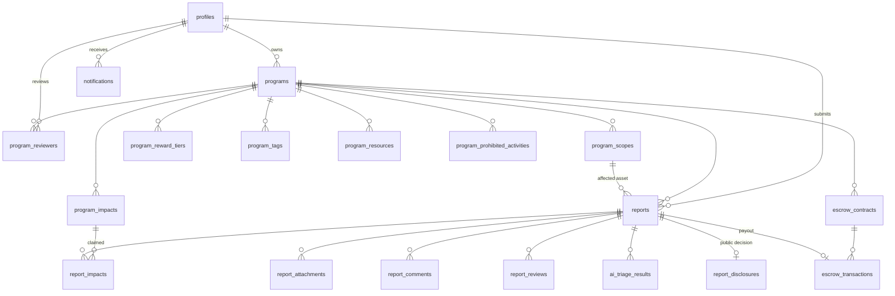
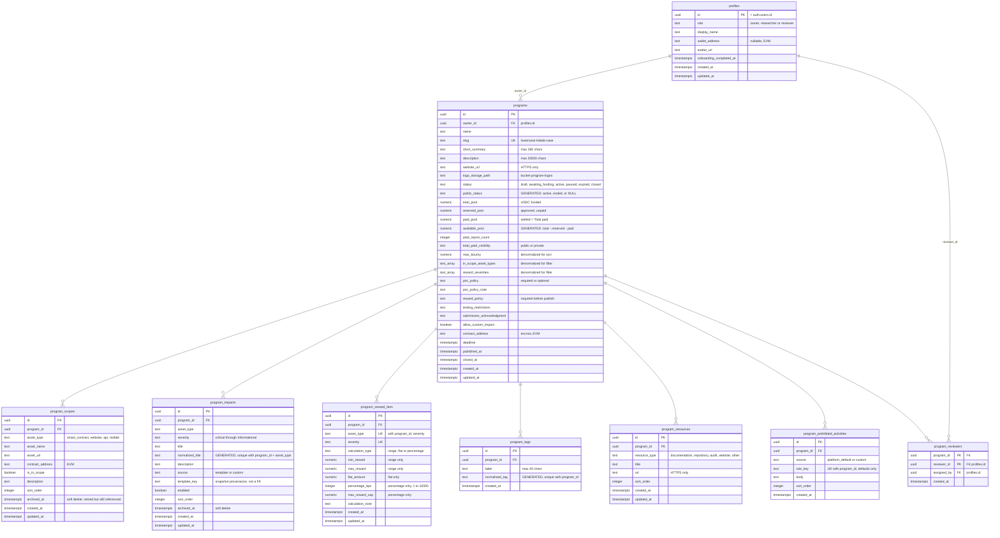
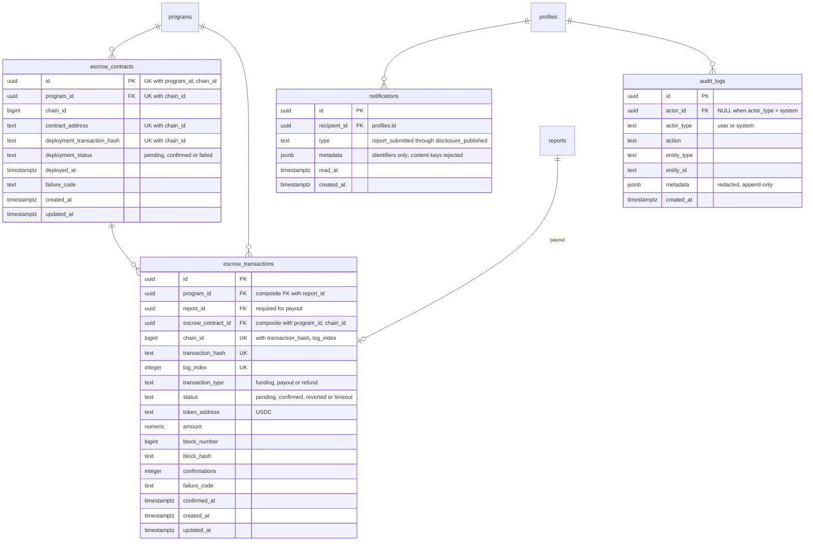
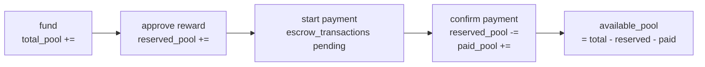

# Database ERD

Sinh từ `packages/database/migrations/`. Khi schema đổi, cập nhật file này cùng migration.

Quy ước: `PK` khóa chính · `FK` khóa ngoại · `UK` unique. Generated column và soft-delete
được ghi trong phần chú thích của từng cột (mermaid chỉ hiểu ba key trên). Kiểu được rút gọn
(`numeric` = `numeric(30,6)` cho tiền, `timestamptz` = `timestamp with time zone`).

---

## 1. Tổng quan quan hệ

Bốn cụm: **Program** (cấu hình bounty) → **Report** (nội dung private) → **Escrow**
(tiền on-chain) → **Settlement/Disclosure** (kết quả).

---

## 2. Program cluster

**Điểm cần nhớ**

- `public_status` là ranh giới công khai duy nhất: `active` → `active`, `expired`/`closed` →
  `ended`, còn lại `NULL` (không bao giờ xuất hiện trong listing public).
- `available_pool` là generated column, kèm CHECK `total_pool >= reserved_pool + paid_pool`.
  Role `authenticated` không có quyền UPDATE lên 3 cột pool — chỉ SECURITY DEFINER RPC.
- `max_bounty`, `in_scope_asset_types`, `reward_severities` được denormalize để bounty table
  sort/filter không phải join child table; refresh bởi `refresh_program_projection()`.
- Reward tier unique theo `(program_id, asset_type, severity)`, không phải chỉ severity. Unique
  index là partial (`where archived_at is null`): tier đã từng định giá một reward được approve
  sẽ bị archive thay vì xoá, và severity đó vẫn thêm lại được sau này.
- Tier `percentage` không phải guidance text. Reviewer cung cấp `calculationBasisAmount`; server
  tính `min(basis × percentage_bps / 10000, max_reward_cap)` và snapshot toàn bộ input vào
  `report_reviews.metadata`.
- Scope, impact và reward tier chỉ nhận `smart_contract` và `website` ở MVP. `api` và `mobile`
  vẫn nằm trong CHECK để mở rộng sau, nhưng write schema của API từ chối chúng.

---

## 3. Report cluster

```mermaid
erDiagram
    reports {
        uuid id PK "UK with program_id"
        uuid program_id FK
        uuid researcher_id FK "profiles.id"
        uuid affected_scope_id FK "composite FK with program_id"
        text title "max 300 chars"
        text description "max 50000 chars"
        text reproduction_steps "required when poc_policy = required"
        text secret_gist_url "optional HTTPS pointer, never replaces the PoC"
        text proposed_severity "researcher assessment"
        boolean severity_mismatch_acknowledged "audit signal, never the final severity"
        text final_severity "reviewer decision"
        text status "draft through paid"
        text content_hash "SHA-256 over the whole submitted payload"
        numeric approved_reward
        timestamptz reward_approved_at
        timestamptz submitted_at
        timestamptz paid_at
        timestamptz created_at
        timestamptz updated_at
    }

    report_impacts {
        uuid id PK
        uuid report_id FK "composite FK with program_id"
        uuid program_id FK
        uuid program_impact_id FK "NULL for custom"
        text source "program or custom"
        text custom_title "custom only"
        text impact_title_snapshot "frozen at submit"
        text impact_severity_snapshot "NULL for custom"
        text asset_type_snapshot "must match the scope"
        timestamptz created_at
    }

    report_attachments {
        uuid id PK
        uuid report_id FK
        uuid uploader_id FK "profiles.id"
        text storage_bucket "UK with storage_path"
        text storage_path "never a URL"
        text original_filename
        text mime_type "seven allowed types"
        bigint size_bytes "max 10 MB"
        text checksum_sha256
        text upload_status "pending, uploaded or failed"
        timestamptz uploaded_at
        timestamptz created_at
    }

    report_comments {
        uuid id PK
        uuid report_id FK
        uuid author_id FK "profiles.id"
        text body
        timestamptz deleted_at "soft delete"
        timestamptz created_at
        timestamptz updated_at
    }

    report_reviews {
        uuid id PK
        uuid report_id FK
        uuid reviewer_id FK "profiles.id"
        text action "triage, request_information, resubmit, reject, mark_duplicate, validate, approve_reward, start_payment, confirm_payment"
        text from_status
        text to_status
        text reason "required for reject / info / duplicate"
        jsonb metadata "safe transition data only"
        timestamptz created_at
    }

    ai_triage_results {
        uuid id PK
        uuid report_id FK
        text provider
        text model
        integer schema_version
        jsonb result "NULL on failure"
        numeric confidence "0 to 1"
        text error_code
        text error_message
        timestamptz created_at
    }

    report_disclosures {
        uuid id PK
        uuid report_id FK "UK, composite with program_id"
        uuid program_id FK
        text decision "keep_private, publish_summary or publish_full"
        uuid decided_by FK "profiles.id"
        timestamptz decided_at
        text public_title "owner-authored"
        text public_summary "owner-authored"
        text public_content "publish_full only"
        text public_severity
        timestamptz published_at
        timestamptz created_at
        timestamptz updated_at
    }

    reports ||--o{ report_impacts : ""
    reports ||--o{ report_attachments : ""
    reports ||--o{ report_comments : ""
    reports ||--o{ report_reviews : ""
    reports ||--o{ ai_triage_results : ""
    reports ||--o| report_disclosures : ""
```

**Điểm cần nhớ**

- Không còn cột `reports.impact` free text. Một report có ≥1 dòng `report_impacts`, và
  composite FK `(program_impact_id, program_id, asset_type_snapshot)` →
  `program_impacts(id, program_id, asset_type)` chứng minh **ngay trong database** rằng impact
  được chọn thuộc đúng program và khớp asset type của affected scope.
- Snapshot title/severity/asset-type để owner sửa catalog về sau không đổi nội dung lịch sử của
  report đã submit.
- `report_attachments` chỉ lưu bucket + object path, không bao giờ lưu URL. Row `pending` nghĩa
  là file chưa lên — không được liệt kê hay cho tải.
- `report_disclosures` **tách riêng** khỏi `reports` để public query không bao giờ phải join vào
  bảng chứa nội dung private.
- `status = 'draft'` không tồn tại server-side; draft chỉ nằm trong `localStorage`.
- `content_hash` phủ cả impact selection, `secret_gist_url` và `severity_mismatch_acknowledged`
  — hash chỉ phủ phần prose sẽ cho phép đổi nội dung đã khai mà digest không đổi.
- `submitted_at` là lần submit **đầu tiên** và không bị reset khi resubmit sau
  `needs_information`. `program_median_resolution_seconds()` đo từ cột này tới review đầu tiên
  chuyển report sang `rejected`/`duplicate`/`validated`; settlement không tính.

---

## 4. Escrow & platform cluster

**Điểm cần nhớ**

- Enum của `escrow_transactions` khớp `ESCROW_TRANSACTION_TYPES` / `ESCROW_TRANSACTION_STATUSES`
  trong `packages/domain`; `verify_schema.sql` có assertion chống drift.
- Unique partial index trên `report_id where transaction_type = 'payout' and status = 'confirmed'`
  đảm bảo một report chỉ settle đúng một lần.
- `notifications.metadata` và `audit_logs.metadata` bị CHECK đệ quy từ chối mọi key trông giống
  nội dung report hoặc credential.
- `audit_logs` append-only bằng trigger (UPDATE/DELETE raise `55000`).

---

## 5. Vòng đời tiền

Reserve tại thời điểm approve là thứ ngăn hai report cùng được duyệt trọn số dư. Toàn bộ 4 bước
đều nằm trong SECURITY DEFINER RPC, lock program row, và ghi `report_reviews` + `notifications`
trong cùng transaction.
