# Create Program — Owner flow for Figma

## 1. Mục tiêu

Tài liệu này định nghĩa user flow để **Program owner tạo một bug bounty program mới** trong BountyEscrow.

Flow bắt đầu từ Owner workspace tại `/owner/programs`, kết thúc khi API tạo thành công một program ở trạng thái `draft` và điều hướng bằng `replace` tới `/owner/programs/:id/edit`.

Flow mô tả hành trình liên tục từ cấu hình program tới funding escrow gồm:

- Overview.
- Scope.
- Impact catalog theo asset type.
- Reward tiers và reward calculation theo asset type.
- Program rules, PoC requirement và disclosure policy.
- Review và lưu draft.
- Deploy escrow contract.
- Fund USDC và xác nhận funding thành công.

Publish program là hành động kế tiếp sau flow này, không được gộp vào thao tác tạo draft hoặc fund reward.

## 2. Nguồn sự thật hiện tại

### Routes

| Mục đích | Route |
| --- | --- |
| Danh sách program của owner | `/owner/programs` |
| Tạo program | `/owner/programs/new` |
| Edit draft sau khi tạo | `/owner/programs/:id/edit` |

### API

```text
POST /api/programs
```

Request hiện tại được validate bằng `createProgramRequestSchema`. Schema hiện tại mới hỗ trợ overview, scopes và reward range cơ bản; phần **Target data contract** trong tài liệu này là requirement cho migration/API revision kế tiếp và có độ ưu tiên cao hơn schema hiện hành khi hai bên khác nhau.

Sau khi tạo thành công:

```text
invalidate programs query
cache program response
router.replace(/owner/programs/:id/edit)
```

### Quyền truy cập

- Chỉ account type `owner` được truy cập flow.
- Researcher hoặc account type khác mở deep link phải tới safe forbidden screen, không render form owner trước khi role/profile được xác nhận.
- Khi session hoặc profile đang loading, hiển thị full-page loading; không flash protected content.

## 3. Target data contract

### Program overview

| Field | Bắt buộc | Validation |
| --- | --- | --- |
| Name | Có | Trimmed, 1–200 ký tự |
| Slug | Có khi create | 1–120 ký tự, lowercase kebab-case: `^[a-z0-9]+(?:-[a-z0-9]+)*$` |
| Short summary | Có | Trimmed, 1–280 ký tự; dùng trong program card/header |
| Description | Có | Trimmed, 1–20,000 ký tự; rich long-form overview |
| Official website | Có | HTTPS URL hợp lệ |
| Logo asset | Không | Private draft upload; PNG/JPEG/WebP/SVG, tối đa 2 MB |
| Tags | Có | 1–10 giá trị normalized, mỗi tag tối đa 40 ký tự |
| Deadline | Không | ISO date-time khi có giá trị |

Slug có thể được gợi ý từ Name nhưng phải cho phép owner chỉnh sửa trước khi lưu.

`liveSince`, `lastUpdated`, `maximumBounty`, `totalPaid`, `paidReportCount`, `medianResolutionTime` và `totalAssetsInScope` là derived values. Owner không nhập trực tiếp các field này.

### Định nghĩa canonical của `resolved`

Trong product này, một report được xem là **resolved for review purposes** tại thời điểm có
quyết định review đầu tiên đưa report tới một trong ba trạng thái:

- `rejected`: report bị từ chối;
- `duplicate`: report được xác định là trùng;
- `validated`: lỗ hổng được xác nhận hợp lệ.

`resolvedAt` là `created_at` của bản ghi `report_reviews` đầu tiên có `to_status` thuộc
`rejected | duplicate | validated`. Các trạng thái `reward_approved`, `payment_pending` và
`paid` là settlement sau quyết định; chúng không thay đổi `resolvedAt`.

`medianResolutionSeconds` là median của:

```text
resolvedAt - submitted_at
```

trên các report của program đã có `resolvedAt`. Metric trả `null` nếu chưa có report nào được
resolved. Thời gian ở `triaged`, `needs_information` và các vòng researcher bổ sung/resubmit vẫn
được tính vì `submitted_at` ban đầu không reset. Thời gian chờ approve reward hoặc payout không
được tính.

Label UI: `Median resolution time`. Tooltip bắt buộc:

```text
Median time from initial submission to the first validated, rejected, or duplicate decision.
Reward approval and payment time are not included.
```

Trong flow và Figma, từ `resolved` nếu không có qualifier luôn mang nghĩa review-resolution ở
trên, không có nghĩa là `paid`.

### Program resource

Program có thể có 0–20 resource links.

| Field | Bắt buộc | Validation |
| --- | --- | --- |
| Resource type | Có | `documentation`, `repository`, `audit`, `website`, `other` |
| Title | Có | Trimmed, 1–120 ký tự |
| URL | Có | HTTPS URL hợp lệ |
| Sort order | Có | Integer không âm |

### Scope item

Mỗi program phải có từ 1 đến 50 scope items.

| Field | Bắt buộc | Validation |
| --- | --- | --- |
| Asset type | Có | MVP UI nhận `smart_contract` hoặc `website` |
| Asset name | Có | Trimmed, tối đa 200 ký tự |
| Asset URL | Không | URL hợp lệ |
| Contract address | Không | EVM address hợp lệ |
| Scope status | Có | In scope hoặc Out of scope; mặc định In scope |
| Description | Không | Trimmed, tối đa 2,000 ký tự |

UI phải dùng structured fields. Không hiển thị JSON textarea cho người dùng cuối.

Domain enum hiện còn `api` và `mobile` để mở rộng sau MVP, nhưng Create Program/Submit Bug hiện không được render hai type này. API target phải reject type chưa được product enable thay vì âm thầm tạo asset mà UI không quản lý được.

### Impact definition

Impact catalog là dữ liệu owner cấu hình để researcher chọn trong Submit Bug. Mỗi asset type có in-scope asset phải có ít nhất một enabled impact.

| Field | Bắt buộc | Validation |
| --- | --- | --- |
| Asset type | Có | Thuộc `ASSET_TYPES` và phải tồn tại trong scope của program |
| Severity | Có | `critical`, `high`, `medium`, `low`, `informational` |
| Title | Có | Trimmed, 1–300 ký tự |
| Description | Không | Trimmed, tối đa 2,000 ký tự |
| Enabled | Có | Boolean; mặc định `true` |
| Sort order | Có | Integer không âm |

- Owner có thể dùng impact template hoặc thêm custom impact.
- Không cho phép duplicate normalized title trong cùng `program + asset type`.
- Researcher có thể chọn một hoặc nhiều impact phù hợp với asset type của affected scope.
- Proposed severity của researcher vẫn là đánh giá riêng; UI cảnh báo nếu thấp hơn severity cao nhất của impact đã chọn. Final severity do reviewer quyết định.

### Reward tier

Mỗi asset type có in-scope asset phải có ít nhất 1 reward tier. Tier là duy nhất theo `program + asset type + severity`, không phải chỉ theo severity toàn program.

| Field | Bắt buộc | Validation |
| --- | --- | --- |
| Asset type | Có | Thuộc asset type đang được dùng trong scope |
| Severity | Có | Một severity chỉ xuất hiện một lần trong cùng asset type |
| Calculation type | Có | `range`, `flat` hoặc `percentage` |
| Minimum reward | Với `range` | Monetary amount không âm |
| Maximum reward | Với `range` | Không nhỏ hơn minimum reward |
| Flat amount | Với `flat` | Monetary amount lớn hơn 0 |
| Percentage BPS | Với `percentage` | 1–10,000 basis points |
| Maximum reward cap | Với `percentage` | Monetary amount lớn hơn 0 |
| Calculation note | Không | Trimmed, tối đa 2,000 ký tự |

Đơn vị hiển thị là `USDC`. Network `Arc` và payout token `USDC` là platform-fixed trong MVP, owner không chọn trong form.

Với tier `percentage`, reviewer phải cung cấp verified `calculationBasisAmount` khi approve reward. Backend tính amount từ basis + percentage, áp dụng cap và lưu snapshot của basis, percentage, cap và computed amount trong review/payment metadata; percentage không chỉ là guidance text.

### Program rules and policies

| Field | Bắt buộc | Validation / behavior |
| --- | --- | --- |
| PoC policy | Có | `required` hoặc `optional`; mặc định `required`; global toàn program trong MVP |
| PoC policy note | Không | Trimmed, tối đa 2,000 ký tự |
| Reward/eligibility policy | Có | Markdown, 1–20,000 ký tự |
| Prohibited activities | Có | Platform defaults luôn tồn tại; owner có thể thêm 0–20 rules |
| Testing restrictions | Không | Markdown, tối đa 10,000 ký tự |
| Custom submission acknowledgment | Không | Trimmed, tối đa 1,000 ký tự |
| Allow custom impact | Có | Boolean; mặc định `true` |

Platform defaults gồm tối thiểu: không social engineering, không DoS, không automated high-volume traffic, không test mainnet/public deployment gây thiệt hại và không public unpatched vulnerability.

### Known issues and public disclosure

- Không có field `Known issues` trong Create Program.
- Report content luôn private mặc định, kể cả khi program active hoặc report đã resolved.
- Khi program `expired` hoặc `closed`, owner có thể review từng resolved report và chọn `Keep private`, `Publish summary` hoặc `Publish full disclosure`.
- Chỉ disclosure đã được owner xác nhận mới xuất hiện trong Known Issues/Public disclosures của Program Detail.
- KYC không tồn tại trong product và không tạo field/table/config liên quan KYC.

### Platform-owned data, không thuộc Create Program

- Researcher submission quota/level.
- Spam/quality warning.
- Researcher payout wallet.
- Platform-wide acknowledgments.
- Metrics như total paid và median resolution time.

Các dữ liệu này không được đặt trong `programs` hoặc nested create payload.

### Server-created values

- `status = draft`.
- `totalPool = 0`.
- `remainingPool = 0`.
- Chưa có contract address.
- Program chưa public cho researcher cho đến khi hoàn thành các flow deploy, fund và publish.

### Database mapping requirement

Target normalized storage tối thiểu:

| Table/entity | Mục đích / constraint chính |
| --- | --- |
| `programs` | Identity, summary, overview, website, logo reference, deadline và policies cấp program |
| `program_tags` | Unique `(program_id, normalized_tag)` |
| `program_resources` | Resource type/title/url/sort order |
| `program_scopes` | Structured eligible/excluded assets |
| `program_impacts` | Impact catalog theo asset type và severity |
| `program_reward_tiers` | Unique `(program_id, asset_type, severity)`; calculation-type checks |
| `program_prohibited_activities` | Default/custom rule snapshots và sort order |
| `report_impacts` | Many-to-many giữa report và selected program impacts |
| `report_disclosures` | Owner decision, visibility level, public summary/content và published timestamp |

Migration không được biến report content thành public mặc định. `report_disclosures` phải tách khỏi private `reports` để public query không vô tình select nội dung nhạy cảm.

Child records đã được report/review tham chiếu phải giữ stable ID. Update program dùng upsert + soft-disable/versioning; không delete-and-recreate scope, impact hoặc reward rows đã có lịch sử. Program `expired` và `closed` vẫn có public read model cho Program Detail/disclosures, trong khi private report tables tiếp tục participant-only.

## 4. Nguyên tắc UX

1. Dùng stepper 7 bước để thể hiện trọn hành trình: Overview, Scope, Impacts, Rewards, Rules, Review và Fund rewards.
2. Giữ dữ liệu của các bước trước khi Back/Next.
3. Validate tại field khi blur và validate toàn bước khi nhấn Continue.
4. Không submit API trước bước Review.
5. Trong lúc save, khóa Back và primary action; không optimistic redirect.
6. Nếu network/API lỗi, giữ nguyên toàn bộ form data để retry cùng payload.
7. Chỉ redirect sau khi server trả về program hợp lệ.
8. Leaving flow với thay đổi chưa lưu phải có confirmation dialog.
9. Program mới luôn được trình bày là `Draft`, không dùng copy khiến owner nghĩ program đã live hoặc đã funded.

## 5. Information architecture

### Desktop shell

- Viewport: `1440 × 1200` cho các màn desktop dài trong flow create program.
- Header cao `80px`; sidebar và workspace content cao `1120px` để toàn bộ form/action phía dưới luôn nằm trong frame.
- Header dùng Owner workspace navigation hiện có.
- Sidebar active item: `Programs`.
- Main content max width: `1120px`.
- Wizard gồm:
  - Breadcrumb: `Programs / Create program`.
  - Page title và `Draft` badge.
  - Horizontal stepper có node tròn, connector và trạng thái completed/current/upcoming.
  - Form card.
  - Sticky action footer bên trong form card.

### Step labels

1. Overview
2. Scope
3. Impacts
4. Rewards
5. Rules
6. Review
7. Fund rewards

Quy tắc hiển thị stepper:

- Completed: node mint với semantic Lucide icon và connector mint.
- Current: node brand violet với focus halo nhẹ.
- Upcoming: node surface-raised, border và text disabled.
- Label nằm dưới node, không dùng Tabs component cho wizard này.
- Giữ tối thiểu `24px` từ subtitle tới stepper và `32px` từ đáy stepper tới content card.
- Không dùng số thứ tự trong node. Dùng Lucide icon theo semantic step: `file-text`, `crosshair`, `shield-alert`, `coins`, `scroll-text`, `clipboard-check`, `wallet`.

## 6. User flow tổng quát

```mermaid
flowchart LR
  A[OWNER-01 Programs] -->|Create program| B[CP-01 Overview]
  B -->|Valid| C[CP-02 Scope]
  B -->|Invalid| BV[CP-01V Overview validation]
  C -->|At least 1 valid scope| CI[CP-02I Impacts]
  C -->|Invalid| CV[CP-02V Scope validation]
  CI -->|Impact coverage valid| D[CP-03 Rewards]
  CI -->|Invalid| CIV[CP-02IV Impact validation]
  D -->|Reward coverage valid| DR[CP-03R Rules]
  D -->|Invalid| DV[CP-03V Reward validation]
  DR -->|Policies valid| E[CP-04 Review]
  DR -->|Invalid| DRV[CP-03RV Rules validation]
  E -->|Save draft| F[CP-05 Saving]
  F -->|201 success| G[CP-06 Draft created / edit]
  G -->|Deploy escrow| J[CP-10 Deploying escrow]
  J -->|Contract ready| K[CP-11 Fund rewards]
  K -->|Confirm transfer| L[CP-12 Funding pending]
  L -->|USDC funded| M[CP-13 Rewards funded]
  F -->|API or network error| H[CP-07 Save error]
  H -->|Try again, same payload| F
  B -->|Cancel with dirty form| I[CP-08 Discard dialog]
  C -->|Cancel with dirty form| I
  CI -->|Cancel with dirty form| I
  D -->|Cancel with dirty form| I
  DR -->|Cancel with dirty form| I
  E -->|Cancel with dirty form| I
  I -->|Discard| A
  I -->|Keep editing| previous[Return to current step]
```



## 7. Screen inventory

| ID | Screen | Route/state | Mục đích |
| --- | --- | --- | --- |
| CP-00 | Owner programs entry | `/owner/programs` | CTA mở flow |
| CP-01 | Overview | `/owner/programs/new`, step 1 | Nhập thông tin tổng quan |
| CP-01V | Overview validation | Client state | Hiển thị field errors |
| CP-02 | Scope | Step 2 | Quản lý scope items |
| CP-02A | Scope editor | Dialog/drawer state | Add hoặc edit một scope item |
| CP-02V | Scope validation | Client state | Scope thiếu hoặc field không hợp lệ |
| CP-02I | Impacts | Step 3 | Cấu hình impact catalog theo asset type |
| CP-02IV | Impact validation | Client state | Thiếu coverage hoặc duplicate impact |
| CP-03 | Rewards | Step 4 | Quản lý reward tiers theo asset type |
| CP-03V | Reward validation | Client state | Duplicate severity hoặc reward range sai |
| CP-03R | Rules | Step 5 | Cấu hình PoC, eligibility và prohibited activities |
| CP-03RV | Rules validation | Client state | Policy bắt buộc thiếu hoặc không hợp lệ |
| CP-04 | Review | Step 6 | Kiểm tra payload trước khi submit |
| CP-05 | Saving | Mutation pending | Chờ server xác nhận |
| CP-06 | Draft created | `/owner/programs/:id/edit` | Xác nhận draft và next actions |
| CP-07 | Save error | Mutation error | Retry giữ nguyên payload |
| CP-08 | Discard changes | Confirmation dialog | Ngăn mất dữ liệu ngoài ý muốn |
| CP-09 | Wrong role | Safe forbidden | Bảo vệ owner-only route |
| CP-10 | Deploying escrow | Deploy mutation pending | Tạo escrow contract cho program đã có ID |
| CP-11 | Fund rewards | Fund form | Chọn số USDC chuyển vào escrow |
| CP-12 | Funding pending | Fund mutation pending | Chờ giao dịch funding được xác nhận |
| CP-13 | Rewards funded | Funding success | Xác nhận pool và chuẩn bị publish |

## 8. Chi tiết màn hình

### CP-00 — Owner programs entry

- Giữ Owner programs landing đã có.
- Primary CTA: `Create program`.
- CTA điều hướng tới `/owner/programs/new`.
- Nếu owner chưa có program, empty state dùng heading `Create your first program` và cùng CTA.

### CP-01 — Overview

Eyebrow:

```text
NEW BOUNTY PROGRAM
```

Heading:

```text
Create a program
```

Supporting copy:

```text
Start with the public identity and timeline for your bounty. Your program remains a private draft until it is funded and published.
```

Fields:

1. `Program logo` — optional upload.
   - PNG, JPEG, WebP hoặc SVG; tối đa 2 MB.
   - Preview vuông; alt/accessible name lấy từ program name.
2. `Program name`
   - Placeholder: `e.g. Aegis Protocol`
   - Helper: `Shown to researchers when the program is published.`
3. `Slug`
   - Prefix presentation: `/programs/`
   - Placeholder: `aegis-protocol`
   - Helper: `Lowercase letters, numbers and hyphens only.`
4. `Short summary`
   - Placeholder: `Describe the program in one concise sentence.`
   - Character counter: `0 / 280`.
5. `Official website`
   - Placeholder: `https://aegis.xyz`.
6. `Tags`
   - Combobox/chips; 1–10 tags.
   - Example: `DeFi`, `Solidity`, `DEX`, `Arbitrum`.
7. `Program overview`
   - Textarea.
   - Placeholder: `Describe the product, security goals and what researchers should know.`
   - Character counter: `0 / 20,000`.
8. `Submission deadline` — optional.
   - Helper: `Leave empty for an open-ended program.`
9. `Resources` — optional repeatable rows.
   - Type, title và HTTPS URL.
   - Dùng `Add resource`; delete dùng Lucide `trash-2` icon button.

Actions:

- Secondary: `Cancel`.
- Primary: `Continue to scope`.

### CP-01V — Overview validation

Summary alert:

```text
Review the highlighted fields before continuing.
```

Field errors:

- Name empty: `Enter a program name.`
- Slug invalid: `Use lowercase letters, numbers and single hyphens.`
- Short summary empty/too long: `Add a summary within 280 characters.`
- Website invalid: `Enter a valid HTTPS website.`
- Tags empty: `Add at least one program tag.`
- Description empty: `Describe the program.`
- Resource invalid: `Enter a title and valid HTTPS URL.`
- Deadline invalid/past: `Choose a valid future date or leave it empty.`

Focus chuyển tới field invalid đầu tiên sau khi submit bước.

### CP-02 — Scope

Heading:

```text
Define program scope
```

Supporting copy:

```text
Tell researchers exactly which assets are eligible and which assets are excluded.
```

Content:

- Summary row: số In scope và Out of scope items.
- Filter tabs: `Smart contracts` và `Websites`.
- Tabs chỉ lọc danh sách đang hiển thị; không giới hạn asset type có thể thêm.
- Reusable Scope cards, mỗi card hiển thị:
  - Asset name.
  - URL hoặc shortened contract address.
  - In scope / Out of scope badge.
  - Description preview.
  - `Edit` và overflow action `Remove`.
- Secondary button: `Add scope`.

Empty state:

```text
Add at least one asset researchers can assess.
```

Actions:

- Ghost: `Back`.
- Primary: `Continue to impacts`.

### CP-02A — Scope editor

Desktop dùng modal/dialog rộng khoảng `640px`.

Heading khi create:

```text
Add scope item
```

Fields:

1. `Asset type` — Select.
   - Luôn có cả `Smart contract` và `Website`, không phụ thuộc filter tab đang active phía sau dialog.
2. `Asset name` — Input.
3. `Asset URL` — optional input.
4. `Contract address` — optional input, chỉ nổi bật với contract asset.
5. `Scope status` — Radio group: `In scope`, `Out of scope`.
6. `Description` — optional textarea.

Actions:

- Secondary: `Cancel`.
- Primary: `Add scope` hoặc `Save changes`.

Modal chỉ cập nhật client draft. Không gọi create program API.

Prototype phải có view Smart contracts active, Websites active và trạng thái chọn Website từ dropdown khi Smart contracts vẫn đang active.

### CP-02V — Scope validation

Các error chính:

- Không có scope: `Add at least one scope item.`
- Asset name trống: `Enter an asset name.`
- URL sai: `Enter a valid URL.`
- Contract address sai: `Enter a valid EVM contract address.`
- Vượt 50 items: `A program can contain up to 50 scope items.`

Giữ modal mở nếu lỗi thuộc item đang edit.

### CP-02I — Impacts

Heading:

```text
Define impacts in scope
```

Supporting copy:

```text
Choose the security outcomes researchers can report for each asset type. These options appear directly in Submit Bug.
```

Content:

- Asset type tabs: `Smart contracts`, `Websites` và các type khác khi scope có type đó.
- Tabs lọc impact list; không thay đổi data của tab khác.
- Coverage summary: số enabled impacts và severity coverage cho asset type active.
- Impact rows/cards gồm:
  - Checkbox/toggle enabled.
  - Impact title.
  - Severity badge/dot.
  - Optional guidance preview.
  - Edit và Lucide `trash-2` action với custom impact.
- `Add custom impact` mở dialog gồm Title, Severity và Description.
- `Allow researchers to propose a custom impact` switch; mặc định on.
- Template impacts có thể được chọn nhanh nhưng được lưu thành program-owned snapshot để thay đổi template sau này không âm thầm đổi active program.

Actions:

- Ghost: `Back`.
- Primary: `Continue to rewards`.

### CP-02IV — Impact validation

- Asset type có in-scope asset nhưng không có enabled impact: `Add at least one impact for this asset type.`
- Duplicate normalized title: `This impact is already listed for this asset type.`
- Missing severity: `Choose the severity associated with this impact.`
- Missing title: `Enter an impact title.`
- Tab có lỗi hiển thị error indicator ngoài label để lỗi không bị ẩn.

### CP-03 — Rewards

Heading:

```text
Set reward tiers
```

Supporting copy:

```text
Define USDC rewards for each asset type and severity. Funding happens after the draft is created.
```

Content:

- Asset type tabs chỉ xuất hiện cho type có in-scope asset.
- Coverage summary cho asset type active.

Reward tier row:

- Severity Select.
- Calculation type Select: `Range`, `Flat`, `Percentage with cap`.
- `Range`: Minimum và Maximum reward, suffix `USDC`.
- `Flat`: Flat amount, suffix `USDC`.
- `Percentage with cap`: Percentage và Maximum reward cap.
- Optional calculation note/callout, ví dụ `10% of directly affected funds, capped at 250,000 USDC`.
- Delete action dùng icon button `trash-2` của Lucide; không dùng text `Remove`.
- Severity dot và label được căn giữa bằng Auto Layout với gap `8px`.

Secondary button:

```text
Add reward tier
```

Context callout:

```text
These ranges describe intended rewards. Researchers will only see the program after escrow is funded and the program is published.
```

Actions:

- Ghost: `Back`.
- Primary: `Continue to rules`.

### CP-03V — Reward validation

- Không có tier: `Add at least one reward tier.`
- Asset type thiếu tier: `Add at least one reward tier for this asset type.`
- Duplicate severity: `Each severity can only be used once per asset type.`
- Missing amount: `Enter a valid USDC amount.`
- Maximum thấp hơn minimum: `Maximum reward must not be below minimum reward.`
- Percentage không hợp lệ: `Enter a percentage greater than 0% and no more than 100%.`
- Missing cap: `Enter the maximum USDC reward for this calculation.`

Không tự sửa hoặc tự đổi thứ tự severity của owner.

### CP-03R — Rules

Heading:

```text
Set program rules
```

Supporting copy:

```text
Explain what a valid submission must include and which testing activities are prohibited.
```

Sections:

1. `Proof of Concept`
   - Radio: `Required` hoặc `Optional`; default `Required`.
   - Optional policy note.
2. `Reward and eligibility policy`
   - Markdown-friendly textarea.
   - Nêu calculation, exclusions và primacy rules nếu cần.
3. `Prohibited activities`
   - Platform default rules hiển thị checked + locked.
   - Owner có thể thêm, edit và delete custom rules.
4. `Testing restrictions` — optional markdown textarea.
5. `Custom acknowledgment` — optional concise checkbox copy cho Submit Bug.

Disclosure callout:

```text
Reports stay private by default. After the program ends, you decide whether each resolved report remains private or becomes a public summary/full disclosure.
```

Không có KYC section. Không có Known Issues editor.

Actions:

- Ghost: `Back`.
- Primary: `Review program`.

### CP-03RV — Rules validation

- Missing reward policy: `Describe reward eligibility and exclusions.`
- Empty custom prohibited rule: `Enter a rule or remove this row.`
- Custom acknowledgment too long: `Keep the acknowledgment within 1,000 characters.`

### CP-04 — Review

Heading:

```text
Review your program
```

Status callout:

```text
This creates a private draft. It will not be visible to researchers until escrow is deployed, funded and the program is published.
```

Summary sections:

1. `Program details`
   - Logo, name, slug, summary, website, tags, deadline, overview và resources.
   - Edit link → Step 1.
2. `Scope`
   - Count and compact scope list.
   - Edit link → Step 2.
3. `Impacts`
   - Coverage/count grouped by asset type and severity.
   - Edit link → Step 3.
4. `Reward tiers`
   - Asset type, severity, calculation type và amount/cap.
   - Edit link → Step 4.
5. `Rules`
   - PoC requirement, reward policy preview, prohibited activity count và disclosure policy.
   - Edit link → Step 5.
6. `Next after creating the draft`
   - Deploy escrow.
   - Fund USDC.
   - Publish when ready.

Actions:

- Ghost: `Back`.
- Primary: `Create draft`.

Không dùng label `Publish program` hoặc `Launch program` tại bước này.

### CP-05 — Saving

Heading:

```text
Creating your draft…
```

Body:

```text
We’re validating and saving the program identity, resources, scope, impacts, rewards and rules.
```

Rules:

- Disable Back, Cancel và primary action.
- Primary label: `Creating draft…`.
- Không optimistic redirect.
- Không reset form data.

### CP-06 — Draft created / edit landing

Route:

```text
/owner/programs/:id/edit
```

Success banner:

```text
Draft created
Your program is saved and remains private.
```

Header:

- Program name.
- `Draft` status badge.
- Last saved timestamp.

Readiness checklist:

- Program details — Complete.
- Scope — Complete.
- Impact catalog — Complete.
- Reward tiers — Complete.
- Program rules — Complete.
- Escrow contract — Not deployed.
- Funding — 0 USDC.
- Publishing — Not ready.

Primary next action:

```text
Deploy escrow
```

Secondary actions:

- `Edit program`.
- `Back to programs`.

`Deploy escrow` chuyển sang CP-10. Program phải được tạo thành draft trước vì API deploy và fund đều yêu cầu program ID.

### CP-07 — Save error

Error alert:

```text
The program could not be saved. Check every field or refresh if another editor changed it.
```

Supporting note:

```text
Your draft data is still here. Retrying sends the same program details, resources, scope, impacts, reward tiers and rules.
```

Actions:

- Primary: `Try again`.
- Secondary: `Review program`.

Retry dùng cùng payload và quay lại CP-05.

### CP-08 — Discard changes dialog

Heading:

```text
Discard this program draft?
```

Body:

```text
The program has not been created. Your unsaved details, scope, impacts, rewards and rules will be lost.
```

Actions:

- Destructive: `Discard draft` → `/owner/programs`.
- Secondary: `Keep editing` → đóng dialog và giữ nguyên current step/data.

### CP-09 — Wrong role

Dùng lại `ACCESS-01` pattern:

```text
This workspace isn’t available
Your account does not have Program owner access.
```

Không render form create program phía sau forbidden state.

### CP-10 — Deploying escrow

- Stepper: Overview, Scope, Rewards và Review completed; Fund rewards current.
- Heading: `Preparing program escrow…`.
- Hiển thị program name, network `Arc testnet`, token `USDC` và trạng thái `Deploying contract`.
- Khoá navigation/action trong lúc mutation pending.
- Thành công chuyển tự động tới CP-11.

### CP-11 — Fund rewards

- Heading: `Fund reward pool`.
- Current escrow pool: `0 USDC`.
- Amount input có suffix `USDC`.
- Summary hiển thị network, token, escrow contract và reward coverage.
- Warning copy: `USDC will be transferred to the program escrow. This does not publish the program.`
- Primary: `Fund reward pool`.
- Secondary: `Do this later` về draft edit.

### CP-12 — Funding pending

- Heading: `Funding reward pool…`.
- Hiển thị amount, token, program và escrow address để owner kiểm tra.
- Không optimistic success; khoá nút trong khi chờ API/transaction confirmation.
- Thành công chuyển tới CP-13; lỗi giữ amount để retry.

### CP-13 — Rewards funded

- Success banner: `Rewards funded`.
- Hiển thị funded amount và remaining pool.
- Readiness checklist cập nhật Escrow contract và Funding thành Complete.
- Primary next action: `Publish program`.
- Secondary: `Back to program`.

## 9. Prototype scenarios

1. Owner programs → Create program → Overview → Scope → Impacts → Rewards → Rules → Review → Saving → Draft created → Deploy escrow → Fund rewards → Rewards funded.
2. Overview invalid → field errors → sửa → tiếp tục.
3. Add scope modal → validation error → sửa → scope card được thêm.
4. Asset type thiếu impact → tab error → thêm template/custom impact → tiếp tục.
5. Duplicate severity trong cùng asset type hoặc invalid calculation → reward errors → sửa.
6. Rules thiếu eligibility policy → validation → sửa → Review.
7. API/network error → giữ toàn bộ nested payload → Try again → success.
8. Cancel khi form dirty → Keep editing.
9. Cancel khi form dirty → Discard draft → Owner programs.
10. Researcher deep link `/owner/programs/new` → safe forbidden screen.
11. Program hết hạn/closed → owner chọn disclosure cho resolved report → chỉ approved disclosure xuất hiện trong Known Issues.

## 10. Figma screen placement

- Chỉ sử dụng page `Layouts` hiện có.
- Tạo section mới: `Owner · Create program flow`.
- Không tạo thêm Figma page.
- Đặt section sau các section flow hiện có, tránh overlap.
- Desktop frame dùng width `1440px`; height theo content và tối thiểu `1288px` khi có Header `80px` + workspace `1120px` + Footer `88px`.
- Mỗi frame đặt tên theo screen ID, ví dụ `CP-01 · Overview · Desktop`.
- Error state đặt cạnh screen gốc tương ứng.
- Prototype nối theo scenarios ở mục 9.

## 11. Design-system và shadcn/Tailwind mapping

Ưu tiên dùng instance và semantic Variables trong `BBE Design System`.

| Figma pattern | shadcn/Tailwind mapping |
| --- | --- |
| Primary/Secondary/Ghost action | `Button` variants |
| Program form sections | `Card`, `CardHeader`, `CardContent`, `CardFooter` |
| Name, slug, amount | `Input` |
| Description | `Textarea` |
| Tags | `Combobox` + removable `Badge` |
| Logo | File input/dropzone + image preview |
| Resources/custom rules | Repeatable field rows |
| Asset type, severity | `Select` |
| Impact enable/custom-impact policy | `Checkbox` / `Switch` |
| In/Out scope | `RadioGroup` hoặc segmented control |
| Draft/status | `Badge` |
| Stepper | Semantic list + progress indicator |
| Validation summary | `Alert` destructive |
| Scope editor | `Dialog` desktop |
| Discard changes | `AlertDialog` |
| Impact and reward summary | `Tabs`, `Checkbox`, `Table` |
| Saving | Disabled Button + spinner/progress |

Layout rules:

- Spacing bám scale 4/8/12/16/24/32/48.
- Các action row của form/dialog dùng `padding-top: 12px` để tách primary/secondary buttons khỏi content phía trên.
- Radius ưu tiên `radius-md` hoặc `radius-lg` tương ứng `rounded-lg`/`rounded-xl` sau khi cấu hình Tailwind.
- Không dùng arbitrary color; bind semantic variables `color/bg/*`, `color/text/*`, `color/border/*`, `color/status/*`.
- Form field có label, helper/error độc lập để AI generate ra cấu trúc accessible.
- Layer names dùng semantic English, không dùng `Rectangle 123` hoặc `Group 8`.

## 12. Acceptance criteria

- Flow chỉ cho Program owner.
- Program mới được tạo là Draft, không phải Live.
- Có đủ structured fields cho identity/resources, scopes, impacts, rewards và rules; không dùng JSON textarea trong thiết kế.
- Mỗi asset type có in-scope asset đều có ít nhất một enabled impact và một reward tier trước Review.
- Reward severity không trùng trong cùng asset type; mọi calculation type có constraint phù hợp.
- PoC, reward eligibility, prohibited activities và disclosure policy được review trước khi tạo draft.
- Không có KYC hoặc Known Issues editor trong create flow.
- Known Issues/Public disclosures chỉ lấy từ resolved report sau program end và explicit owner decision.
- Researcher submission quota, wallet và platform warning không nằm trong create payload.
- Saving không optimistic redirect.
- Save error giữ nguyên form data và có same-payload retry.
- Success chuyển tới edit route, cho phép deploy escrow rồi fund reward pool trong cùng user flow.
- Funding chỉ bắt đầu sau khi program draft đã có ID và escrow contract sẵn sàng.
- Funding success thể hiện pool đã funded nhưng program vẫn chưa public cho tới khi Publish.
- Discard dialog bảo vệ dữ liệu chưa lưu.
- Figma dùng Design System hiện tại, dark desktop, semantic layer names và prototype connections.
