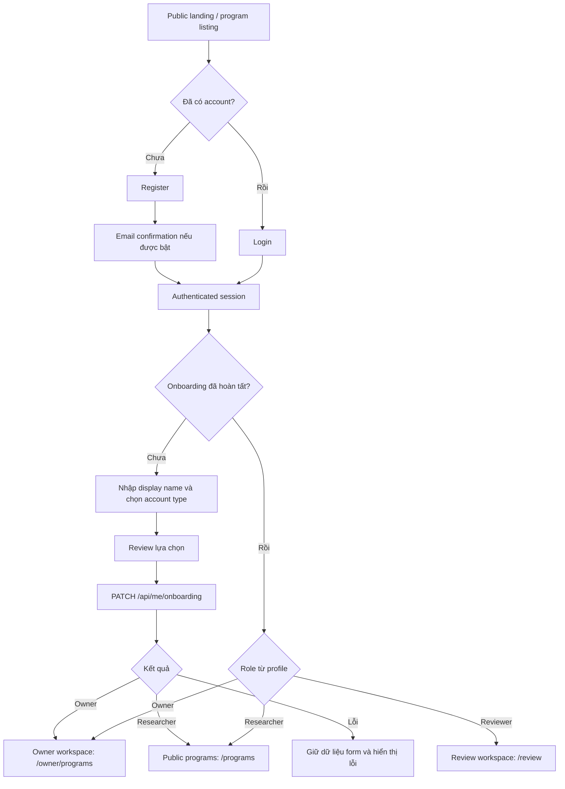
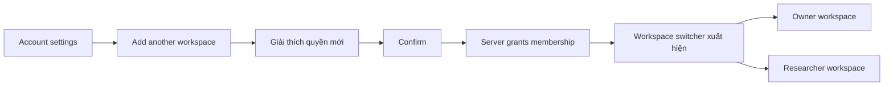

# Onboarding and role selection flow — Figma handoff

## 1. Mục tiêu tài liệu

Tài liệu này là đầu vào cho thread thiết kế Figma của luồng đăng ký, đăng nhập,
onboarding và điều hướng theo vai trò trong Bug Bounty Escrow.

Phạm vi hiện tại chỉ bao gồm **website responsive** chạy trên trình duyệt desktop,
tablet và mobile. Không thiết kế native mobile app, app navigation theo chuẩn
iOS/Android hoặc màn hình dành riêng cho ứng dụng cài đặt.

Thiết kế phải dùng đúng thuật ngữ sản phẩm:

- **Program owner**: cá nhân hoặc tổ chức tạo và quản lý bug bounty program.
- **Security researcher**: người tìm lỗ hổng và gửi vulnerability report.
- **Reviewer**: người được cấp quyền review; không phải vai trò được tự chọn khi
  onboarding.
- Không dùng từ **programmer** như tên role trong UI hoặc dữ liệu. Một programmer
  có thể là program owner, researcher hoặc cả hai tùy cách họ sử dụng sản phẩm.

## 2. Quyết định sản phẩm về đổi vai trò

### 2.1. Hành vi MVP hiện tại

Mỗi account chỉ có một application role chính: `owner`, `researcher` hoặc
`reviewer`.

- Người dùng chỉ được tự chọn `owner` hoặc `researcher` trong lần onboarding đầu
  tiên.
- Sau khi onboarding hoàn tất, người dùng **không được tự đổi trực tiếp** từ
  `owner` sang `researcher` hoặc ngược lại.
- Gửi lại đúng role và display name cũ là thao tác retry hợp lệ.
- Gửi role/display name khác sau khi hoàn tất sẽ bị backend từ chối với conflict.
- `reviewer` không xuất hiện trong màn hình chọn account type và không thể
  self-assign.

Lý do không cho ghi đè role:

- Tránh thay đổi đột ngột quyền truy cập vào program hoặc report đang sở hữu.
- Tránh dùng role switching để vượt qua authorization/RLS.
- Giữ audit trail và ownership của dữ liệu ổn định.
- Phù hợp với API và database hiện tại đang lưu một role duy nhất.

Trong MVP, màn hình Profile/Settings chỉ hiển thị account type ở trạng thái
read-only. Không thiết kế dropdown đổi role.

### 2.2. Hướng mở rộng được khuyến nghị

Về lâu dài, một người có thể vừa vận hành program vừa nghiên cứu bảo mật. Khi
đó không nên “đổi role” bằng cách xóa role cũ. Nên:

1. Cho phép account **thêm workspace/capability thứ hai**.
2. Lưu tập role/membership được cấp, ví dụ `owner` và `researcher`.
3. Cho người dùng chuyển **active workspace** trong UI.
4. Việc chuyển workspace chỉ đổi navigation và landing page, không tự cấp quyền.
5. Dữ liệu, ownership và audit history của cả hai vai trò vẫn được giữ nguyên.

Figma nên thiết kế một concept riêng cho hướng mở rộng này, gắn nhãn
**Future / not in MVP**. Không đặt workspace switcher trong prototype MVP có thể
click được.

## 3. Quy tắc hệ thống mà thiết kế phải phản ánh

| Trạng thái user | Trang được phép vào | Kết quả mặc định |
| --- | --- | --- |
| Chưa đăng nhập | Public program pages, login, register | Không thấy dashboard riêng |
| Đã xác thực, chưa onboarding | Onboarding | Mọi protected route redirect về `/onboarding` |
| Owner đã onboarding | Owner workspace và public pages | Redirect về `/owner/programs` |
| Researcher đã onboarding | Researcher workspace và public pages | Redirect về `/programs` hoặc `/reports` tùy entry point |
| Reviewer được cấp quyền | Review workspace và public pages | Redirect về `/review` |
| Sai role cho protected route | Không hiển thị dữ liệu trang | Hiển thị forbidden state hoặc redirect an toàn |

Các nguyên tắc bắt buộc:

- Backend và database là nguồn sự thật về role; frontend không suy ra role từ
  email, ví, URL hoặc giá trị trong form.
- Không dùng role do client tự gửi để quyết định authorization ngoài request
  onboarding hợp lệ.
- Không hiển thị nội dung protected trong lúc đang tải session/profile.
- `returnTo` chỉ được chấp nhận nếu là đường dẫn nội bộ an toàn.
- Không làm lộ sự tồn tại của resource mà user không có quyền xem.

## 4. Happy path tổng thể



## 5. Screen inventory cho MVP

Thiết kế desktop và responsive mobile web cho các frame sau.

| ID | Screen | Route gợi ý | Mục đích |
| --- | --- | --- | --- |
| AUTH-01 | Public entry | `/programs` | Entry point trước đăng ký |
| AUTH-02 | Register | `/register` | Tạo account bằng email/password |
| AUTH-03 | Check email | `/register/check-email` | Chờ xác nhận email nếu Supabase yêu cầu |
| AUTH-04 | Login | `/login` | Đăng nhập và tiếp tục hành trình trước đó |
| ONB-01 | Onboarding intro | `/onboarding` | Giải thích lựa chọn account type |
| ONB-02 | Select account type | `/onboarding` | Chọn owner hoặc researcher |
| ONB-03 | Profile details | `/onboarding` | Nhập display name |
| ONB-04 | Confirm selection | `/onboarding` | Review trước khi lưu lựa chọn một lần |
| ONB-05 | Submitting | `/onboarding` | Ngăn double submit và báo đang xử lý |
| ONB-06 | Conflict/error | `/onboarding` | Xử lý retry, conflict hoặc lỗi mạng |
| OWNER-01 | Owner landing | `/owner/programs` | Điểm đến sau onboarding owner |
| RES-01 | Researcher landing | `/programs` | Điểm đến sau onboarding researcher |
| ACCESS-01 | Forbidden | N/A | Wrong-role protected route |
| PROFILE-01 | Account settings | Route tương lai | Hiển thị role read-only trong MVP |

Nếu prototype dùng multi-step onboarding, giữ toàn bộ dữ liệu đã nhập khi back.
Nếu dùng single-page onboarding, vẫn phải có bước xác nhận rõ ràng trước khi lưu.

## 6. Chi tiết từng flow

### 6.1. Register

**Entry points**

- CTA “Create account” từ public header.
- CTA “Submit a report” khi anonymous.
- CTA “Create a program” khi anonymous.

**Fields**

- Email.
- Password.
- Confirm password nếu design system yêu cầu.
- Checkbox Terms/Privacy nếu phạm vi sản phẩm yêu cầu.

**Actions**

- Primary: `Create account`.
- Secondary: `Already have an account? Sign in`.

**States**

- Default.
- Field validation.
- Email đã tồn tại.
- Password không đạt yêu cầu.
- Submitting.
- Network/server error.
- Check-email success.

Không hỏi role ngay trong form đăng ký. Role được chọn sau khi identity/session đã
được tạo để onboarding được ghi nhận có audit.

### 6.2. Login

**Fields**

- Email.
- Password.

**Actions**

- Primary: `Sign in`.
- Secondary: `Create account`.
- Có thể để placeholder cho `Forgot password`, nhưng đánh dấu ngoài phạm vi MVP
  nếu chưa có task triển khai.

**Routing after login**

1. Fetch `GET /api/me`.
2. Nếu `onboardingComplete = false`, tới `/onboarding`.
3. Nếu đã hoàn tất, route theo role thật từ profile.
4. Nếu có `returnTo` nội bộ và role có quyền, tiếp tục tới route đó.
5. Nếu không có quyền với `returnTo`, đưa tới landing page của role và không flash
   nội dung forbidden.

### 6.3. Onboarding intro

Mục tiêu là nói rõ lựa chọn này ảnh hưởng đến workspace và không thể tự đổi trong
MVP.

Suggested copy:

- Eyebrow: `One last step`
- Heading: `How will you participate?`
- Body: `Choose the workspace that matches what you want to do first. Your
  account type cannot be changed by yourself after setup.`

Không nhắc blockchain, wallet hoặc reviewer tại intro nếu chưa cần thiết.

### 6.4. Account type selection

Hiển thị hai selection cards, không dùng dropdown cho thiết kế đích.

#### Card A — Security researcher

- Title: `Security researcher`
- Description: `Find vulnerabilities, submit private reports, respond to review
  requests, and track rewards.`
- Icon gợi ý: shield/search.
- Value gửi API: `researcher`.

#### Card B — Program owner

- Title: `Program owner`
- Description: `Publish bounty programs, define scopes and rewards, review
  reports, and fund payouts.`
- Icon gợi ý: briefcase/program.
- Value gửi API: `owner`.

Footer note:

`Reviewer access is assigned through a trusted workflow and cannot be selected
here.`

Interaction:

- Toàn bộ card click được.
- Selected state có border, background và check icon; không chỉ khác màu.
- Keyboard dùng Tab + Space/Enter; semantics tương đương radio group.
- Không chọn sẵn role trong thiết kế đích. Người dùng phải chủ động chọn để giảm
  nhầm lẫn.

### 6.5. Profile details

Field bắt buộc:

- `Display name`
- 1–120 ký tự sau khi trim.

Helper text:

`This name is shown in your workspace. You can update the display name later.`

Không yêu cầu wallet trong onboarding. Wallet connection là flow riêng khi
funding/payout cần tới.

### 6.6. Confirm selection

Hiển thị:

- Account type đã chọn.
- Display name.
- Tóm tắt 2–3 khả năng chính của workspace.
- Warning nhẹ: account type không thể tự đổi trong MVP.

Actions:

- Primary: `Complete setup`.
- Secondary: `Back`.

Suggested warning:

`You can edit your display name later. To use a different account type in the
MVP, contact support; do not create or overwrite permissions from this screen.`

### 6.7. Submit onboarding

Request:

```http
PATCH /api/me/onboarding
Authorization: Bearer <access-token>
Content-Type: application/json

{
  "role": "owner | researcher",
  "displayName": "..."
}
```

Loading behavior:

- Disable primary and back actions.
- Button copy: `Setting up your workspace…`
- Không optimistic redirect trước khi nhận profile mới từ API.
- Khi thành công, cập nhật cached current user rồi `replace` route; không để Back
  quay lại onboarding.

Success routing:

- `owner` → `/owner/programs`.
- `researcher` → `/programs`.

### 6.8. Error and recovery

| Case | UI behavior | Suggested message/action |
| --- | --- | --- |
| Validation error | Focus field/card đầu tiên lỗi | `Choose an account type and enter a display name.` |
| Session hết hạn | Không submit lại vô hạn | `Your session expired. Sign in again to continue.` |
| Network error | Giữ nguyên form | `We couldn't save your profile. Try again.` |
| Same-data retry | Xem như success | Route theo role trả về từ API |
| Conflict vì onboarding đã hoàn tất với dữ liệu khác | Không cho ghi đè | `Your account has already been set up. Continue to your workspace.` |
| Role trả về không khớp lựa chọn do trạng thái mới hơn | Tin dữ liệu server | Route theo profile server, không theo state local |
| Unauthorized/forged reviewer | Generic forbidden/validation | Không hiển thị reviewer option hay hướng dẫn tự sửa request |

Ở conflict state, CTA chính là `Continue to workspace`; CTA phụ có thể là
`Contact support`.

### 6.9. Protected-route interception

Ví dụ anonymous chọn `Submit report`:

```text
/reports/new?programId=123
  → /login?returnTo=%2Freports%2Fnew%3FprogramId%3D123
  → /onboarding (nếu chưa hoàn tất)
  → kiểm tra role
  → researcher: quay lại report form
  → owner/reviewer: landing page phù hợp, không mở report form
```

Figma cần thể hiện ít nhất:

- Anonymous → login → onboarding → destination hợp lệ.
- Authenticated nhưng chưa onboarding → onboarding.
- Wrong role → forbidden/role landing.
- Loading state trong lúc chưa biết profile.

## 7. Navigation sau onboarding

### Owner workspace

Primary navigation:

- Programs.
- Reports/Review inbox.
- Transactions hoặc funding khi feature được triển khai.
- Account menu.

Primary CTA: `Create program`.

### Researcher workspace

Primary navigation:

- Browse programs.
- My reports.
- Rewards khi feature được triển khai.
- Account menu.

Primary CTA: `Submit report`.

### Reviewer workspace

Primary navigation:

- Review inbox.
- Assigned programs.
- Account menu.

Reviewer UI không được xuất hiện như một lựa chọn onboarding.

## 8. Profile/settings trong MVP

Account settings hiển thị:

- Display name: editable.
- Email: read-only hoặc theo auth settings.
- Account type: badge/read-only.
- Wallet: chưa kết nối/đã kết nối, nếu flow blockchain đã được triển khai.

Copy bên cạnh account type:

`Account type cannot be changed from settings in the MVP. Contact support if
your account was set up incorrectly.`

Không thiết kế:

- Dropdown `owner/researcher/reviewer`.
- Nút tự nâng cấp thành reviewer.
- Nút đổi role xóa ownership hoặc report history.

## 9. Future concept — thêm role và chuyển workspace

Phần này cần đặt trong một page/frame Figma riêng có nhãn `Future`.

### Add workspace flow



Quy tắc UX:

- Dùng câu `Add researcher workspace` hoặc `Add program owner workspace`, không
  dùng `Change role`.
- Không xóa hoặc chuyển owner/researcher data cũ.
- Workspace switcher chỉ liệt kê role đã được server cấp.
- Active workspace là preference điều hướng, không phải security boundary.
- Deep link hợp lệ được ưu tiên hơn active workspace.
- Reviewer access hiển thị theo assignment được cấp, không phải self-service.

## 10. Component inventory

Figma cần tạo component/variant cho:

- Auth page shell.
- Text input: default, focus, filled, error, disabled.
- Password input.
- Role selection card: default, hover, focus, selected, disabled.
- Radio group semantics annotation.
- Primary/secondary/text button: default, hover, focus, loading, disabled.
- Inline field error.
- Page-level error alert.
- Information/warning callout.
- Account-type badge.
- Full-page loading/skeleton state.
- Empty/forbidden state.
- Desktop website header, responsive mobile-web header và account menu.
- Future workspace switcher, tách khỏi MVP component set.

## 11. Responsive website và accessibility

- Frame thiết kế chuẩn: desktop 1440 px và mobile web 390 px.
- Kiểm tra layout website vẫn sử dụng được ở viewport 1280 px và tablet 768 px.
- Form content có max width dễ đọc; không kéo fields toàn màn hình desktop.
- Selection cards xếp ngang trên desktop và xếp dọc trên mobile web.
- Tất cả interactive target tối thiểu khoảng 44 × 44 px.
- Có visible focus state.
- Contrast đạt WCAG AA.
- Error không chỉ biểu diễn bằng màu; có icon/text và liên kết với field.
- Loading button giữ width ổn định.
- Screen reader announcement cho submit error và routing/loading state.
- Không dùng hover làm cách duy nhất để xem thông tin.

## 12. Prototype scenarios bắt buộc

Figma prototype cần click được các scenario sau:

1. Anonymous đăng ký → xác nhận email placeholder → chọn researcher → nhập display
   name → confirm → tới researcher landing.
2. Anonymous đăng ký → chọn owner → confirm → tới owner landing.
3. Login user chưa onboarding → onboarding → đúng workspace.
4. Validation error khi chưa chọn account type.
5. Network error → retry thành công mà không mất dữ liệu.
6. Conflict do account đã onboarding → continue tới workspace từ profile server.
7. Wrong-role deep link → forbidden/landing an toàn.
8. Responsive mobile-web onboarding từ đầu đến cuối.
9. Future-only: account có hai workspace chuyển Owner ↔ Researcher.

## 13. Figma deliverables

Thread Figma cần bàn giao:

- User-flow page nối đầy đủ các frame và nhánh lỗi.
- Wireframe low fidelity trước khi hoàn thiện visual.
- High-fidelity desktop và responsive mobile-web frames.
- Component variants và interaction states.
- Clickable prototype cho 9 scenarios ở trên.
- Annotation về API/state tại các frame ONB-05 và ONB-06.
- Content/copy sheet để dev không phải tự đặt lại nội dung.
- Một section `MVP` và một section `Future`; tuyệt đối không trộn workspace switcher
  tương lai vào MVP.

## 14. Acceptance checklist

- [ ] Chỉ có owner và researcher trong onboarding.
- [ ] Dùng `Program owner`, không dùng `Programmer` làm role.
- [ ] Không cho đổi role trực tiếp sau onboarding trong MVP.
- [ ] Có confirm step hoặc confirmation treatment đủ rõ.
- [ ] Có loading, validation, network, expired-session và conflict states.
- [ ] Role routing dựa trên profile server.
- [ ] Có desktop/mobile-web frames và keyboard/focus annotations.
- [ ] Không yêu cầu wallet trong onboarding.
- [ ] Reviewer không self-assign.
- [ ] Future dual-workspace flow được tách và gắn nhãn rõ.

## 15. Tham chiếu implementation hiện tại

- Current API: `GET /api/me`.
- Onboarding API: `PATCH /api/me/onboarding`.
- Current self-assignable roles: `owner`, `researcher`.
- Current onboarding route: `/onboarding`.
- Current owner landing: `/owner/programs`.
- Current researcher landing: `/programs`.
- Current reviewer landing: `/review`.

Nếu Figma đề xuất thay đổi business rule hoặc route, phải ghi thành open question;
không âm thầm thay đổi contract trong prototype.
