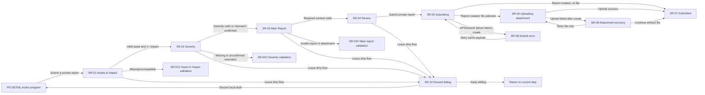

# Submit bug — Researcher flow for Figma

## 1. Mục tiêu

Tài liệu này định nghĩa user flow để **Security researcher gửi một vulnerability report riêng tư cho một active bug bounty program** trong BountyEscrow.

Flow bắt đầu từ trang chi tiết program tại `/programs/:id`, đi qua report composer tại `/reports/new?programId=:id`, và kết thúc tại report detail `/reports/:reportId` sau khi server tạo report ở trạng thái `submitted`.

Phạm vi gồm:

- Kiểm tra program, scope và reward trước khi submit.
- Soạn report với local autosave trong browser.
- Chọn affected scope, một hoặc nhiều impact do program công bố và proposed severity riêng của researcher.
- Đính kèm một PoC file riêng tư trong MVP.
- Review disclosure trước khi gửi.
- Submit report, upload attachment bằng signed URL và xác nhận thành công.
- Các nhánh validation, network/API error, attachment error, session/role error và program ngừng nhận report.

Review, triage, request-information, reward approval và payout là các flow kế tiếp. UI submit không được hứa hẹn report sẽ được chấp nhận hoặc được trả thưởng.

## 2. Nguồn sự thật hiện tại

### Routes

| Mục đích | Route |
| --- | --- |
| Browse active programs | `/programs` |
| Program detail | `/programs/:id` |
| Submit report | `/reports/new?programId=:id` |
| Report detail sau submit | `/reports/:reportId` |
| My reports | `/reports` |

### API

```text
GET  /api/programs/:id
POST /api/programs/:id/reports
POST /api/reports/:id/attachments/upload-url
GET  /api/reports/:id
```

Submit request được validate bằng `createReportRequestSchema`.

Flow attachment hiện tại:

```text
create report
  → receive report id
  → request short-lived signed upload URL
  → PUT file directly to private storage
  → redirect to report detail
```

Report được tạo trước attachment. Vì vậy attachment upload error là **partial success**: report đã `submitted`, không được submit lại toàn bộ payload và tạo duplicate report.

### Quyền truy cập

- Chỉ account type `researcher` được mở composer.
- Anonymous chọn `Submit a private report` phải sign in và giữ internal `returnTo` an toàn.
- Owner/reviewer mở deep link phải tới safe forbidden state; không render private form trước khi role/profile được xác nhận.
- Researcher chỉ xem report của chính mình.
- Program phải có trạng thái `active` tại thời điểm server nhận submit.
- Chỉ scope item có `isInScope = true` được phép chọn trong form.

### Trạng thái report tại submit

Draft trước submit chỉ được lưu trong `localStorage` theo program:

```text
offchain-report-draft:<programId>
```

Server không tạo report `draft` trong flow hiện tại. `POST /api/programs/:id/reports` tạo trực tiếp:

```text
status = submitted
submittedAt = now
contentHash = SHA-256 of canonical report payload
```

Sau thành công, client xóa local draft, invalidate reports query, cache report response và dùng `router.replace(/reports/:id)`.

## 3. Data contract

### Current implementation và target contract

API hiện tại vẫn dùng `createReportRequestSchema` với trường `impact` dạng free text. Đây là **current implementation**, không phải data model đích cho flow này.

Target contract cần tách rõ:

- `reports.affectedScopeId`: asset in-scope mà researcher xác nhận bị ảnh hưởng.
- `reports.proposedSeverity`: đánh giá riêng của researcher; reviewer vẫn quyết định final severity.
- `report_impacts`: một hoặc nhiều impact được chọn cho report.
- `program_impacts`: catalog impact do owner cấu hình theo program và asset type.
- Custom impact chỉ tồn tại khi program bật `allowCustomImpact`; không được dùng một free-text `reports.impact` để thay cho toàn bộ quan hệ structured impact.

Migration/backend validation chưa nằm trong phạm vi thiết kế Figma, nhưng UI và prototype phải thể hiện target contract này. Khi backend chưa migrate, implementation phải có adapter rõ ràng; không được diễn giải UI mới như thể schema hiện tại đã hỗ trợ đầy đủ.

### Report fields — target

| Field | Bắt buộc | Validation / UI rule |
| --- | --- | --- |
| Affected scope | Có | UUID của đúng một in-scope item thuộc program |
| Selected impacts | Có | Tối thiểu một `programImpactId`; mỗi impact phải thuộc cùng program, đang enabled và khớp `assetType` của affected scope |
| Custom impacts | Có điều kiện | Chỉ cho nhập khi program bật `allowCustomImpact`; mỗi giá trị phải trim, không rỗng và được đánh dấu là researcher-proposed |
| Title | Có | Trimmed, 1–300 ký tự |
| Description | Có | Trimmed, 1–50,000 ký tự |
| Reproduction steps / PoC | Theo policy | Trimmed, 1–50,000 ký tự khi program yêu cầu PoC; optional khi policy cho phép |
| Proposed severity | Có | `critical`, `high`, `medium`, `low`, `informational` |

`program_impacts` target tối thiểu cần có:

```text
id
programId
assetType
severity
title
description | guidance
enabled
sortOrder
```

`report_impacts` target tối thiểu cần hỗ trợ:

```text
reportId
programImpactId | null
customTitle | null
source = program | custom
impactTitleSnapshot
impactSeveritySnapshot | null
assetTypeSnapshot
```

Rules bắt buộc:

- Một report có ít nhất một impact row.
- `programImpactId` phải thuộc program của report và khớp asset type của affected scope tại thời điểm submit.
- Custom row phải có `programImpactId = null`, `source = custom`, và chỉ được server chấp nhận khi program cho phép custom impact.
- Lưu snapshot để owner chỉnh catalog sau này không làm thay đổi nội dung lịch sử của report đã submit.
- Khi researcher đổi affected scope sang asset type khác, client phải xóa hoặc yêu cầu xác nhận xóa các selected impacts không còn tương thích.

Target submit payload về mặt ý nghĩa:

```json
{
  "affectedScopeId": "uuid",
  "programImpactIds": ["uuid"],
  "customImpacts": [],
  "proposedSeverity": "high",
  "severityMismatchAcknowledged": false,
  "title": "…",
  "description": "…",
  "reproductionSteps": "…",
  "secretGistUrl": null
}
```

`severityMismatchAcknowledged` là audit signal cho lựa chọn của researcher, không biến proposed severity thành final severity.

UI dùng structured fields. Không gộp vulnerability description và reproduction steps / PoC vào một textarea duy nhất; selected impacts là dữ liệu quan hệ riêng, không được suy ra bằng cách parse report body.

### Attachment MVP

| Rule | Giá trị |
| --- | --- |
| Số file trong UI hiện tại | 0 hoặc 1 |
| Maximum size | 10 MB |
| Allowed | TXT, Markdown, JSON, PDF, PNG, JPEG, WebP |
| Storage | Private bucket |
| Upload | Short-lived signed URL sau khi report đã được tạo |

Không đưa report content hoặc file content vào analytics, client logs, toast debug hoặc URL.

### Severity guidance

Severity trong submit form là đề xuất riêng của researcher, không phải kết luận cuối cùng. UI tính `impactSuggestedSeverity` bằng severity cao nhất trong các program impact đã chọn; custom impact không tự tạo severity chuẩn.

| Severity | Guidance ngắn cho UI |
| --- | --- |
| Critical | Direct loss, permanent freeze hoặc complete protocol compromise |
| High | Major asset/security impact với điều kiện khai thác thực tế |
| Medium | Limited impact, constrained exploit hoặc significant malfunction |
| Low | Minor security impact hoặc issue khó khai thác |
| Informational | Best practice hoặc observation không có direct security impact |

Copy bắt buộc:

```text
This is your assessment. The reviewer makes the final severity decision.
```

Nếu `proposedSeverity` khác `impactSuggestedSeverity`, hiển thị warning nêu cả hai giá trị và yêu cầu researcher xác nhận trước khi tiếp tục. Warning không tự thay đổi lựa chọn và không thay reviewer quyết định final severity.

Ví dụ:

```text
Your selected impacts suggest Critical, but your proposed severity is High. Review your selection or confirm that you want to continue.
```

### Các dữ liệu cố ý không thuộc submit request

- Không có KYC trong sản phẩm hoặc flow này.
- Wallet payout không nằm trong submit flow; wallet được thu thập/xác nhận trong reward/payout flow riêng khi cần.
- Researcher submission quota/level và anti-spam policy là platform-level, không phải field của program hay report.
- Quyết định public disclosure không được hỏi researcher trong composer này. Report private mặc định.

### Program configuration được submit flow tiêu thụ

Composer không tự định nghĩa các rules sau; chúng phải đến từ published program version:

- Eligible `program_scopes` với `assetType` và `isInScope`.
- Enabled `program_impacts` theo asset type.
- `allowCustomImpact`.
- PoC policy: required/optional, và override theo asset type hoặc severity nếu Create Program hỗ trợ.
- Program status/deadline để xác định còn nhận report hay không.
- Disclosure policy chỉ để researcher đọc; không tạo quyền public tự động.

Submit phải validate lại program version/current rules trên server vì owner có thể cập nhật catalog trong lúc researcher đang giữ local draft.

### Public disclosure và Known Issues

- Report không trở thành Known Issue chỉ vì được submit, confirmed, rejected hoặc paid.
- Chỉ sau khi program kết thúc, owner mới có thể đưa ra quyết định disclosure riêng cho từng report/issue.
- Chỉ report đã có explicit owner approval mới được xuất hiện trong `Known Issues` / public disclosures của program.
- Không có implicit public, bulk auto-public hoặc public-by-timeout.
- Target data model phải lưu quyết định có thể audit, tối thiểu gồm `reportId`, `decision`, `decidedBy`, `decidedAt`; trạng thái public cần `publishedAt` và public-safe content/snapshot thay vì render thẳng private report body.

### Định nghĩa canonical của `resolved`

Một report được xem là **resolved for review purposes** khi review đầu tiên chuyển nó tới
`rejected`, `duplicate` hoặc `validated`. `resolvedAt` là thời điểm của transition đầu tiên đó.

- `submitted`, `triaged` và `needs_information` chưa phải resolved.
- `reward_approved`, `payment_pending` và `paid` là các bước settlement sau khi report đã được
  resolved; chúng không tạo lại hoặc cập nhật `resolvedAt`.
- Nếu có vòng yêu cầu thêm thông tin/resubmit, resolution time vẫn bắt đầu từ `submitted_at` ban
  đầu và kết thúc ở quyết định đầu tiên.
- `medianResolutionSeconds` không đo thời gian approve reward hoặc thanh toán.

Tooltip của metric trên Program Detail phải nói rõ đây là thời gian từ initial submission tới
quyết định `validated`, `rejected` hoặc `duplicate` đầu tiên.

## 4. Nguyên tắc UX

1. Flow dùng composer 4 bước tương ứng data contract đích: Assets & Impact, Severity, Main Report, Review.
2. Program context và private-disclosure warning luôn nhìn thấy trên desktop.
3. Local autosave phải được truyền đạt rõ là chỉ lưu trong browser hiện tại.
4. Back/Next giữ dữ liệu; validation theo field khi blur và theo step khi Continue.
5. Không gửi API trước bước Review.
6. Primary CTA cuối dùng `Submit private report`, không dùng `Save draft` hoặc `Publish`.
7. Trước final submit phải nhắc rằng report sẽ được chia sẻ với program owner/reviewer và không public.
8. Trong lúc submit, khóa stepper, Back, file controls và primary action; không optimistic redirect.
9. API/network error trước khi tạo report giữ toàn bộ local draft để retry cùng payload.
10. Attachment error sau khi tạo report không gửi lại report; chuyển sang recovery state gắn với report ID đã có.
11. Không dùng wallet trong submit flow. Researcher chỉ cần wallet khi nhận payout theo flow riêng.
12. Không hiển thị AI suggestion trong composer. AI triage chỉ diễn ra sau submit và không phải quyết định cuối cùng.
13. Không có KYC step, KYC callout hoặc KYC-derived validation.
14. Asset type điều khiển danh sách impact hợp lệ; đổi asset có thể làm invalid selected impacts và phải được xử lý rõ ràng.
15. Proposed severity là field độc lập với selected impacts; mismatch chỉ tạo warning + explicit confirmation, không âm thầm overwrite.

## 5. Information architecture

### Figma placement

- Tạo page mới tên chính xác: `researcher`.
- Không thêm frame vào page `Layouts` đang được thread owner flow sử dụng.
- Trong page `researcher`, tạo section: `Researcher · Submit bug flow`.
- Desktop frame: `1440 × 1368`, gồm header `80px`, content canvas `1200px` và footer `88px`.
- Không giới hạn composer ở viewport `820px`. Footer bắt đầu tại `y = 1280`, sau toàn bộ nội dung, nên không được che card hoặc action row.
- Mobile-web frame chính: `390 × 844`.
- Frame name bắt đầu bằng screen ID, ví dụ `SR-02 · Severity · Desktop`.

### Desktop shell

- Dark website shell bám BBE Design System hiện có.
- Header navigation:
  - BountyEscrow logo.
  - `Browse programs`.
  - `My reports`.
  - `Rewards`.
  - Notification icon.
  - Researcher account menu.
- Active nav trong composer: `Browse programs` hoặc contextual `Submit report`; không hiển thị owner navigation.
- Main content max width: `1180px`.
- Left/main column khoảng `760px`; sticky program summary rail khoảng `340px`.

### Composer anatomy

- Breadcrumb: `Programs / Aegis Protocol / Submit report`.
- Eyebrow: `PRIVATE DISCLOSURE`.
- Title: `Submit a vulnerability report`.
- Supporting copy về privacy và local autosave.
- Stepper: Assets & Impact, Severity, Main Report, Review.
- Main form card.
- Sticky program context card.
- Action row nằm trong document flow của form card; cách field cuối tối thiểu `32px` và không được overlay nội dung.

### Stepper states

- Stepper desktop nằm trong raised surface riêng, có khoảng cách `38px` sau subtitle và `32px` trước content card.
- Không dùng số `1/2/3/4`. Dùng Lucide component từ BBE Design System: Assets & Impact = `crosshair`, Severity = `gauge`, Main Report = `file-text`, Review = `clipboard-check`.
- Completed: mint node, dark Lucide icon và mint connector.
- Current: brand violet node, primary-contrast Lucide icon và halo nhẹ.
- Upcoming: raised node, default border, disabled Lucide icon và disabled label.
- Mobile chỉ hiển thị `Step N of 4`, current label và compact progress bar.

## 6. User flow tổng quát



## 7. Screen inventory

| ID | Screen | Route/state | Mục đích |
| --- | --- | --- | --- |
| PG-DETAIL | Program entry | `/programs/:id` | Đọc scope/reward và mở composer |
| SR-00 | Loading program | Composer loading | Chờ program và eligible scopes |
| SR-01 | Assets & Impact | Step 1 | Chọn affected in-scope asset và 1+ program impacts phù hợp asset type |
| SR-01V | Assets & Impact validation | Client state | Thiếu/invalid asset, impact hoặc custom impact không được phép |
| SR-02 | Severity | Step 2 | Chọn proposed severity độc lập với impact catalog |
| SR-02V | Severity validation | Client state | Thiếu severity hoặc mismatch chưa được xác nhận |
| SR-03 | Main Report | Step 3 | Nhập title, vulnerability details, PoC/reproduction và optional attachment |
| SR-03V | Main Report validation | Client state | Content, PoC policy hoặc attachment không hợp lệ |
| SR-04 | Review | Step 4 | Kiểm tra disclosure trước submit |
| SR-05 | Submitting report | Mutation pending | Tạo report trên server |
| SR-06 | Uploading attachment | Upload pending | Upload file qua signed URL |
| SR-07 | Submitted | `/reports/:id` | Xác nhận report đã gửi |
| SR-08 | Submit error | Mutation error | Retry cùng payload, giữ local draft |
| SR-09 | Attachment recovery | Partial success | Retry file-only hoặc tiếp tục không file |
| SR-10 | Discard local draft | Confirmation dialog | Bảo vệ dữ liệu chưa submit |
| SR-11 | Program closed | Server/state conflict | Program không còn nhận report |
| SR-12 | Wrong role | Safe forbidden | Bảo vệ researcher-only route |
| SR-13 | Session expired | Auth recovery | Sign in lại với safe returnTo |
| SR-14 | Missing program | Invalid query | Yêu cầu chọn program trước |

## 8. Chi tiết màn hình

### PG-DETAIL — Program entry

Program header:

- Program name và `Active` badge.
- Short description.
- Remaining pool / total pool bằng USDC.
- Deadline hoặc `Ongoing`.
- Primary CTA: `Submit a private report`.

Content:

- `Information`: overview, reward policy, program rules, PoC requirement, prohibited activities và disclosure policy.
- `Scope`: in-scope/out-of-scope assets và impact definitions theo asset type.
- `Resources`: documentation, repository, audit report và official links do owner cấu hình.
- Reward tiers được nhóm theo asset type và severity; hiển thị đúng calculation type (flat, range hoặc percentage/capped).
- Metrics như total paid và resolution time là server-derived.
- `Known Issues` / public disclosures chỉ hiển thị dữ liệu đã được owner explicitly approve sau khi program kết thúc; không render private report body hoặc pending disclosure decision.

CTA chỉ hoạt động khi program active. Với anonymous, CTA đi qua login/onboarding rồi quay lại composer nếu role hợp lệ.

### SR-00 — Loading program

Copy:

```text
Loading program and eligible scopes…
```

- Dùng skeleton cho breadcrumb, stepper, form card và context rail.
- Không flash dữ liệu của program khác hoặc protected form.
- Load error có `Try again` và `Back to programs`.

### SR-01 — Assets & Impact

Heading:

```text
Choose the affected asset and impact
```

Supporting copy:

```text
Select the in-scope asset where you found the vulnerability, then choose every program impact that applies.
```

UI:

- `Affected asset` là searchable select hoặc radio-card list cho eligible scopes.
- Mỗi option hiển thị asset name, asset type, URL/short address và short scope description.
- Chỉ render items `isInScope = true`.
- Sau khi chọn asset, render `Impacts in scope — {assetType}` dưới dạng checkbox list; cho chọn một hoặc nhiều.
- Mỗi impact option hiển thị title, program-defined severity và guidance ngắn.
- Danh sách chỉ chứa `program_impacts` đang enabled, thuộc cùng program và có `assetType` khớp affected scope.
- Link `View impact definitions` mở đúng section của program detail.
- Nếu program bật `allowCustomImpact`, hiển thị vùng `Impact not listed?` và action `Add custom impact`.
- Mỗi custom impact là input riêng, có Remove action, được gắn nhãn `Researcher proposed`; custom impact không giả mạo program-defined severity.
- Nếu program không bật custom impact, không render input/action này; dùng copy hướng dẫn researcher quay lại program scope thay vì cho bypass.
- Context link: `Review full program scope` mở program detail trong cùng site.

Asset-change rule:

- Nếu researcher đổi sang asset cùng type, giữ selected impacts vẫn hợp lệ.
- Nếu đổi sang asset type khác và selection hiện tại không tương thích, mở confirmation nhỏ: `Changing asset type will clear the selected impacts.`
- Không giữ hidden stale impact IDs trong payload.

Actions:

- Secondary: `Cancel`.
- Primary: `Continue to severity`.

### SR-01V — Assets & Impact validation

Page alert:

```text
Choose an in-scope asset and at least one applicable impact before continuing.
```

Nếu scope đã bị owner thay đổi sau khi composer load:

```text
This asset is no longer eligible. Refresh the program scope and choose another asset.
```

Additional errors:

- Missing impact: `Select at least one impact.`
- Stale/incompatible impact: `One or more impacts no longer apply to this asset. Review your selections.`
- Custom impact disabled after load: `This program no longer accepts custom impacts. Remove the custom impact to continue.`
- Empty custom impact: `Describe the custom impact or remove this field.`

Không tự chọn scope hoặc impact đầu tiên để tránh researcher submit nhầm dữ liệu.

### SR-02 — Severity

Heading:

```text
Choose your proposed severity
```

Supporting copy:

```text
Use the highest severity that matches the impacts you selected. This is your assessment; the reviewer makes the final decision.
```

UI:

- Segmented control hoặc radio cards: Critical, High, Medium, Low, Informational.
- Không default selection.
- Summary nhỏ liệt kê affected asset, selected impact count và `Highest selected impact: {severity}`.
- Severity guidance nằm cạnh lựa chọn hoặc trong expandable help; không giấu selected-impact context.
- Nếu proposed severity khác highest program-defined impact severity, hiển thị warning có cả hai values.
- Warning có checkbox:

```text
I reviewed the mismatch and want to continue with my proposed severity.
```

- Custom-only selection không có suggested severity chuẩn; vẫn yêu cầu researcher chọn proposed severity nhưng không tạo mismatch giả.

Actions:

- Ghost: `Back`.
- Primary: `Continue to main report`.

### SR-02V — Severity validation

Summary alert:

```text
Review your severity assessment before continuing.
```

Field errors:

- Missing severity: `Select your proposed severity.`
- Mismatch without confirmation: `Confirm the severity mismatch or update your selection.`

Mismatch không phải server-authoritative final severity và không được tự sửa selected impacts hoặc proposed severity.

### SR-03 — Main Report

Heading:

```text
Write the vulnerability report
```

Fields:

1. `Report title`
   - Placeholder: `e.g. Re-entrancy can drain the staking pool`.
   - Counter: `0 / 300`.
2. `Vulnerability description`
   - Placeholder: `Explain the vulnerable behavior, root cause and affected component.`
   - Counter: `0 / 50,000`.
3. `Proof of concept / reproduction steps`
   - Multiline textarea hoặc code-friendly editor treatment.
   - Required/optional state lấy từ program PoC policy; không hardcode cùng một rule cho mọi program.
   - Placeholder có cấu trúc:

```text
1. Set up the affected environment…
2. Send the following transaction/request…
3. Observe…
Expected result…
Actual result…
```

   - Counter: `0 / 50,000`.
4. `Secret Gist URL (optional)`
   - Chỉ chấp nhận HTTPS URL hợp lệ.
   - Copy nhắc Gist phải private/secret và không thay thế PoC khi program yêu cầu runnable proof.
5. `Private attachment (optional)`
   - Drag/drop hoặc `Choose file`.
   - TXT, MD, JSON, PDF, PNG, JPG hoặc WebP; tối đa 10 MB; một file trong MVP.
   - Selected state hiển thị filename, type, size, `Replace` và `Remove`.

Info callout:

```text
Your report stays private to authorized reviewers. Do not include seed phrases, private keys or unrelated personal data.
```

Actions:

- Ghost: `Back`.
- Primary: `Review report`.

### SR-03V — Main Report validation

Summary alert:

```text
Review the highlighted fields before continuing.
```

Field errors:

- Empty title: `Enter a concise report title.`
- Title too long: `Keep the title within 300 characters.`
- Empty description: `Describe the vulnerability and root cause.`
- Missing PoC when required: `This program requires proof of concept or clear reproduction steps.`
- Invalid Gist URL: `Enter a valid HTTPS Gist URL.`
- Unsupported attachment type: `Choose a supported TXT, MD, JSON, PDF or image file.`
- Attachment larger than 10 MB: `Choose a file smaller than 10 MB.`
- Unsafe filename: `Rename the file without folders or control characters.`

Focus tới field invalid đầu tiên. Error không chỉ dùng border color; luôn có message và icon.

Security note:

```text
Files are uploaded to private storage using a short-lived link after the report is created.
```

Validation error không xóa main report content, selected asset, impacts hoặc severity ở các step trước.

### SR-04 — Review

Heading:

```text
Review your private report
```

Warning callout:

```text
Submitting shares this report with the program's authorized owner and reviewers. It will not be public by default.
```

Summary sections:

1. `Program and scope`
   - Program name, selected asset và asset type.
   - Edit → Step 1.
2. `Impacts and severity`
   - Program impact titles, custom impacts được gắn nhãn rõ, highest selected impact và proposed severity.
   - Hiển thị mismatch acknowledgment nếu có.
   - Edit impacts → Step 1; edit severity → Step 2.
3. `Vulnerability report`
   - Title, description preview và PoC/reproduction preview.
   - Secret Gist URL nếu có.
   - Attachment filename/size hoặc `No attachment`.
   - Edit → Step 3.
4. `What happens next`
   - Report enters review as `Submitted`.
   - Reviewer may request more information.
   - Final severity and reward are decided by authorized humans.
   - Report remains private; it can only become a public Known Issue after program end and an explicit owner disclosure decision.

Confirmation checkbox:

```text
I confirm this report is accurate to the best of my knowledge and contains no secrets unrelated to this disclosure.
```

Không có KYC checkbox, wallet field hoặc public-disclosure opt-in trong Review.

Actions:

- Ghost: `Back`.
- Primary: `Submit private report`.

### SR-05 — Submitting report

Heading:

```text
Submitting your private report…
```

Body:

```text
We’re creating the report securely. Keep this tab open.
```

Progress list:

- `Creating report` — active.
- `Uploading attachment` — upcoming hoặc skipped nếu không có file.
- `Opening report` — upcoming.

Không dùng copy `AI is validating your report`. AI không quyết định submit success.

### SR-06 — Uploading attachment

Heading:

```text
Report submitted. Uploading private attachment…
```

- `Creating report` — complete.
- `Uploading attachment` — active.
- `Opening report` — upcoming.
- Hiển thị filename và progress treatment không khẳng định phần trăm nếu client không có progress thật.
- Không cho submit form lại.

### SR-07 — Submitted

Route:

```text
/reports/:reportId
```

Success banner:

```text
Report submitted privately
The program's authorized reviewers can now review your disclosure.
```

Header:

- Report title.
- `Submitted` status badge.
- Program name.
- Proposed severity.
- Submitted timestamp.
- Report ID với copy action.

Timeline:

- Submitted — complete/current.
- Triage — next.
- Review decision.
- Reward approval.
- Payment.

Primary action:

```text
View report
```

Secondary:

- `My reports`.
- `Back to program`.

Copy:

```text
Watch for reviewer questions in this report. It stays private by default. A separate owner decision after the program ends is required before any public Known Issue can be created.
```

### SR-08 — Submit error

Error alert:

```text
Your report could not be submitted. Your draft is still saved in this browser.
```

Supporting copy:

```text
Check your connection and try again. Retrying sends the same report once.
```

Actions:

- Primary: `Try again`.
- Secondary: `Review report`.

Nếu server trả program không active, chuyển SR-11 thay vì retry vô hạn.

### SR-09 — Attachment recovery

State này chỉ xuất hiện khi report đã được tạo nhưng file upload thất bại.

Alert:

```text
Your report was submitted, but the attachment did not finish uploading.
```

Rules:

- Hiển thị report ID và filename.
- Không render `Submit private report`.
- Primary: `Retry attachment` chỉ request/upload file lại.
- Secondary: `Continue without attachment` tới report detail.
- Tertiary: `Open submitted report`.

Copy:

```text
Do not resubmit the report. You can attach proof again from this recovery step.
```

### SR-10 — Discard local draft dialog

Heading:

```text
Discard this report draft?
```

Body:

```text
This removes the draft saved in this browser. Nothing has been submitted to the program.
```

Actions:

- Destructive: `Discard local draft` → clear the program-specific storage key and return to program.
- Secondary: `Keep editing`.

### SR-11 — Program closed or paused

Heading:

```text
This program is no longer accepting reports
```

Body:

```text
The program changed while you were preparing this disclosure. Your local draft is still available in this browser.
```

Actions:

- Primary: `View program`.
- Secondary: `Copy draft content` placeholder only if implementation adds a safe explicit export action.

Không tự chuyển report sang program khác.

### SR-12 — Wrong role

```text
This workspace isn’t available
Your account does not have Security researcher access.
```

CTA: `Browse programs` hoặc role landing phù hợp. Không render composer phía sau forbidden state.

### SR-13 — Session expired

```text
Your session expired before the report was submitted.
Sign in again to continue with the draft saved in this browser.
```

Primary: `Sign in again`, với safe internal `returnTo` quay lại đúng composer.

### SR-14 — Missing program

Khi URL thiếu `programId`:

```text
Choose a program before starting a report.
```

Primary: `Browse programs`.

## 9. Prototype scenarios bắt buộc

1. Active program → Assets & Impact → Severity → Main Report → Review → Submit → Success.
2. Chọn một asset → chọn nhiều program impacts cùng asset type → proposed severity khớp → continue.
3. Chọn asset Smart contract rồi đổi sang Website → confirmation clear incompatible impacts → chọn lại Website impacts.
4. Thiếu asset/impact → inline validation → chọn đủ → continue.
5. Program cho phép custom impact → Add custom impact → Review hiển thị nhãn `Researcher proposed`.
6. Program không cho custom impact → không có Add custom impact và payload không thể chứa custom row.
7. Proposed severity khác highest selected impact → warning → chưa confirm thì blocked → confirm thì continue.
8. Main Report invalid hoặc thiếu PoC khi policy required → inline errors → sửa → Review.
9. Cùng happy path với một attachment → Creating report → Uploading → Success.
10. Unsupported/oversized attachment → error → replace file → Review.
11. API/network error trước report create → giữ draft → retry cùng payload → success.
12. Attachment upload error sau report create → retry file-only → success.
13. Attachment upload error → continue without attachment → submitted report.
14. Cancel dirty composer → Keep editing.
15. Cancel dirty composer → Discard local draft → Program detail.
16. Program hoặc selected impact trở thành non-active trước submit → state phù hợp, giữ local draft và yêu cầu refresh selection.
17. Anonymous CTA → login/onboarding → valid researcher returnTo; owner/reviewer deep link → safe forbidden.
18. Mobile-web happy path 390px.

Không tạo KYC, Wallet Address hoặc disclosure-consent screen trong bất kỳ prototype scenario nào.

## 10. Figma screen placement và naming

- Page: `researcher`.
- Section: `Researcher · Submit bug flow`.
- Desktop frames xếp theo hàng chính: PG-DETAIL → SR-01 → SR-02 → SR-03 → SR-04 → SR-05/SR-06 → SR-07.
- Validation/error states đặt ngay dưới screen gốc.
- Mobile frames đặt thành hàng riêng: `Researcher · Submit bug · Mobile`.
- Không overlap section/page đang được thread owner flow chỉnh.
- Prototype links bám 18 scenarios ở mục 9.
- Flow starting point: `PG-DETAIL · Program entry · Desktop`.

## 11. Design system và shadcn/Tailwind mapping

Ưu tiên instance và semantic Variables trong `BBE Design System` của file hiện tại.

| Figma pattern | shadcn/Tailwind mapping |
| --- | --- |
| Primary/secondary/ghost action | `Button` variants |
| Composer sections | `Card`, `CardHeader`, `CardContent`, `CardFooter` |
| Title | `Input` |
| Vulnerability description / PoC | `Textarea` |
| Affected asset | searchable `Select` hoặc `RadioGroup` cards |
| Program impacts | `Checkbox` list trong scrollable `Card` |
| Proposed severity | segmented `RadioGroup` |
| Custom impact | repeatable `Input` + icon-only remove `Button` |
| Report/program status | `Badge` |
| Step progress | Semantic list + progress indicator |
| Privacy/guidance | `Alert` / callout |
| Attachment | Styled file input / dropzone |
| Discard confirmation | `AlertDialog` |
| Review summary | Definition list + `Separator` |
| Loading | Disabled Button + spinner/progress |

Layout rules:

- Spacing scale: 4/8/12/16/24/32/48.
- Form field spacing contract:
  - Label → control: `8px` / `spacing/sm`.
  - Control → helper, error hoặc counter: `8px` / `spacing/sm`.
  - Field group → field group: `32px` / `spacing/2xl`.
  - Subtitle → stepper: `32–48px` / `spacing/2xl–3xl`.
  - Stepper → content surface: `32px` / `spacing/2xl`.
  - Final field → actions: tối thiểu `32px`; actions luôn nằm trong document flow.
- Nested surface và action containment:
  - Child surface dùng inset trái, phải và đáy bằng parent padding: mặc định `24px` / `spacing/xl`.
  - Action → annotation, helper hoặc supporting copy kế tiếp: tối thiểu `24px` / `spacing/xl`.
  - Action → border đáy của parent: `32px` / `spacing/2xl`, tuyệt đối không nhỏ hơn `24px`.
  - Nested border không được chạm hoặc tạo cảm giác dính với border của parent.
- Radius: semantic `radius-md` / `radius-lg` tương ứng `rounded-lg` / `rounded-xl`.
- Không dùng arbitrary color; bind `color/bg/*`, `color/text/*`, `color/border/*`, `color/status/*`, `color/accent/*`.
- Purple dùng cho primary/current; mint dùng cho complete/private-security success; red chỉ dùng error/destructive.
- Field label, helper, counter và error là các layer riêng để hỗ trợ accessibility.
- Layer names semantic English, không dùng `Rectangle 123` hoặc `Group 8`.

## 12. Accessibility và responsive

- Desktop canvas chuẩn `1440 × 1368`, mobile web `390 × 844`; layout vẫn dùng được ở width 1280px và tablet 768px.
- Desktop page được phép dài hơn viewport khi nội dung cần thêm không gian; không crop hoặc dùng footer/sticky action để che phần UI bên dưới.
- Interactive target tối thiểu khoảng 44 × 44px.
- Có visible focus state đạt contrast WCAG AA.
- Stepper có current/completed semantics, không chỉ khác màu.
- Field error được liên kết với field và có screen-reader announcement.
- Character counter không thay thế validation message.
- Dropzone có keyboard-accessible `Choose file` action.
- Loading button giữ width ổn định.
- Sticky rail desktop chuyển thành collapsible program summary trên mobile.
- Bottom action bar mobile không che textarea hoặc virtual keyboard content.

## 13. Privacy và security annotations

Figma annotation tại SR-04, SR-05, SR-06 và SR-09 phải ghi rõ:

- Report content không public mặc định.
- Không có KYC trong flow và payout wallet được xử lý riêng khỏi submit.
- Public disclosure chỉ có thể được owner quyết định theo từng report sau khi program kết thúc.
- `Known Issues` chỉ dùng public-safe content/snapshot của report đã được explicit approve; không render trực tiếp private body.
- Không gửi report body vào analytics hoặc application logs.
- Attachment nằm trong private storage.
- Signed upload URL có thời hạn ngắn và không được persist.
- Authorization luôn được kiểm tra ở API; hidden UI không phải security boundary.
- Content hash có thể được dùng cho integrity/on-chain reference, nhưng raw report content không lên blockchain.
- AI chỉ hỗ trợ triage sau submit và không tự validate hoặc payout.

## 14. Acceptance criteria

- Flow chỉ cho Security researcher và chỉ submit vào active program.
- Composer chỉ cho chọn in-scope asset.
- Có ít nhất một selected impact; mọi referenced program impact cùng program, enabled và khớp asset type của affected scope.
- Custom impact chỉ xuất hiện và được server chấp nhận khi program bật `allowCustomImpact`.
- Target contract dùng `program_impacts` + `report_impacts` và lưu snapshot; free-text `reports.impact` hiện tại được ghi rõ là implementation cũ cần adapter/migration.
- Proposed severity là field độc lập, được trình bày là đề xuất chứ không phải quyết định cuối.
- Severity mismatch hiển thị cả proposed và impact-suggested severity, yêu cầu explicit acknowledgment, không tự overwrite.
- Main Report tuân theo PoC policy của program; attachment vẫn optional và tách khỏi report-create transaction.
- Local draft được mô tả đúng là browser-only; server tạo trực tiếp trạng thái `submitted`.
- Không submit API trước bước Review.
- Submit loading không optimistic redirect.
- API/network error trước create giữ local draft và hỗ trợ same-payload retry.
- Attachment giới hạn 1 file, đúng allowed types và 10 MB trong MVP.
- Attachment error sau create được xử lý như partial success, không tạo duplicate report.
- Success chuyển tới `/reports/:id`, hiển thị Submitted và next steps thực tế.
- Không có KYC; không yêu cầu wallet trong submit flow; không đặt AI làm gate; không hứa chắc reward.
- Report private mặc định; chỉ explicit owner decision sau program end mới cho phép tạo Known Issue/public disclosure.
- Có discard confirmation, program-closed, wrong-role, session-expired và missing-program states.
- Figma tạo page `researcher`, dùng BBE Design System hiện tại, dark desktop, semantic layer names và prototype connections.
